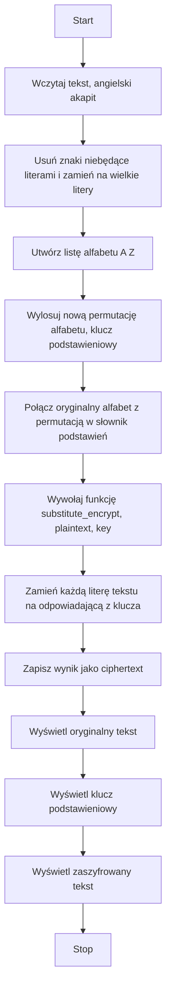

# Kryptografia i kryptoanaliza
## Laboratorium 3
### Grupa 1ID24B
### Autorzy: Iga Ozimska, Eliza Janus

### Zadanie 1
Zrealizować program implementujący podstawieniowy algorytm szyfrowania.
1. Wybrać dłuższy fragment tekstu w języku angielskim (np. akapit składający się z kilkunastu zdań).
2. Usunąć z niego wszystkie znaki niebędące literami (ograniczenie do 26 liter alfabetu łacińskiego).
3. Zaszyfrować tekst używając wybranego w sposób losowy klucza (tablicy podstawień): permutacji πˆ.

### Schemat blokowy 

#### Implementacja

``` Python
import random
import string
from typing import Dict

ALPHABET = list(string.ascii_uppercase)

# ------------------------------------------------------------
# Funkcja: preprocess_letters_only(text)
# Wejście: text (str) – tekst wejściowy
# Wyjście: (str) – tekst zawierający tylko wielkie litery A–Z
# Działanie:
#   Konwertuje tekst na wielkie litery oraz usuwa wszystkie znaki,
#   które nie są literami alfabetu łacińskiego.
# ------------------------------------------------------------
def preprocess_letters_only(text: str) -> str:
    return ''.join(ch.upper() for ch in text if ch.isalpha())


# ------------------------------------------------------------
# Funkcja: generate_substitution_key()
# Wejście: brak
# Wyjście: (dict) – słownik mapujący litery A–Z na ich losowe podstawienia
# Działanie:
#   Tworzy losowy klucz podstawieniowy, mieszając litery alfabetu.
#   Klucz można użyć zarówno do szyfrowania, jak i odszyfrowania.
# ------------------------------------------------------------
def generate_substitution_key() -> Dict[str, str]:
    shuffled = ALPHABET.copy()
    random.shuffle(shuffled)
    return dict(zip(ALPHABET, shuffled))


# ------------------------------------------------------------
# Funkcja: substitute_encrypt(plaintext, key)
# Wejście:
#   plaintext (str) – tekst jawny (tylko litery A–Z)
#   key (dict) – słownik mapujący litery jawne na litery szyfrogramu
# Wyjście: (str) – zaszyfrowany tekst
# Działanie:
#   Dla każdej litery tekstu jawnego podstawia odpowiadającą literę
#   z klucza podstawieniowego.
# ------------------------------------------------------------
def substitute_encrypt(plaintext: str, key: Dict[str, str]) -> str:
    return ''.join(key[ch] for ch in plaintext)

# ------------------------------------------------------------
# Funkcja: display_key(key)
# Wejście: key (dict) – słownik klucza podstawieniowego
# Wyjście: brak (drukuje klucz na ekranie)
# Działanie:
#   Wyświetla pary liter w formacie A → X, po jednej w każdej linii.
# ------------------------------------------------------------
def display_key(key: Dict[str, str]) -> None:
    for k, v in key.items():
        print(f"{k} → {v}")


# ------------------------------------------------------------
# Funkcja: main()
# Wejście: brak
# Wyjście: brak (drukuje wyniki na ekranie)
# Działanie:
#   1. Definiuje przykładowy tekst.
#   2. Czyści go z niedozwolonych znaków (pozostawia tylko litery).
#   3. Generuje losowy klucz podstawieniowy.
#   4. Szyfruje tekst jawny.
#   5. Wyświetla klucz i fragmenty tekstu oryginalnego oraz zaszyfrowanego.
# ------------------------------------------------------------
def main():
    text = """
    In cryptography, a substitution cipher is a method of encrypting by which units of plaintext
    are replaced with ciphertext according to a fixed system; the "units" may be single letters,
    pairs of letters, triplets of letters, mixtures of the above, and so forth.
    """

    clean_text = preprocess_letters_only(text)
    substitution_key = generate_substitution_key()
    ciphertext = substitute_encrypt(clean_text, substitution_key)

    print("Oryginalny tekst:")
    print(clean_text[:200] + "...\n")

    print("Klucz podstawieniowy:")
    display_key(substitution_key)

    print("\nZaszyfrowany tekst:")
    print(ciphertext[:200] + "...")


# ------------------------------------------------------------
# Uruchomienie programu
# ------------------------------------------------------------
if __name__ == "__main__":
    main()


```
#### Wyniki
``` sh
python .\zad1.py
```

### Zadanie 2
Dokonać kryptoanalizy heurystycznej na zaimplementowany w ramach pierwszego zadania monoalfabetyczny
kryptosystem podstawieniowy. Założenia ataku są następujące:
1. Znany jest szyfrogram.
2. Wiadomo jaki kryptosystem użyty został do zaszyfrowania wiadomości.
3. Należy odzyskać klucz i tekst jawny.
Do realizacji zadania kryptoanalizy heurystycznej, należy użyć algorytmu Metropolis-Hastings. Algorytm ten
umożliwia realizację procedury poszukiwanie klucza (czyli mapowania znaków), który najlepiej dopasowuje
się do rozkładu prawdopodobieństwa tekstu jawnego. Przebieg tego procesu wygląda następująco:
   1. Wybieramy reprezentację klucza jako permutację πˆ:
   • Zakładamy losowy klucz początkowy, czyli permutację znaków klucza.
   2. Definiujemy funkcję oceny klucza (funkcja celu / funkcja wiarygodności) pl(ˆπ):
   • Funkcja ta jest miarą tego jak bardzo odszyfrowany tekst przypomina tekst naturalny.
   • Na potrzeby zadania, funkcja ta zdefiniowana jest w następujący sposób: pl (ˆπ) = Q
   i,j (Mi,j )
   Mˆ
   i,j
   .
   gdzie:
   – M to macierz bigramów utworzona na bazie tekstu referencyjnego, natomiast Mi,j to liczba
   wystąpień pary (i, j) w tekście referencyjnym.
   – Mˆ to macierz bigramów utworzona na bazie tekstu otrzymanego przez odszyfrowanie szyfrogramu c przy użyciu klucza πˆ, natomiast Mˆ
   i,j to liczba wystąpień pary (i, j) w odszyfrowanym
   tekście.
   • Uwaga zdefiniowaną funkcję należy rozpatrywać w kategorii prawdopodobieństwa.
   3. Losujemy nową permutację klucza πˆ
   ′
   :
   • Zadanie to realizowane jest poprzez losową zamianę dwóch znaków z permutacji (klucza) πˆ.
   4. Definiujemy kryterium akceptacji ρ(ˆπ, πˆ
   ′
   ):
   • Algorytm Metropolis-Hastings akceptuje nowy klucz z pewnym prawdopodobieństwem, które zależy od stosunku funkcji oceny dla nowego i starego klucza. Jeśli nowy klucz πˆ
   ′ prowadzi do
   lepszego dopasowania, to akceptujemy go jako Xt+1, jeśli nie, to zostajemy przy starym πˆ kluczu.
   • Dla rozważanego przypadku, kryterium akceptacji można zdefiniować w następujący sposób:
   ρ(ˆπ, πˆ
   ′
   ) = pl(ˆπ
   ′
   )
   pl(ˆπ)
   .
   • Dla rozważanego algorytmu, należy wylosować liczbę u należącą do rozkładu jednostajnego na
   przedziale [0, 1] a następnie dokonać porównania: u ≤ ρ(ˆπ, πˆ
   ′
   ). Jeżeli warunek ten jest spełniony
   to akceptujemy nowy klucz (permutację), jeżeli nie to zostajemy przy starym kluczu.
   1
   5. Iteracja procesu:
• Proces ten jest powtarzany, tworząc łańcuch kluczy {Xt
: t = 0, . . . , T}, które przybliżają optymalne rozwiązanie.
• W miarę postępu procesu iteracyjnego, algorytm koncentruje się na obszarach rozwiązań, które
lepiej odtwarzają tekst jawny.


### Schemat blokowy 
```mermaid


```
#### Implementacja
``` Python

```
#### Wyniki
``` sh

```


### Zadanie 3
Dokonać kryptoanalizy heurystycznej na zaimplementowany w ramach pierwszego zadania monoalfabetyczny
kryptosystem podstawieniowy. Założenia ataku są takie jak w zadaniu 2. Do ataku wykorzystać algorytm
optymalizacji Symulowanego Wyżarzania (ang. Simulated Annealing).
### Schemat blokowy 
```mermaid

```
#### Implementacja
``` Python

```
#### Wyniki
``` sh
 
```

### Zadanie 4
Dokonać analizy pracy zaimplementowanych algorytmów, porównując ich wydajność w ataku na analizowany
kryptosystem.
Analiza powinna zawierać:
1. Porównanie jakości wyników:
• Procent poprawnie odzyskanych liter klucza,
• Czytelność odszyfrowanego tekstu.
2. Porównanie wydajności:
• Czas wykonania algorytmów,
• Liczba iteracji potrzebna do uzyskania dobrego wyniku.
3. Analiza zbieżności:
• Wykres wartości funkcji celu w funkcji numeru iteracji dla obu algorytmów,
• Ocena stabilności wyników (wielokrotne uruchomienia).
4. Badanie wpływu parametrów:
• MH: wpływ liczby iteracji T,
5
• SA: wpływ temperatury początkowej T0 i współczynnika chłodzenia α.
Wyniki przedstawić w formie raportu z tabelami, wykresami i wnioskami.

### Schemat blokowy 
```mermaid

```
#### Implementacja
``` Python

```
#### Wyniki
``` sh


```
