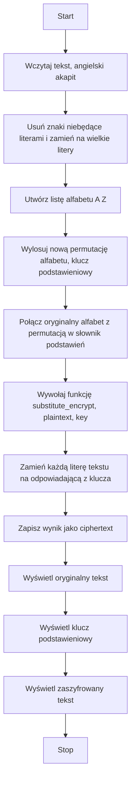
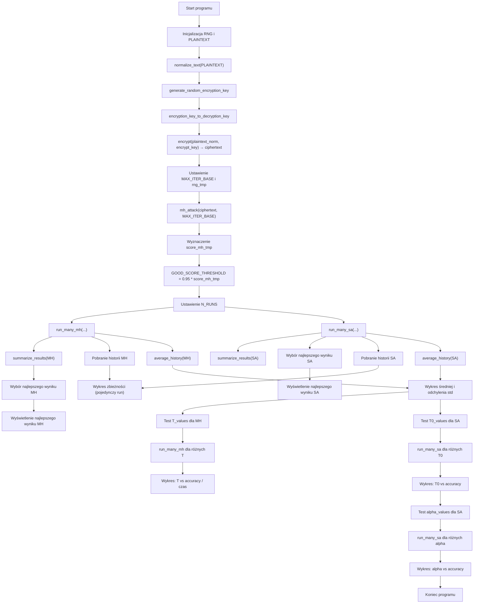
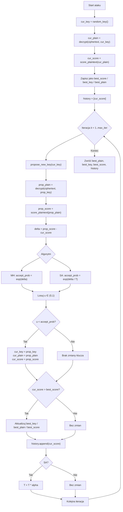

# Kryptografia i kryptoanaliza
## Laboratorium 3
### Grupa 1ID24B
### Autorzy: Iga Ozimska, Eliza Janus

### Zadanie 1
Zrealizować program implementujący podstawieniowy algorytm szyfrowania.
1. Wybrać dłuższy fragment tekstu w języku angielskim (np. akapit składający się z kilkunastu zdań).
2. Usunąć z niego wszystkie znaki niebędące literami (ograniczenie do 26 liter alfabetu łacińskiego).
3. Zaszyfrować tekst używając wybranego w sposób losowy klucza (tablicy podstawień): permutacji πˆ.

### Schemat blokowy 

#### Implementacja

``` Python
import random
import string
from typing import Dict

ALPHABET = list(string.ascii_uppercase)

# ------------------------------------------------------------
# Funkcja: preprocess_letters_only(text)
# Wejście: text (str) – tekst wejściowy
# Wyjście: (str) – tekst zawierający tylko wielkie litery A–Z
# Działanie:
#   Konwertuje tekst na wielkie litery oraz usuwa wszystkie znaki,
#   które nie są literami alfabetu łacińskiego.
# ------------------------------------------------------------
def preprocess_letters_only(text: str) -> str:
    return ''.join(ch.upper() for ch in text if ch.isalpha())


# ------------------------------------------------------------
# Funkcja: generate_substitution_key()
# Wejście: brak
# Wyjście: (dict) – słownik mapujący litery A–Z na ich losowe podstawienia
# Działanie:
#   Tworzy losowy klucz podstawieniowy, mieszając litery alfabetu.
#   Klucz można użyć zarówno do szyfrowania, jak i odszyfrowania.
# ------------------------------------------------------------
def generate_substitution_key() -> Dict[str, str]:
    shuffled = ALPHABET.copy()
    random.shuffle(shuffled)
    return dict(zip(ALPHABET, shuffled))


# ------------------------------------------------------------
# Funkcja: substitute_encrypt(plaintext, key)
# Wejście:
#   plaintext (str) – tekst jawny (tylko litery A–Z)
#   key (dict) – słownik mapujący litery jawne na litery szyfrogramu
# Wyjście: (str) – zaszyfrowany tekst
# Działanie:
#   Dla każdej litery tekstu jawnego podstawia odpowiadającą literę
#   z klucza podstawieniowego.
# ------------------------------------------------------------
def substitute_encrypt(plaintext: str, key: Dict[str, str]) -> str:
    return ''.join(key[ch] for ch in plaintext)

# ------------------------------------------------------------
# Funkcja: display_key(key)
# Wejście: key (dict) – słownik klucza podstawieniowego
# Wyjście: brak (drukuje klucz na ekranie)
# Działanie:
#   Wyświetla pary liter w formacie A → X, po jednej w każdej linii.
# ------------------------------------------------------------
def display_key(key: Dict[str, str]) -> None:
    for k, v in key.items():
        print(f"{k} → {v}")


# ------------------------------------------------------------
# Funkcja: main()
# Wejście: brak
# Wyjście: brak (drukuje wyniki na ekranie)
# Działanie:
#   1. Definiuje przykładowy tekst.
#   2. Czyści go z niedozwolonych znaków (pozostawia tylko litery).
#   3. Generuje losowy klucz podstawieniowy.
#   4. Szyfruje tekst jawny.
#   5. Wyświetla klucz i fragmenty tekstu oryginalnego oraz zaszyfrowanego.
# ------------------------------------------------------------
def main():
    text = """
    In cryptography, a substitution cipher is a method of encrypting by which units of plaintext
    are replaced with ciphertext according to a fixed system; the "units" may be single letters,
    pairs of letters, triplets of letters, mixtures of the above, and so forth.
    """

    clean_text = preprocess_letters_only(text)
    substitution_key = generate_substitution_key()
    ciphertext = substitute_encrypt(clean_text, substitution_key)

    print("Oryginalny tekst:")
    print(clean_text[:200] + "...\n")

    print("Klucz podstawieniowy:")
    display_key(substitution_key)

    print("\nZaszyfrowany tekst:")
    print(ciphertext[:200] + "...")


# ------------------------------------------------------------
# Uruchomienie programu
# ------------------------------------------------------------
if __name__ == "__main__":
    main()


```
#### Wyniki
``` sh
python .\zad1.py
```

### Zadanie 2
Dokonać kryptoanalizy heurystycznej na zaimplementowany w ramach pierwszego zadania monoalfabetyczny
kryptosystem podstawieniowy. Założenia ataku są następujące:
1. Znany jest szyfrogram.
2. Wiadomo jaki kryptosystem użyty został do zaszyfrowania wiadomości.
3. Należy odzyskać klucz i tekst jawny.
Do realizacji zadania kryptoanalizy heurystycznej, należy użyć algorytmu Metropolis-Hastings. Algorytm ten
umożliwia realizację procedury poszukiwanie klucza (czyli mapowania znaków), który najlepiej dopasowuje
się do rozkładu prawdopodobieństwa tekstu jawnego. Przebieg tego procesu wygląda następująco:
   1. Wybieramy reprezentację klucza jako permutację πˆ:
   • Zakładamy losowy klucz początkowy, czyli permutację znaków klucza.
   2. Definiujemy funkcję oceny klucza (funkcja celu / funkcja wiarygodności) pl(ˆπ):
   • Funkcja ta jest miarą tego jak bardzo odszyfrowany tekst przypomina tekst naturalny.
   • Na potrzeby zadania, funkcja ta zdefiniowana jest w następujący sposób: pl (ˆπ) = Q
   i,j (Mi,j )
   Mˆ
   i,j
   .
   gdzie:
   – M to macierz bigramów utworzona na bazie tekstu referencyjnego, natomiast Mi,j to liczba
   wystąpień pary (i, j) w tekście referencyjnym.
   – Mˆ to macierz bigramów utworzona na bazie tekstu otrzymanego przez odszyfrowanie szyfrogramu c przy użyciu klucza πˆ, natomiast Mˆ
   i,j to liczba wystąpień pary (i, j) w odszyfrowanym
   tekście.
   • Uwaga zdefiniowaną funkcję należy rozpatrywać w kategorii prawdopodobieństwa.
   3. Losujemy nową permutację klucza πˆ
   ′
   :
   • Zadanie to realizowane jest poprzez losową zamianę dwóch znaków z permutacji (klucza) πˆ.
   4. Definiujemy kryterium akceptacji ρ(ˆπ, πˆ
   ′
   ):
   • Algorytm Metropolis-Hastings akceptuje nowy klucz z pewnym prawdopodobieństwem, które zależy od stosunku funkcji oceny dla nowego i starego klucza. Jeśli nowy klucz πˆ
   ′ prowadzi do
   lepszego dopasowania, to akceptujemy go jako Xt+1, jeśli nie, to zostajemy przy starym πˆ kluczu.
   • Dla rozważanego przypadku, kryterium akceptacji można zdefiniować w następujący sposób:
   ρ(ˆπ, πˆ
   ′
   ) = pl(ˆπ
   ′
   )
   pl(ˆπ)
   .
   • Dla rozważanego algorytmu, należy wylosować liczbę u należącą do rozkładu jednostajnego na
   przedziale [0, 1] a następnie dokonać porównania: u ≤ ρ(ˆπ, πˆ
   ′
   ). Jeżeli warunek ten jest spełniony
   to akceptujemy nowy klucz (permutację), jeżeli nie to zostajemy przy starym kluczu.
   1
   5. Iteracja procesu:
• Proces ten jest powtarzany, tworząc łańcuch kluczy {Xt
: t = 0, . . . , T}, które przybliżają optymalne rozwiązanie.
• W miarę postępu procesu iteracyjnego, algorytm koncentruje się na obszarach rozwiązań, które
lepiej odtwarzają tekst jawny.


### Schemat blokowy 
```mermaid
flowchart TD

    %% GŁÓWNY PROGRAM
    A[Start] --> B[parse_args(sys.argv[1:])]
    B --> C{Czy podano seed?}
    C -- Tak --> D[random.seed(seed)]
    C -- Nie --> E[Bez ustawiania ziarna]
    D --> F
    E --> F

    F[read_file(infile)] --> G[clean_text(cipher_raw)]
    G --> H{Długość cipher < 2?}
    H -- Tak --> I[Wypisz błąd\nZakończ program]
    H -- Nie --> J[read_file(ref)]
    
    J --> K[clean_text(ref_raw)]
    K --> L{Długość ref < 100?}
    L -- Tak --> M[Wypisz ostrzeżenie\n(mało danych referencyjnych)]
    L -- Nie --> N[Bez ostrzeżenia]
    M --> O
    N --> O

    O[build_bigram_counts(ref)] --> P[smooth_and_probs(Mref_counts, alpha)\n=> Mref_probs]

    P --> Q[Ustaw best_overall_perm = None\nbest_overall_logpl = -1e99]

    Q --> R{{Pętla po restartach\nr = 1..restarts}}
    R --> S[mh_run(cipher, Mref_probs,\n T=iter, alpha, verbose)]
    S --> T[Odbierz (perm, logpl)]
    T --> U{logpl > best_overall_logpl?}
    U -- Tak --> V[Zaktualizuj\nbest_overall_logpl,\nbest_overall_perm]
    U -- Nie --> W[Bez zmian]
    V --> X{Koniec restartów?}
    W --> X{Koniec restartów?}
    X -- Nie --> R
    X -- Tak --> Y[decrypt_with_perm(cipher,\n best_overall_perm)\n=> best_plain]

    Y --> Z[save_text(outfile, best_plain)]
    Z --> ZA{Czy podano keyout?}
    ZA -- Tak --> ZB[save_key_mapping(keyout,\n best_overall_perm)]
    ZA -- Nie --> ZC[Pomijamy zapis klucza]
    ZB --> ZD[Wypisz komunikaty o zapisaniu\ntekstów i klucza]
    ZC --> ZD[Wypisz komunikaty o zapisaniu\ntekstów]
    ZD --> ZE[Wypisz najlepsze log-prawdopodobieństwo]
    ZE --> ZF[Stop]


    %% PODPROGRAM MH_RUN
    subgraph MH[mh_run(cipher_text, Mref_probs, T, alpha, verbose)]
        direction TB
        MH1[Losowa permutacja\ncurrent_perm = random_perm()] --> MH2[decrypt_with_perm(cipher_text,\n current_perm)]
        MH2 --> MH3[bigram_counts_from_decrypted(dec)]
        MH3 --> MH4[log_pl_from_bigram_counts(Mhat,\n Mref_probs)\n=> current_logpl]
        MH4 --> MH5[Ustaw best_perm = current_perm,\n best_logpl = current_logpl]

        MH5 --> MH6{{Pętla t = 1..T}}
        MH6 --> MH7[swap_two(current_perm)\n=> cand_perm]
        MH7 --> MH8[decrypt_with_perm(cipher_text,\n cand_perm)\n=> cand_dec]
        MH8 --> MH9[bigram_counts_from_decrypted(cand_dec)\n=> cand_Mhat]
        MH9 --> MH10[log_pl_from_bigram_counts(cand_Mhat,\n Mref_probs)\n=> cand_logpl]
        MH10 --> MH11[delta = cand_logpl - current_logpl]

        MH11 --> MH12{delta >= 0?}
        MH12 -- Tak --> MH13[accept = True]
        MH12 -- Nie --> MH14[u = random.random()\naccept = (u <= exp(delta))]

        MH13 --> MH15{accept?}
        MH14 --> MH15{accept?}

        MH15 -- Tak --> MH16[Zaktualizuj current_perm,\n current_logpl]
        MH15 -- Nie --> MH17[Zachowaj current_perm,\n current_logpl]

        MH16 --> MH18{cand_logpl > best_logpl?}
        MH17 --> MH19[Kontynuuj pętlę]
        MH18 -- Tak --> MH20[Zaktualizuj best_perm,\n best_logpl]
        MH18 -- Nie --> MH19
        MH20 --> MH19

        MH19 --> MH21{Koniec iteracji T?}
        MH21 -- Nie --> MH6
        MH21 -- Tak --> MH22[Zwróć (best_perm,\n best_logpl)]
    end
```
#### Implementacja
``` Python
import sys
import random
import math

# ------------------------------------------------------------
# Stałe globalne:
#   ALPHABET – lista liter A–Z,
#   IDX      – słownik: litera -> indeks 0..25
# ------------------------------------------------------------
ALPHABET = [chr(ord('A') + i) for i in range(26)]
IDX = {c: i for i, c in enumerate(ALPHABET)}


# ------------------------------------------------------------
# Funkcja: read_file(path)
# Wejście : path (str) – ścieżka do pliku tekstowego (UTF-8)
# Wyjście : (str) – cała zawartość pliku
# Działanie:
#   Otwiera plik w trybie tekstowym i zwraca jego zawartość
#   jako pojedynczy łańcuch znaków.
# ------------------------------------------------------------
def read_file(path):
    with open(path, 'r', encoding='utf-8') as f:
        return f.read()


# ------------------------------------------------------------
# Funkcja: clean_text(s)
# Wejście : s (str) – dowolny tekst
# Wyjście : (str) – tekst zawierający tylko wielkie litery A–Z
# Działanie:
#   1) zamienia wszystkie litery na wielkie,
#   2) odrzuca znaki, które nie są literami (isalpha()).
# ------------------------------------------------------------
def clean_text(s):
    return ''.join(ch for ch in s.upper() if ch.isalpha())


# ------------------------------------------------------------
# Funkcja: save_text(path, text)
# Wejście : path (str) – ścieżka do pliku wyjściowego,
#           text (str) – tekst do zapisania
# Wyjście : brak
# Działanie:
#   Zapisuje podany tekst do pliku w kodowaniu UTF-8.
# ------------------------------------------------------------
def save_text(path, text):
    with open(path, 'w', encoding='utf-8') as f:
        f.write(text)


# ------------------------------------------------------------
# Funkcja: save_key_mapping(path, mapping_cipher_to_plain)
# Wejście : path (str) – ścieżka do pliku z kluczem,
#           mapping_cipher_to_plain (list[str]) – permutacja alfabetu
# Wyjście : brak
# Działanie:
#   Zapisuje klucz permutacyjny w formacie:
#       C P
#   gdzie C – litera szyfrogramu (A–Z),
#         P – odpowiadająca jej litera tekstu jawnego.
#   Jedna para na wiersz.
# ------------------------------------------------------------
def save_key_mapping(path, mapping_cipher_to_plain):
    with open(path, 'w', encoding='utf-8') as f:
        for i, p in enumerate(mapping_cipher_to_plain):
            f.write(f"{ALPHABET[i]} {p}\n")


# ------------------------------------------------------------
# Funkcja: build_bigram_counts(text)
# Wejście : text (str) – tekst złożony z liter A–Z
# Wyjście : counts (list[list[float]]) – macierz 26×26 z licznością
#           bigramów (pierwszy indeks – litera 1., drugi – litera 2.)
# Działanie:
#   Zlicza wszystkie kolejne pary liter (bigramy) w tekście.
# ------------------------------------------------------------
def build_bigram_counts(text):
    counts = [[0.0] * 26 for _ in range(26)]
    for a, b in zip(text, text[1:]):
        ia, ib = IDX[a], IDX[b]
        counts[ia][ib] += 1.0
    return counts


# ------------------------------------------------------------
# Funkcja: smooth_and_probs(counts, alpha)
# Wejście : counts – macierz zliczeń bigramów 26×26,
#           alpha  – parametr wygładzania addytywnego (>0)
# Wyjście : probs – macierz 26×26 z prawdopodobieństwami bigramów
# Działanie:
#   1) do każdego licznika dodaje alpha (wygładzenie),
#   2) dzieli wszystkie komórki przez sumę globalną,
#   3) zwraca znormalizowane prawdopodobieństwa.
# ------------------------------------------------------------
def smooth_and_probs(counts, alpha):
    probs = [[0.0] * 26 for _ in range(26)]
    total = 0.0
    for i in range(26):
        for j in range(26):
            v = counts[i][j] + alpha
            probs[i][j] = v
            total += v
    for i in range(26):
        for j in range(26):
            probs[i][j] /= total
    return probs


# ------------------------------------------------------------
# Funkcja: decrypt_with_perm(cipher_text, perm)
# Wejście : cipher_text (str) – szyfrogram (A–Z + ewentualnie inne znaki),
#           perm (list[str]) – permutacja alfabetu (cipher -> plain)
# Wyjście : (str) – tekst odszyfrowany
# Działanie:
#   Tworzy słownik odwzorowania litera_szyfrogramu -> litera_jawna
#   na podstawie permutacji i podstawia go do szyfrogramu.
#   Znaki spoza A–Z pozostawia bez zmian.
# ------------------------------------------------------------
def decrypt_with_perm(cipher_text, perm):
    table = {ALPHABET[i]: perm[i] for i in range(26)}
    return ''.join(table.get(ch, ch) for ch in cipher_text)


# ------------------------------------------------------------
# Funkcja: bigram_counts_from_decrypted(text)
# Wejście : text (str) – tekst (odszyfrowany)
# Wyjście : macierz zliczeń bigramów 26×26
# Działanie:
#   Prosty wrapper wywołujący build_bigram_counts.
# ------------------------------------------------------------
def bigram_counts_from_decrypted(text):
    return build_bigram_counts(text)


# ------------------------------------------------------------
# Funkcja: log_pl_from_bigram_counts(Mhat_counts, Mref_probs)
# Wejście : Mhat_counts – macierz zliczeń bigramów dla odszyfrowania,
#           Mref_probs  – macierz prawdopodobieństw bigramów (model)
# Wyjście : (float) – log-prawdopodobieństwo tekstu:
#           log p(π) = Σ_ij Mhat_ij * log(Mref_ij)
# Działanie:
#   Sumuje po wszystkich parach liter; elementy o zliczeniu 0
#   są pomijane (nie wnoszą wkładu).
# ------------------------------------------------------------
def log_pl_from_bigram_counts(Mhat_counts, Mref_probs):
    s = 0.0
    for i in range(26):
        for j in range(26):
            cij = Mhat_counts[i][j]
            if cij > 0.0:
                s += cij * math.log(Mref_probs[i][j])
    return s


# ------------------------------------------------------------
# Funkcja: random_perm()
# Wejście : brak
# Wyjście : (list[str]) – losowa permutacja alfabetu A–Z
# Działanie:
#   Tworzy losowy klucz monoalfabetyczny, mieszając litery.
# ------------------------------------------------------------
def random_perm():
    letters = ALPHABET[:]
    random.shuffle(letters)
    return letters


# ------------------------------------------------------------
# Funkcja: swap_two(perm)
# Wejście : perm (list[str]) – permutacja alfabetu
# Wyjście : (p, i, j)
#           p – nowa permutacja po zamianie dwóch elementów,
#           i, j – indeksy zamienionych liter
# Działanie:
#   Losuje dwa różne indeksy w permutacji i zamienia odpowiadające
#   im litery, tworząc sąsiadujący klucz.
# ------------------------------------------------------------
def swap_two(perm):
    p = perm[:]
    i = random.randrange(26)
    j = random.randrange(26)
    while j == i:
        j = random.randrange(26)
    p[i], p[j] = p[j], p[i]
    return p, i, j


# ------------------------------------------------------------
# Funkcja: mh_run(cipher_text, Mref_probs, T=20000, alpha=0.01, verbose=False)
# Wejście : cipher_text (str) – szyfrogram (A–Z),
#           Mref_probs – macierz prawd. bigramów (model języka),
#           T (int)    – liczba iteracji algorytmu MH,
#           alpha      – (niewykorzystane tutaj, przekazywane tylko dalej),
#           verbose    – czy wypisywać postęp.
# Wyjście : (best_perm, best_logpl)
#           best_perm  – najlepsza znaleziona permutacja,
#           best_logpl – log-prawdopodobieństwo dla best_perm.
# Działanie:
#   1) Startuje z losowego klucza.
#   2) W każdej iteracji:
#        - proponuje nowy klucz przez swap_two(),
#        - oblicza różnicę log-prawdopodobieństw,
#        - akceptuje/odrzuca wg reguły Metropolisa–Hastingsa.
#   3) Zapamiętuje najlepszy (najwyższe log p) klucz.
# ------------------------------------------------------------
def mh_run(cipher_text, Mref_probs, T=20000, alpha=0.01, verbose=False):
    current_perm = random_perm()
    dec = decrypt_with_perm(cipher_text, current_perm)
    Mhat = bigram_counts_from_decrypted(dec)
    current_logpl = log_pl_from_bigram_counts(Mhat, Mref_probs)

    best_perm = current_perm[:]
    best_logpl = current_logpl

    for t in range(1, T + 1):
        cand_perm, i, j = swap_two(current_perm)
        cand_dec = decrypt_with_perm(cipher_text, cand_perm)
        cand_Mhat = bigram_counts_from_decrypted(cand_dec)
        cand_logpl = log_pl_from_bigram_counts(cand_Mhat, Mref_probs)

        delta = cand_logpl - current_logpl

        if delta >= 0:
            accept = True
        else:
            u = random.random()
            accept = (u <= math.exp(delta))

        if accept:
            current_perm = cand_perm
            current_logpl = cand_logpl
            if cand_logpl > best_logpl:
                best_logpl = cand_logpl
                best_perm = cand_perm[:]

        if verbose and (t % (T // 10 if T >= 10 else 1) == 0):
            print(f"[MH iter {t}/{T}] curr_logpl={current_logpl:.2f} best_logpl={best_logpl:.2f}")

    return best_perm, best_logpl


# ------------------------------------------------------------
# Funkcja: parse_args(argv)
# Wejście : argv (list[str]) – lista argumentów z linii poleceń
# Wyjście : args (dict) – słownik z ustawieniami:
#           infile, ref, outfile, keyout, iter, restarts,
#           alpha, seed, verbose
# Działanie:
#   Ręcznie parsuje argumenty:
#     -i, -r, -o   – pliki wej./refer./wyj.,
#     -k           – plik z kluczem,
#     -iter        – liczba iteracji MH,
#     -restarts    – liczba restartów,
#     -alpha       – parametr wygładzania,
#     -seed        – ziarno generatora liczb losowych,
#     -v / --verbose – tryb gadatliwy.
#   W razie braku wymaganych argumentów wypisuje instrukcję użycia
#   i kończy program.
# ------------------------------------------------------------
def parse_args(argv):
    args = {
        'infile': None,
        'ref': None,
        'outfile': None,
        'keyout': None,
        'iter': 20000,
        'restarts': 3,
        'alpha': 0.01,
        'seed': None,
        'verbose': False
    }

    i = 0
    while i < len(argv):
        a = argv[i]
        if a == '-i':
            args['infile'] = argv[i + 1]
            i += 2
        elif a == '-r':
            args['ref'] = argv[i + 1]
            i += 2
        elif a == '-o':
            args['outfile'] = argv[i + 1]
            i += 2
        elif a == '-k':
            args['keyout'] = argv[i + 1]
            i += 2
        elif a == '-iter':
            args['iter'] = int(argv[i + 1])
            i += 2
        elif a == '-restarts':
            args['restarts'] = int(argv[i + 1])
            i += 2
        elif a == '-alpha':
            args['alpha'] = float(argv[i + 1])
            i += 2
        elif a == '-seed':
            args['seed'] = int(argv[i + 1])
            i += 2
        elif a in ('-v', '--verbose'):
            args['verbose'] = True
            i += 1
        else:
            print("Nieznany argument:", a)
            sys.exit(1)

    if not args['infile'] or not args['ref'] or not args['outfile']:
        print("Użycie: python task2.py -i szyfrogram.txt -r reference.txt "
              "-o best_plain.txt [-k key.txt] [-iter N] [-restarts R] "
              "[-alpha a] [-seed s] [-v]")
        sys.exit(1)

    return args


# ------------------------------------------------------------
# Funkcja: main()
# Wejście : brak (używa sys.argv)
# Wyjście : brak (efekty uboczne: odczyt/zapis plików, wydruk na stdout)
# Działanie:
#   1) Parsuje argumenty.
#   2) Ustawia ziarno RNG (jeśli podane).
#   3) Wczytuje i oczyszcza szyfrogram oraz tekst referencyjny.
#   4) Buduje model bigramowy (Mref_probs).
#   5) Wykonuje zadany licznik restartów algorytmu MH,
#      zapamiętując najlepszy globalnie klucz.
#   6) Zapisuje najlepsze odszyfrowanie i, opcjonalnie, klucz do plików.
# ------------------------------------------------------------
def main():
    args = parse_args(sys.argv[1:])

    if args['seed'] is not None:
        random.seed(args['seed'])

    cipher_raw = read_file(args['infile'])
    cipher = clean_text(cipher_raw)
    if len(cipher) < 2:
        print("Błąd: szyfrogram po oczyszczeniu jest zbyt krótki (min. 2 litery).")
        sys.exit(1)

    ref_raw = read_file(args['ref'])
    ref = clean_text(ref_raw)
    if len(ref) < 100:
        print("Uwaga: tekst referencyjny ma mniej niż 100 znaków – model bigramowy może być mało wiarygodny.")

    Mref_counts = build_bigram_counts(ref)
    Mref_probs = smooth_and_probs(Mref_counts, args['alpha'])

    best_overall_perm = None
    best_overall_logpl = -1e99

    for r in range(args['restarts']):
        if args['verbose']:
            print(f"=== Restart {r + 1}/{args['restarts']} ===")
        perm, logpl = mh_run(cipher, Mref_probs,
                             T=args['iter'],
                             alpha=args['alpha'],
                             verbose=args['verbose'])
        if args['verbose']:
            print(f"Restart {r + 1}: best_logpl={logpl:.2f}")

        if logpl > best_overall_logpl:
            best_overall_logpl = logpl
            best_overall_perm = perm[:]

    best_plain = decrypt_with_perm(cipher, best_overall_perm)
    save_text(args['outfile'], best_plain)
    if args['keyout']:
        save_key_mapping(args['keyout'], best_overall_perm)

    print(f"Zapisano najlepsze odszyfrowanie do: {args['outfile']}")
    if args['keyout']:
        print(f"Zapisano klucz (CIPHER->PLAIN) do: {args['keyout']}")
    print(f"Najlepsze log-prawdopodobieństwo: {best_overall_logpl:.2f}")


# ------------------------------------------------------------
# Punkt wejścia programu
# ------------------------------------------------------------
if __name__ == '__main__':
    main()

```
#### Wyniki
``` sh
 python zad2.py -i szyfrogram.txt -r reference.txt -o best_plain.txt -k best_key.txt -iter 20000 -restarts 3 -alpha 0.01 -seed 42
```

### Zadanie 3
Dokonać kryptoanalizy heurystycznej na zaimplementowany w ramach pierwszego zadania monoalfabetyczny
kryptosystem podstawieniowy. Założenia ataku są takie jak w zadaniu 2. Do ataku wykorzystać algorytm
optymalizacji Symulowanego Wyżarzania (ang. Simulated Annealing).
### Schemat blokowy 
```mermaid
flowchart TD

    %% --- GŁÓWNY PROGRAM ---

    A[Start] --> B[parse_args(sys.argv)]
    B --> C{Czy podano seed?}
    C -- Tak --> D[random.seed(seed)]
    C -- Nie --> E[Bez ustawiania ziarna]
    D --> F
    E --> F

    F[read_file(infile)] --> G[clean_text(cipher)]
    G --> H{cipher ma < 2 litery?}
    H -- Tak --> I[Wypisz błąd\nZakończ program]
    H -- Nie --> J[read_file(ref)]

    J --> K[clean_text(ref)]
    K --> L{ref < 100 znaków?}
    L -- Tak --> M[Wypisz ostrzeżenie]
    L -- Nie --> N[Przejdź dalej]
    M --> O
    N --> O

    O[compute_phi_norm(ref)\n=> phi_norm, max_phi]

    O --> P[best_overall_score = -∞]

    P --> Q{{Pętla restartów SA:\nr = 1..restarts}}
    Q --> R[sa_run(cipher, phi_norm,\nN, T0, alpha, verbose)]
    R --> S[Odbierz (perm, score)]

    S --> T{score > best_overall_score?}
    T -- Tak --> U[Zapisz best_overall_score,\nbest_overall_perm]
    T -- Nie --> V[Brak zmian]

    U --> W{Koniec restartów?}
    V --> W{Koniec restartów?}
    W -- Nie --> Q
    W -- Tak --> X[decrypt_with_perm(cipher,\nbest_overall_perm)\n=> best_plain]

    X --> Y[save_text(outfile, best_plain)]
    Y --> Z{Podano keyout?}
    Z -- Tak --> ZA[save_key_mapping(keyout,\nbest_overall_perm)]
    Z -- Nie --> ZB[Bez zapisu klucza]

    ZA --> ZC[Wypisz komunikaty]
    ZB --> ZC[Wypisz komunikaty]
    ZC --> ZD[Stop]


    %% --- ALGORYTM SA_RUN ---

    subgraph SA[sa_run(cipher, phi_norm, N, T0, alpha)]
        direction TB

        SA1[random_perm() => current_perm] --> SA2[score_perm(current)]
        SA2 --> SA3[Ustaw best_perm = current,\nbest_score = current_score]
        SA3 --> SA4[T = T0]

        SA4 --> SA5{{Iteracja k = 1..N}}
        SA5 --> SA6[swap_two(current_perm)\n=> cand_perm]
        SA6 --> SA7[score_perm(cand_perm)\n=> cand_score]
        SA7 --> SA8[delta = cand_score - current_score]

        SA8 --> SA9{delta > 0?}
        SA9 -- Tak --> SA10[accept = True]
        SA9 -- Nie --> SA11{T <= 1e-12?}
        SA11 -- Tak --> SA12[accept = False]
        SA11 -- Nie --> SA13[prob = exp(delta / T)]
        SA13 --> SA14[accept = (rand < prob)]

        SA10 --> SA15{accept?}
        SA12 --> SA15{accept?}
        SA14 --> SA15{accept?}

        SA15 -- Tak --> SA16[Zaktualizuj current_perm,\ncurrent_score]
        SA15 -- Nie --> SA17[Zachowaj current_perm]

        SA16 --> SA18{cand_score > best_score?}
        SA17 --> SA19[Kontynuuj]
        SA18 -- Tak --> SA20[zapisz best_perm,\nbest_score]
        SA18 -- Nie --> SA19
        SA20 --> SA19

        SA19 --> SA21[T = T * alpha]
        SA21 --> SA22{Koniec N?}
        SA22 -- Nie --> SA5
        SA22 -- Tak --> SA23[Zwróć best_perm,\nbest_score]
    end
```
#### Implementacja
``` Python
import sys
import random
import math

# ------------------------------------------------------------
# Stałe globalne:
#   ALPHABET – lista liter A–Z,
#   IDX      – słownik: litera -> indeks 0..25
# ------------------------------------------------------------
ALPHABET = [chr(ord('A') + i) for i in range(26)]
IDX = {c: i for i, c in enumerate(ALPHABET)}


# ------------------------------------------------------------
# Funkcja: read_file(path)
# Wejście : path (str) – ścieżka do pliku tekstowego (UTF-8)
# Wyjście : (str) – cała zawartość pliku
# Działanie:
#   Otwiera plik w trybie tekstowym i zwraca jego zawartość
#   jako pojedynczy łańcuch znaków.
# ------------------------------------------------------------
def read_file(path):
    with open(path, 'r', encoding='utf-8') as f:
        return f.read()


# ------------------------------------------------------------
# Funkcja: clean_text(s)
# Wejście : s (str) – dowolny tekst
# Wyjście : (str) – tekst zawierający tylko wielkie litery A–Z
# Działanie:
#   1) zamienia wszystkie litery na wielkie,
#   2) odrzuca znaki, które nie są literami (isalpha()).
# ------------------------------------------------------------
def clean_text(s):
    return ''.join(ch for ch in s.upper() if ch.isalpha())


# ------------------------------------------------------------
# Funkcja: build_bigram_counts(text)
# Wejście : text (str) – tekst złożony z liter A–Z
# Wyjście : counts (list[list[float]]) – macierz 26×26 z licznością
#           bigramów (pierwszy indeks – litera 1., drugi – litera 2.)
# Działanie:
#   Zlicza wszystkie kolejne pary liter (bigramy) w tekście.
# ------------------------------------------------------------
def build_bigram_counts(text):
    counts = [[0.0] * 26 for _ in range(26)]
    for a, b in zip(text, text[1:]):
        ia, ib = IDX[a], IDX[b]
        counts[ia][ib] += 1.0
    return counts


# ------------------------------------------------------------
# Funkcja: compute_phi_norm(ref_text)
# Wejście : ref_text (str) – tekst referencyjny (po oczyszczeniu, A–Z)
# Wyjście : (phi_norm, max_phi)
#           phi_norm – macierz 26×26 znormalizowanych wag bigramów
#           max_phi  – maksymalna liczność bigramu w tekście referencyjnym
# Działanie:
#   1) Zlicza bigramy w tekście referencyjnym.
#   2) Wyznacza największą liczność bigramu (max_phi).
#   3) Dzieli wszystkie liczniki przez max_phi, otrzymując macierz
#      wartości z zakresu [0, 1].
#   4) Jeśli brak bigramów (max_phi == 0), zgłasza wyjątek.
# ------------------------------------------------------------
def compute_phi_norm(ref_text):
    counts = build_bigram_counts(ref_text)
    max_phi = 0.0
    for i in range(26):
        for j in range(26):
            if counts[i][j] > max_phi:
                max_phi = counts[i][j]

    if max_phi <= 0.0:
        raise ValueError("Tekst referencyjny jest zbyt krótki – brak bigramów.")

    phi_norm = [[counts[i][j] / max_phi for j in range(26)] for i in range(26)]
    return phi_norm, max_phi


# ------------------------------------------------------------
# Funkcja: decrypt_with_perm(cipher_text, perm)
# Wejście : cipher_text (str) – szyfrogram (A–Z + ew. inne znaki),
#           perm (list[str]) – permutacja alfabetu (cipher -> plain)
# Wyjście : (str) – tekst odszyfrowany
# Działanie:
#   Tworzy słownik odwzorowania litera_szyfrogramu -> litera_jawna
#   na podstawie permutacji i podstawia go do szyfrogramu.
#   Znaki spoza A–Z pozostawia bez zmian.
# ------------------------------------------------------------
def decrypt_with_perm(cipher_text, perm):
    table = {ALPHABET[i]: perm[i] for i in range(26)}
    return ''.join(table.get(ch, ch) for ch in cipher_text)


# ------------------------------------------------------------
# Funkcja: save_text(path, text)
# Wejście : path (str) – ścieżka do pliku wyjściowego,
#           text (str) – tekst do zapisania
# Wyjście : brak
# Działanie:
#   Zapisuje podany tekst do pliku w kodowaniu UTF-8.
# ------------------------------------------------------------
def save_text(path, text):
    with open(path, 'w', encoding='utf-8') as f:
        f.write(text)


# ------------------------------------------------------------
# Funkcja: save_key_mapping(path, mapping_cipher_to_plain)
# Wejście : path (str) – ścieżka do pliku z kluczem,
#           mapping_cipher_to_plain (list[str]) – permutacja alfabetu
# Wyjście : brak
# Działanie:
#   Zapisuje klucz permutacyjny w formacie:
#       C P
#   gdzie C – litera szyfrogramu (A–Z),
#         P – odpowiadająca jej litera tekstu jawnego.
#   Jedna para na wiersz.
# ------------------------------------------------------------
def save_key_mapping(path, mapping_cipher_to_plain):
    with open(path, 'w', encoding='utf-8') as f:
        for i, p in enumerate(mapping_cipher_to_plain):
            f.write(f"{ALPHABET[i]} {p}\n")


# ------------------------------------------------------------
# Funkcja: score_perm(cipher_text, perm, phi_norm)
# Wejście : cipher_text (str) – szyfrogram (A–Z),
#           perm (list[str]) – permutacja alfabetu,
#           phi_norm – macierz 26×26 znormalizowanych wag bigramów
# Wyjście : (float) – wartość funkcji celu dla danej permutacji
# Działanie:
#   1) Odszyfrowuje szyfrogram z użyciem permutacji.
#   2) Zlicza bigramy w otrzymanym tekście jawnym.
#   3) Dla każdej pary liter dodaje do sumy:
#        liczność_bigramu * waga_bigramu_z_phi_norm.
#   4) Zwraca sumę – im większa, tym lepsze dopasowanie.
# ------------------------------------------------------------
def score_perm(cipher_text, perm, phi_norm):
    plain = decrypt_with_perm(cipher_text, perm)
    counts = build_bigram_counts(plain)
    s = 0.0
    for i in range(26):
        row_c = counts[i]
        row_phi = phi_norm[i]
        for j in range(26):
            cij = row_c[j]
            if cij > 0.0:
                s += cij * row_phi[j]
    return s


# ------------------------------------------------------------
# Funkcja: random_perm()
# Wejście : brak
# Wyjście : (list[str]) – losowa permutacja alfabetu A–Z
# Działanie:
#   Tworzy losowy klucz monoalfabetyczny, mieszając litery.
# ------------------------------------------------------------
def random_perm():
    letters = ALPHABET[:]
    random.shuffle(letters)
    return letters


# ------------------------------------------------------------
# Funkcja: swap_two(perm)
# Wejście : perm (list[str]) – permutacja alfabetu
# Wyjście : p (list[str]) – nowa permutacja po zamianie dwóch liter
# Działanie:
#   Losuje dwa różne indeksy w permutacji i zamienia odpowiadające
#   im litery, tworząc sąsiadujący klucz.
# ------------------------------------------------------------
def swap_two(perm):
    p = perm[:]
    i = random.randrange(26)
    j = random.randrange(26)
    while j == i:
        j = random.randrange(26)
    p[i], p[j] = p[j], p[i]
    return p


# ------------------------------------------------------------
# Funkcja: sa_run(cipher_text, phi_norm, N, T0, alpha, verbose=False)
# Wejście : cipher_text (str) – szyfrogram (A–Z),
#           phi_norm – macierz wag bigramowych,
#           N (int)  – liczba iteracji SA,
#           T0 (float) – temperatura początkowa,
#           alpha (float) – współczynnik chłodzenia (0<alpha<1),
#           verbose (bool) – czy wypisywać postęp.
# Wyjście : (best_perm, best_score)
#           best_perm  – najlepsza znaleziona permutacja,
#           best_score – wartość funkcji celu dla best_perm.
# Działanie:
#   1) Startuje z losowego klucza i oblicza jego wynik.
#   2) W każdej iteracji:
#        - proponuje nowy klucz przez swap_two(),
#        - oblicza różnicę wyniku delta,
#        - jeśli delta>0 – akceptuje,
#          w przeciwnym razie akceptuje z prawdopodobieństwem exp(delta/T),
#        - aktualizuje najlepszy znaleziony klucz.
#   3) Temperaturę T w każdej iteracji mnoży przez alpha (chłodzenie).
# ------------------------------------------------------------
def sa_run(cipher_text, phi_norm, N, T0, alpha, verbose=False):
    current_perm = random_perm()
    current_score = score_perm(cipher_text, current_perm, phi_norm)
    best_perm = current_perm[:]
    best_score = current_score
    T = T0

    for k in range(1, N + 1):
        cand_perm = swap_two(current_perm)
        cand_score = score_perm(cipher_text, cand_perm, phi_norm)
        delta = cand_score - current_score

        if delta > 0:
            accept = True
        else:
            if T <= 1e-12:
                accept = False
            else:
                try:
                    prob = math.exp(delta / T)
                except OverflowError:
                    prob = 0.0
                accept = (random.random() < prob)

        if accept:
            current_perm = cand_perm
            current_score = cand_score
            if cand_score > best_score:
                best_score = cand_score
                best_perm = cand_perm[:]

        T *= alpha

        if verbose and (k % (N // 10 if N >= 10 else 1) == 0):
            print(f"[SA iter {k}/{N}] curr_score={current_score:.4f} "
                  f"best_score={best_score:.4f} T={T:.4f}")

    return best_perm, best_score


# ------------------------------------------------------------
# Funkcja: parse_args(argv)
# Wejście : argv (list[str]) – lista argumentów z linii poleceń
# Wyjście : args (dict) – słownik z ustawieniami:
#           infile, ref, outfile, keyout, iter, restarts,
#           T0, alpha, seed, verbose
# Działanie:
#   Ręcznie parsuje argumenty:
#     -i, -r, -o      – pliki wej./refer./wyj.,
#     -k              – plik z kluczem,
#     -iter           – liczba iteracji SA,
#     -restarts       – liczba restartów,
#     -T0             – temperatura początkowa,
#     -alpha          – współczynnik chłodzenia,
#     -seed           – ziarno generatora liczb losowych,
#     -v / --verbose  – tryb gadatliwy.
#   W razie braku wymaganych argumentów wypisuje instrukcję użycia
#   i kończy program.
# ------------------------------------------------------------
def parse_args(argv):
    args = {
        'infile': None,
        'ref': None,
        'outfile': None,
        'keyout': None,
        'iter': 50000,
        'restarts': 5,
        'T0': 5.0,
        'alpha': 0.999,
        'seed': None,
        'verbose': False
    }

    i = 0
    while i < len(argv):
        a = argv[i]
        if a == '-i':
            args['infile'] = argv[i + 1]
            i += 2
        elif a == '-r':
            args['ref'] = argv[i + 1]
            i += 2
        elif a == '-o':
            args['outfile'] = argv[i + 1]
            i += 2
        elif a == '-k':
            args['keyout'] = argv[i + 1]
            i += 2
        elif a == '-iter':
            args['iter'] = int(argv[i + 1])
            i += 2
        elif a == '-restarts':
            args['restarts'] = int(argv[i + 1])
            i += 2
        elif a == '-T0':
            args['T0'] = float(argv[i + 1])
            i += 2
        elif a == '-alpha':
            args['alpha'] = float(argv[i + 1])
            i += 2
        elif a == '-seed':
            args['seed'] = int(argv[i + 1])
            i += 2
        elif a in ('-v', '--verbose'):
            args['verbose'] = True
            i += 1
        else:
            print("Nieznany argument:", a)
            sys.exit(1)

    if not args['infile'] or not args['ref'] or not args['outfile']:
        print("Użycie: python task3.py -i szyfrogram.txt -r reference.txt "
              "-o best_plain_sa.txt [-k key_sa.txt] [-iter N] [-restarts R] "
              "[-T0 T] [-alpha a] [-seed s] [-v]")
        sys.exit(1)

    return args


# ------------------------------------------------------------
# Funkcja: main()
# Wejście : brak (używa sys.argv)
# Wyjście : brak (efekty uboczne: odczyt/zapis plików, wydruk na stdout)
# Działanie:
#   1) Parsuje argumenty.
#   2) Ustawia ziarno RNG (jeśli podane).
#   3) Wczytuje i oczyszcza szyfrogram oraz tekst referencyjny.
#   4) Wyznacza znormalizowaną macierz wag bigramów (phi_norm).
#   5) Wykonuje zadany licznik restartów algorytmu SA,
#      zapamiętując najlepszy globalnie klucz.
#   6) Zapisuje najlepsze odszyfrowanie i, opcjonalnie, klucz do plików.
# ------------------------------------------------------------
def main():
    args = parse_args(sys.argv[1:])

    if args['seed'] is not None:
        random.seed(args['seed'])

    cipher_raw = read_file(args['infile'])
    cipher = clean_text(cipher_raw)
    if len(cipher) < 2:
        print("Błąd: szyfrogram po oczyszczeniu ma mniej niż 2 litery.")
        sys.exit(1)

    ref_raw = read_file(args['ref'])
    ref = clean_text(ref_raw)
    if len(ref) < 100:
        print("Uwaga: tekst referencyjny jest krótki – model bigramowy może być słaby.")

    phi_norm, max_phi = compute_phi_norm(ref)

    best_overall_perm = None
    best_overall_score = -1e99

    for r in range(args['restarts']):
        if args['verbose']:
            print(f"=== SA restart {r + 1}/{args['restarts']} ===")
        perm, score = sa_run(cipher, phi_norm,
                             N=args['iter'],
                             T0=args['T0'],
                             alpha=args['alpha'],
                             verbose=args['verbose'])
        if args['verbose']:
            print(f"Restart {r + 1}: best_score={score:.4f}")

        if score > best_overall_score:
            best_overall_score = score
            best_overall_perm = perm[:]

    best_plain = decrypt_with_perm(cipher, best_overall_perm)
    save_text(args['outfile'], best_plain)
    if args['keyout']:
        save_key_mapping(args['keyout'], best_overall_perm)

    print(f"Zapisano najlepsze odszyfrowanie (SA) do: {args['outfile']}")
    if args['keyout']:
        print(f"Zapisano klucz SA (CIPHER->PLAIN) do: {args['keyout']}")
    print(f"Najlepszy wynik funkcji celu fc,g: {best_overall_score:.4f}")


# ------------------------------------------------------------
# Punkt wejścia programu
# ------------------------------------------------------------
if __name__ == '__main__':
    main()

```
#### Wyniki
``` sh
 python zad3.py -i szyfrogram.txt -r reference.txt -o best_plain_sa.txt -k best_key_sa.txt -iter 50000 -restarts 5 -T0 5.0 -alpha 0.999 -seed 123 
```

### Zadanie 4
Dokonać analizy pracy zaimplementowanych algorytmów, porównując ich wydajność w ataku na analizowany
kryptosystem.
Analiza powinna zawierać:
1. Porównanie jakości wyników:
• Procent poprawnie odzyskanych liter klucza,
• Czytelność odszyfrowanego tekstu.
2. Porównanie wydajności:
• Czas wykonania algorytmów,
• Liczba iteracji potrzebna do uzyskania dobrego wyniku.
3. Analiza zbieżności:
• Wykres wartości funkcji celu w funkcji numeru iteracji dla obu algorytmów,
• Ocena stabilności wyników (wielokrotne uruchomienia).
4. Badanie wpływu parametrów:
• MH: wpływ liczby iteracji T,
5
• SA: wpływ temperatury początkowej T0 i współczynnika chłodzenia α.
Wyniki przedstawić w formie raportu z tabelami, wykresami i wnioskami.

### Schemat blokowy programu


### Schemat blokowy ataku

#### Implementacja
``` Python
import random
import math
import time
from statistics import mean, stdev
import numpy as np
import matplotlib.pyplot as plt


ALPHABET = "ABCDEFGHIJKLMNOPQRSTUVWXYZ"

ENGLISH_FREQ = {
    "E": 12.02, "T": 9.10, "A": 8.12, "O": 7.68, "I": 7.31, "N": 6.95,
    "S": 6.28, "R": 6.02, "H": 5.92, "D": 4.32, "L": 3.98, "U": 2.88,
    "C": 2.71, "M": 2.61, "F": 2.30, "Y": 2.11, "W": 2.09, "G": 2.03,
    "P": 1.82, "B": 1.49, "V": 1.11, "K": 0.69, "X": 0.17, "Q": 0.11,
    "J": 0.10, "Z": 0.07,
}

# --------------------------------------------------------------------
# Tworzenie słownika logarytmów prawdopodobieństw liter
# Działanie:
#   Oblicza p(litera) = freq / sum(freq) i zapisuje log(p)
#   Wykorzystywane do oceny jakości odszyfrowanego tekstu.
# --------------------------------------------------------------------
LOG_PROBS = {}
total_freq = sum(ENGLISH_FREQ.values())
for ch in ALPHABET:
    freq = ENGLISH_FREQ.get(ch, 0.01)
    p = freq / total_freq
    LOG_PROBS[ch] = math.log(p)


# --------------------------------------------------------------------
# Funkcja: normalize_text(text)
# Wejście:
#   text (str) – tekst wejściowy
# Wyjście:
#   (str) – tekst zamieniony na wielkie litery
# Działanie:
#   Normalizuje tekst, konwertując wszystkie znaki na wielkie litery.
# --------------------------------------------------------------------
def normalize_text(text: str) -> str:
    return text.upper()


# --------------------------------------------------------------------
# Funkcja: generate_random_encryption_key(rng)
# Wejście:
#   rng (random.Random) – generator liczb losowych
# Wyjście:
#   (str) – losowa permutacja alfabetu (klucz szyfrujący)
# Działanie:
#   Tworzy losowy klucz podstawieniowy poprzez przetasowanie liter A–Z.
# --------------------------------------------------------------------
def generate_random_encryption_key(rng: random.Random) -> str:
    perm = list(ALPHABET)
    rng.shuffle(perm)
    return "".join(perm)


# --------------------------------------------------------------------
# Funkcja: encryption_key_to_decryption_key(encrypt_key)
# Wejście:
#   encrypt_key (str) – klucz szyfrujący
# Wyjście:
#   (str) – klucz deszyfrujący (cipher → plain)
# Działanie:
#   Odwraca permutację klucza szyfrującego, zwracając klucz deszyfrujący.
# --------------------------------------------------------------------
def encryption_key_to_decryption_key(encrypt_key: str) -> str:
    dec = []
    for ciph in ALPHABET:
        idx = encrypt_key.index(ciph)
        dec.append(ALPHABET[idx])
    return "".join(dec)


# --------------------------------------------------------------------
# Funkcja: encrypt(plaintext, encrypt_key)
# Wejście:
#   plaintext (str) – tekst jawny
#   encrypt_key (str) – klucz szyfrujący
# Wyjście:
#   (str) – tekst zaszyfrowany
# Działanie:
#   Szyfruje tekst podstawieniowo: każdą literę mapuje wg klucza.
# --------------------------------------------------------------------
def encrypt(plaintext: str, encrypt_key: str) -> str:
    text = normalize_text(plaintext)
    result = []
    for ch in text:
        if ch in ALPHABET:
            idx = ALPHABET.index(ch)
            result.append(encrypt_key[idx])
        else:
            result.append(ch)
    return "".join(result)


# --------------------------------------------------------------------
# Funkcja: decrypt(ciphertext, decryption_key)
# Wejście:
#   ciphertext (str) – tekst zaszyfrowany
#   decryption_key (str) – klucz deszyfrujący
# Wyjście:
#   (str) – tekst odszyfrowany
# Działanie:
#   Odszyfrowuje szyfr podstawieniowy zamieniając każdą literę wg klucza.
# --------------------------------------------------------------------
def decrypt(ciphertext: str, decryption_key: str) -> str:
    result = []
    for ch in ciphertext.upper():
        if ch in ALPHABET:
            idx = ALPHABET.index(ch)
            result.append(decryption_key[idx])
        else:
            result.append(ch)
    return "".join(result)


# --------------------------------------------------------------------
# Funkcja: score_plaintext(plaintext)
# Wejście:
#   plaintext (str) – tekst do oceny
# Wyjście:
#   (float) – suma log-prawdopodobieństw liter
# Działanie:
#   Oblicza "czytelność" tekstu na podstawie częstości liter angielskich.
# --------------------------------------------------------------------
def score_plaintext(plaintext: str) -> float:
    s = 0.0
    for ch in plaintext.upper():
        if ch in ALPHABET:
            s += LOG_PROBS[ch]
    return s


# --------------------------------------------------------------------
# Funkcja: key_accuracy(true_key, recovered_key)
# Wejście:
#   true_key (str) – prawdziwy klucz deszyfrujący
#   recovered_key (str) – znaleziony klucz
# Wyjście:
#   (float) – procent zgodnych znaków (0–100%)
# Działanie:
#   Porównuje dwa klucze litera-po-literze i oblicza trafność.
# --------------------------------------------------------------------
def key_accuracy(true_key: str, recovered_key: str) -> float:
    assert len(true_key) == len(recovered_key)
    correct = sum(t == r for t, r in zip(true_key, recovered_key))
    return 100.0 * correct / len(true_key)


# --------------------------------------------------------------------
# Funkcja: readability_score(score)
# Wyjście:
#   (float) – wynik bez zmian
# Działanie:
#   Miejsce na potencjalne inne metryki czytelności.
# --------------------------------------------------------------------
def readability_score(score: float) -> float:
    return score


# --------------------------------------------------------------------
# Funkcja: iterations_to_threshold(score_history, threshold)
# Wejście:
#   score_history (lista) – historia wartości funkcji celu
#   threshold (float) – próg dobrego wyniku
# Wyjście:
#   indeks iteracji lub None
# Działanie:
#   Zwraca numer pierwszej iteracji, w której osiągnięto próg.
# --------------------------------------------------------------------
def iterations_to_threshold(score_history, threshold):
    for i, s in enumerate(score_history, start=1):
        if s >= threshold:
            return i
    return None


# --------------------------------------------------------------------
# Funkcja: random_key(rng)
# Działanie:
#   Tworzy losowy klucz (permutację alfabetu).
# --------------------------------------------------------------------
def random_key(rng: random.Random) -> str:
    perm = list(ALPHABET)
    rng.shuffle(perm)
    return "".join(perm)


# --------------------------------------------------------------------
# Funkcja: propose_new_key(key, rng)
# Wejście:
#   key (str) – aktualny klucz
# Wyjście:
#   (str) – klucz po zamianie dwóch losowych liter
# Działanie:
#   Generuje sąsiednie rozwiązanie w przestrzeni permutacji.
# --------------------------------------------------------------------
def propose_new_key(key: str, rng: random.Random) -> str:
    key_list = list(key)
    i, j = rng.sample(range(len(key_list)), 2)
    key_list[i], key_list[j] = key_list[j], key_list[i]
    return "".join(key_list)


# --------------------------------------------------------------------
# Funkcja: mh_attack(ciphertext, max_iter, rng)
# Wejście:
#   ciphertext (str) – tekst zaszyfrowany
#   max_iter (int) – liczba iteracji
# Wyjście:
#   najlepszy tekst, klucz, wynik oraz historia iteracji
# Działanie:
#   Implementacja algorytmu Metropolisa–Hastingsa do odzyskiwania klucza.
#   W każdej iteracji:
#     - generuje nowy klucz (zamiana 2 liter),
#     - liczy jego wynik,
#     - akceptuje z prawdopodobieństwem min(1, exp(delta)).
# --------------------------------------------------------------------
def mh_attack(ciphertext: str, max_iter: int, rng: random.Random):
    cur_key = random_key(rng)
    cur_plain = decrypt(ciphertext, cur_key)
    cur_score = score_plaintext(cur_plain)

    best_key = cur_key
    best_plain = cur_plain
    best_score = cur_score

    history = [cur_score]

    for it in range(max_iter):
        prop_key = propose_new_key(cur_key, rng)
        prop_plain = decrypt(ciphertext, prop_key)
        prop_score = score_plaintext(prop_plain)

        delta = prop_score - cur_score
        accept_prob = min(1.0, math.exp(delta))

        if rng.random() < accept_prob:
            cur_key = prop_key
            cur_plain = prop_plain
            cur_score = prop_score

        if cur_score > best_score:
            best_score = cur_score
            best_key = cur_key
            best_plain = cur_plain

        history.append(cur_score)

    return best_plain, best_key, best_score, history


# --------------------------------------------------------------------
# Funkcja: sa_attack(ciphertext, max_iter, T0, alpha, rng)
# Wejście:
#   ciphertext – tekst szyfrogramu
#   max_iter – liczba iteracji
#   T0 – temperatura początkowa
#   alpha – współczynnik chłodzenia
# Wyjście:
#   najlepszy tekst, klucz, score, historia
# Działanie:
#   Implementuje algorytm symulowanego wyżarzania:
#     - akceptuje gorsze rozwiązania z prawdopodobieństwem exp(delta/T)
#     - zmniejsza temperaturę T *= alpha
# --------------------------------------------------------------------
def sa_attack(ciphertext: str, max_iter: int, T0: float, alpha: float, rng: random.Random):
    cur_key = random_key(rng)
    cur_plain = decrypt(ciphertext, cur_key)
    cur_score = score_plaintext(cur_plain)

    best_key = cur_key
    best_plain = cur_plain
    best_score = cur_score

    history = [cur_score]
    T = T0

    for it in range(max_iter):
        prop_key = propose_new_key(cur_key, rng)
        prop_plain = decrypt(ciphertext, prop_key)
        prop_score = score_plaintext(prop_plain)

        delta = prop_score - cur_score

        if delta >= 0:
            accept = True
        else:
            accept_prob = math.exp(delta / T) if T > 0 else 0.0
            accept = rng.random() < accept_prob

        if accept:
            cur_key = prop_key
            cur_plain = prop_plain
            cur_score = prop_score

        if cur_score > best_score:
            best_score = cur_score
            best_key = cur_key
            best_plain = cur_plain

        history.append(cur_score)
        T *= alpha

    return best_plain, best_key, best_score, history


# --------------------------------------------------------------------
# Funkcja: run_many_mh(...)
# Działanie:
#   Uruchamia wiele ataków MH i zbiera statystyki (czas, trafność, przebieg).
# --------------------------------------------------------------------
def run_many_mh(ciphertext, true_dec_key, n_runs=20, max_iter=20000, threshold=None):
    results = []
    for run in range(n_runs):
        rng = random.Random(run)

        start = time.perf_counter()
        plaintext, key, score, history = mh_attack(ciphertext, max_iter, rng)
        end = time.perf_counter()

        acc = key_accuracy(true_dec_key, key)
        read = readability_score(score)
        iters_to_good = None
        if threshold is not None:
            iters_to_good = iterations_to_threshold(history, threshold)

        results.append({
            "run": run,
            "accuracy": acc,
            "readability": read,
            "time": end - start,
            "iterations_to_good": iters_to_good,
            "history": history,
            "score": score,
            "plaintext": plaintext,
            "key": key,
        })
    return results


# --------------------------------------------------------------------
# Funkcja: run_many_sa(...)
# Działanie:
#   Analogicznie do run_many_mh – testuje wielokrotnie algorytm SA.
# --------------------------------------------------------------------
def run_many_sa(ciphertext, true_dec_key, n_runs=20, max_iter=20000, T0=20.0, alpha=0.9995, threshold=None):
    results = []
    for run in range(n_runs):
        rng = random.Random(run)

        start = time.perf_counter()
        plaintext, key, score, history = sa_attack(ciphertext, max_iter, T0, alpha, rng)
        end = time.perf_counter()

        acc = key_accuracy(true_dec_key, key)
        read = readability_score(score)
        iters_to_good = None
        if threshold is not None:
            iters_to_good = iterations_to_threshold(history, threshold)

        results.append({
            "run": run,
            "accuracy": acc,
            "readability": read,
            "time": end - start,
            "iterations_to_good": iters_to_good,
            "history": history,
            "score": score,
            "plaintext": plaintext,
            "key": key,
        })
    return results


# --------------------------------------------------------------------
# Funkcja: summarize_results(name, results)
# Działanie:
#   Wyświetla statystyki z wielu uruchomień algorytmu.
# --------------------------------------------------------------------
def summarize_results(name, results):
    accuracies = [r["accuracy"] for r in results]
    times = [r["time"] for r in results]
    readabilities = [r["readability"] for r in results]
    iters_good = [r["iterations_to_good"] for r in results if r["iterations_to_good"] is not None]

    print(f"\n=== {name} ===")
    print(f"Średni % poprawnego klucza: {mean(accuracies):.2f} ± {stdev(accuracies):.2f}")
    print(f"Średnia czytelność (score): {mean(readabilities):.2f} ± {stdev(readabilities):.2f}")
    print(f"Średni czas [s]: {mean(times):.4f} ± {stdev(times):.4f}")
    if iters_good:
        print(f"Średnia liczba iteracji do dobrego wyniku: {mean(iters_good):.0f} ± {stdev(iters_good):.0f}")
    else:
        print("Dobry wynik wg progu nie został osiągnięty w żadnym z uruchomień.")


# --------------------------------------------------------------------
# Funkcja: average_history(results)
# Działanie:
#   Uśrednia historię zbieżności z wielu przebiegów.
# --------------------------------------------------------------------
def average_history(results, max_len=None):
    histories = [r["history"] for r in results]
    if max_len is None:
        max_len = min(len(h) for h in histories)
    arr = np.array([h[:max_len] for h in histories], dtype=float)
    return arr.mean(axis=0), arr.std(axis=0)


# --------------------------------------------------------------------
# Funkcja: main()
# Działanie:
#   Główna procedura:
#     - generuje klucz, szyfruje tekst,
#     - ustala próg jakości,
#     - uruchamia MH i SA,
#     - generuje wykresy i statystyki.
# --------------------------------------------------------------------
def main():
    rng_global = random.Random(123)

    PLAINTEXT = """
    THIS IS A SAMPLE PLAINTEXT USED TO TEST STOCHASTIC CRYPTANALYSIS METHODS.
    THE GOAL IS TO RECOVER THE SECRET KEY OF A SIMPLE SUBSTITUTION CIPHER.
    THE TEXT SHOULD BE LONG ENOUGH TO PROVIDE STATISTICAL INFORMATION ABOUT
    LETTER FREQUENCIES AND MAKE THE ATTACK POSSIBLE.
    """

    plaintext_norm = normalize_text(PLAINTEXT)
    encrypt_key = generate_random_encryption_key(rng_global)
    true_dec_key = encryption_key_to_decryption_key(encrypt_key)
    ciphertext = encrypt(plaintext_norm, encrypt_key)

    print("=== Przykładowy tekst jawny (fragment) ===")
    print(plaintext_norm[:200], "...")
    print("\n=== Zaszyfrowany tekst (fragment) ===")
    print(ciphertext[:200], "...")
    print("\nPrawdziwy klucz deszyfrujący (cipher → plain):")
    print(true_dec_key)

    MAX_ITER_BASE = 8000
    rng_tmp = random.Random(999)
    _, _, score_mh_tmp, _ = mh_attack(ciphertext, MAX_ITER_BASE, rng_tmp)
    GOOD_SCORE_THRESHOLD = 0.95 * score_mh_tmp

    print(f"\nScore z pojedynczego przebiegu MH: {score_mh_tmp:.2f}")
    print(f"Przyjęty próg dobrego wyniku: {GOOD_SCORE_THRESHOLD:.2f}")

    N_RUNS = 10

    mh_results = run_many_mh(ciphertext, true_dec_key, n_runs=N_RUNS, max_iter=MAX_ITER_BASE, threshold=GOOD_SCORE_THRESHOLD)
    sa_results = run_many_sa(ciphertext, true_dec_key, n_runs=N_RUNS, max_iter=MAX_ITER_BASE, T0=20.0, alpha=0.9995, threshold=GOOD_SCORE_THRESHOLD)

    summarize_results("Metropolis–Hastings", mh_results)
    summarize_results("Simulated Annealing", sa_results)

    best_mh = max(mh_results, key=lambda r: r["score"])
    best_sa = max(sa_results, key=lambda r: r["score"])

    print("\n=== Najlepszy wynik MH – odszyfrowany tekst (fragment) ===")
    print(best_mh["plaintext"][:300], "...")
    print("Klucz MH:", best_mh["key"])
    print(f"% poprawnego klucza (MH): {key_accuracy(true_dec_key, best_mh['key']):.2f}%")

    print("\n=== Najlepszy wynik SA – odszyfrowany tekst (fragment) ===")
    print(best_sa["plaintext"][:300], "...")
    print("Klucz SA:", best_sa["key"])
    print(f"% poprawnego klucza (SA): {key_accuracy(true_dec_key, best_sa['key']):.2f}%")

    mh_hist = mh_results[0]["history"]
    sa_hist = sa_results[0]["history"]

    plt.figure()
    plt.plot(mh_hist, label="MH")
    plt.plot(sa_hist, label="SA")
    plt.xlabel("Iteracja")
    plt.ylabel("Wartość funkcji celu")
    plt.title("Zbieżność algorytmów – pojedyncze uruchomienie")
    plt.legend()
    plt.grid(True)
    plt.tight_layout()
    plt.show()

    mh_mean, mh_std = average_history(mh_results)
    sa_mean, sa_std = average_history(sa_results)

    plt.figure()
    x_mh = range(len(mh_mean))
    x_sa = range(len(sa_mean))
    plt.plot(x_mh, mh_mean, label="MH (średnia)")
    plt.fill_between(x_mh, mh_mean - mh_std, mh_mean + mh_std, alpha=0.2)

    plt.plot(x_sa, sa_mean, label="SA (średnia)")
    plt.fill_between(x_sa, sa_mean - sa_std, sa_mean + sa_std, alpha=0.2)

    plt.xlabel("Iteracja")
    plt.ylabel("Wartość funkcji celu")
    plt.title("Zbieżność – średnia i odchylenie standardowe")
    plt.legend()
    plt.grid(True)
    plt.tight_layout()
    plt.show()

    T_values = [2000, 4000, 8000, 12000]
    N_RUNS_PARAM = 5

    mh_acc_means = []
    mh_time_means = []

    for T in T_values:
        res = run_many_mh(ciphertext, true_dec_key, n_runs=N_RUNS_PARAM, max_iter=T, threshold=GOOD_SCORE_THRESHOLD)
        mh_acc_means.append(mean(r["accuracy"] for r in res))
        mh_time_means.append(mean(r["time"] for r in res))

    plt.figure()
    plt.plot(T_values, mh_acc_means, marker="o")
    plt.xlabel("Liczba iteracji T")
    plt.ylabel("Średni % poprawnego klucza")
    plt.title("MH – wpływ liczby iteracji na jakość")
    plt.grid(True)
    plt.tight_layout()
    plt.show()

    plt.figure()
    plt.plot(T_values, mh_time_means, marker="o")
    plt.xlabel("Liczba iteracji T")
    plt.ylabel("Średni czas [s]")
    plt.title("MH – wpływ liczby iteracji na czas")
    plt.grid(True)
    plt.tight_layout()
    plt.show()

    T0_values = [2.0, 5.0, 10.0, 20.0, 40.0]
    sa_acc_means_T0 = []

    for T0 in T0_values:
        res = run_many_sa(ciphertext, true_dec_key, n_runs=N_RUNS_PARAM, max_iter=MAX_ITER_BASE, T0=T0, alpha=0.9995, threshold=GOOD_SCORE_THRESHOLD)
        sa_acc_means_T0.append(mean(r["accuracy"] for r in res))

    plt.figure()
    plt.plot(T0_values, sa_acc_means_T0, marker="o")
    plt.xlabel("Temperatura początkowa T0")
    plt.ylabel("Średni % poprawnego klucza")
    plt.title("SA – wpływ temperatury początkowej T0")
    plt.grid(True)
    plt.tight_layout()
    plt.show()

    alpha_values = [0.9999, 0.9995, 0.999, 0.995, 0.99]
    sa_acc_means_alpha = []

    for alpha in alpha_values:
        res = run_many_sa(ciphertext, true_dec_key, n_runs=N_RUNS_PARAM, max_iter=MAX_ITER_BASE, T0=20.0, alpha=alpha, threshold=GOOD_SCORE_THRESHOLD)
        sa_acc_means_alpha.append(mean(r["accuracy"] for r in res))

    plt.figure()
    plt.plot(alpha_values, sa_acc_means_alpha, marker="o")
    plt.xlabel("Współczynnik chłodzenia α")
    plt.ylabel("Średni % poprawnego klucza")
    plt.title("SA – wpływ współczynnika chłodzenia α")
    plt.grid(True)
    plt.tight_layout()
    plt.show()


if __name__ == "__main__":
    main()
```
#### Wyniki
``` sh
python .\zad4.py
```


