# Kryptografia i kryptoanaliza
## Laboratorium 3
### Grupa 1ID24B
### Autorzy: Iga Ozimska, Eliza Janus

### Zadanie 1
Zrealizować program implementujący podstawieniowy algorytm szyfrowania.
1. Wybrać dłuższy fragment tekstu w języku angielskim (np. akapit składający się z kilkunastu zdań).
2. Usunąć z niego wszystkie znaki niebędące literami (ograniczenie do 26 liter alfabetu łacińskiego).
3. Zaszyfrować tekst używając wybranego w sposób losowy klucza (tablicy podstawień): permutacji πˆ.

### Schemat blokowy 

#### Implementacja

``` Python
import random
import string
from typing import Dict

ALPHABET = list(string.ascii_uppercase)

# ------------------------------------------------------------
# Funkcja: preprocess_letters_only(text)
# Wejście: text (str) – tekst wejściowy
# Wyjście: (str) – tekst zawierający tylko wielkie litery A–Z
# Działanie:
#   Konwertuje tekst na wielkie litery oraz usuwa wszystkie znaki,
#   które nie są literami alfabetu łacińskiego.
# ------------------------------------------------------------
def preprocess_letters_only(text: str) -> str:
    return ''.join(ch.upper() for ch in text if ch.isalpha())


# ------------------------------------------------------------
# Funkcja: generate_substitution_key()
# Wejście: brak
# Wyjście: (dict) – słownik mapujący litery A–Z na ich losowe podstawienia
# Działanie:
#   Tworzy losowy klucz podstawieniowy, mieszając litery alfabetu.
#   Klucz można użyć zarówno do szyfrowania, jak i odszyfrowania.
# ------------------------------------------------------------
def generate_substitution_key() -> Dict[str, str]:
    shuffled = ALPHABET.copy()
    random.shuffle(shuffled)
    return dict(zip(ALPHABET, shuffled))


# ------------------------------------------------------------
# Funkcja: substitute_encrypt(plaintext, key)
# Wejście:
#   plaintext (str) – tekst jawny (tylko litery A–Z)
#   key (dict) – słownik mapujący litery jawne na litery szyfrogramu
# Wyjście: (str) – zaszyfrowany tekst
# Działanie:
#   Dla każdej litery tekstu jawnego podstawia odpowiadającą literę
#   z klucza podstawieniowego.
# ------------------------------------------------------------
def substitute_encrypt(plaintext: str, key: Dict[str, str]) -> str:
    return ''.join(key[ch] for ch in plaintext)

# ------------------------------------------------------------
# Funkcja: display_key(key)
# Wejście: key (dict) – słownik klucza podstawieniowego
# Wyjście: brak (drukuje klucz na ekranie)
# Działanie:
#   Wyświetla pary liter w formacie A → X, po jednej w każdej linii.
# ------------------------------------------------------------
def display_key(key: Dict[str, str]) -> None:
    for k, v in key.items():
        print(f"{k} → {v}")


# ------------------------------------------------------------
# Funkcja: main()
# Wejście: brak
# Wyjście: brak (drukuje wyniki na ekranie)
# Działanie:
#   1. Definiuje przykładowy tekst.
#   2. Czyści go z niedozwolonych znaków (pozostawia tylko litery).
#   3. Generuje losowy klucz podstawieniowy.
#   4. Szyfruje tekst jawny.
#   5. Wyświetla klucz i fragmenty tekstu oryginalnego oraz zaszyfrowanego.
# ------------------------------------------------------------
def main():
    text = """
    In cryptography, a substitution cipher is a method of encrypting by which units of plaintext
    are replaced with ciphertext according to a fixed system; the "units" may be single letters,
    pairs of letters, triplets of letters, mixtures of the above, and so forth.
    """

    clean_text = preprocess_letters_only(text)
    substitution_key = generate_substitution_key()
    ciphertext = substitute_encrypt(clean_text, substitution_key)

    print("Oryginalny tekst:")
    print(clean_text[:200] + "...\n")

    print("Klucz podstawieniowy:")
    display_key(substitution_key)

    print("\nZaszyfrowany tekst:")
    print(ciphertext[:200] + "...")


# ------------------------------------------------------------
# Uruchomienie programu
# ------------------------------------------------------------
if __name__ == "__main__":
    main()


```
#### Wyniki
``` sh
python .\zad1.py
```

### Zadanie 2
Dokonać kryptoanalizy heurystycznej na zaimplementowany w ramach pierwszego zadania monoalfabetyczny
kryptosystem podstawieniowy. Założenia ataku są następujące:
1. Znany jest szyfrogram.
2. Wiadomo jaki kryptosystem użyty został do zaszyfrowania wiadomości.
3. Należy odzyskać klucz i tekst jawny.
Do realizacji zadania kryptoanalizy heurystycznej, należy użyć algorytmu Metropolis-Hastings. Algorytm ten
umożliwia realizację procedury poszukiwanie klucza (czyli mapowania znaków), który najlepiej dopasowuje
się do rozkładu prawdopodobieństwa tekstu jawnego. Przebieg tego procesu wygląda następująco:
   1. Wybieramy reprezentację klucza jako permutację πˆ:
   • Zakładamy losowy klucz początkowy, czyli permutację znaków klucza.
   2. Definiujemy funkcję oceny klucza (funkcja celu / funkcja wiarygodności) pl(ˆπ):
   • Funkcja ta jest miarą tego jak bardzo odszyfrowany tekst przypomina tekst naturalny.
   • Na potrzeby zadania, funkcja ta zdefiniowana jest w następujący sposób: pl (ˆπ) = Q
   i,j (Mi,j )
   Mˆ
   i,j
   .
   gdzie:
   – M to macierz bigramów utworzona na bazie tekstu referencyjnego, natomiast Mi,j to liczba
   wystąpień pary (i, j) w tekście referencyjnym.
   – Mˆ to macierz bigramów utworzona na bazie tekstu otrzymanego przez odszyfrowanie szyfrogramu c przy użyciu klucza πˆ, natomiast Mˆ
   i,j to liczba wystąpień pary (i, j) w odszyfrowanym
   tekście.
   • Uwaga zdefiniowaną funkcję należy rozpatrywać w kategorii prawdopodobieństwa.
   3. Losujemy nową permutację klucza πˆ
   ′
   :
   • Zadanie to realizowane jest poprzez losową zamianę dwóch znaków z permutacji (klucza) πˆ.
   4. Definiujemy kryterium akceptacji ρ(ˆπ, πˆ
   ′
   ):
   • Algorytm Metropolis-Hastings akceptuje nowy klucz z pewnym prawdopodobieństwem, które zależy od stosunku funkcji oceny dla nowego i starego klucza. Jeśli nowy klucz πˆ
   ′ prowadzi do
   lepszego dopasowania, to akceptujemy go jako Xt+1, jeśli nie, to zostajemy przy starym πˆ kluczu.
   • Dla rozważanego przypadku, kryterium akceptacji można zdefiniować w następujący sposób:
   ρ(ˆπ, πˆ
   ′
   ) = pl(ˆπ
   ′
   )
   pl(ˆπ)
   .
   • Dla rozważanego algorytmu, należy wylosować liczbę u należącą do rozkładu jednostajnego na
   przedziale [0, 1] a następnie dokonać porównania: u ≤ ρ(ˆπ, πˆ
   ′
   ). Jeżeli warunek ten jest spełniony
   to akceptujemy nowy klucz (permutację), jeżeli nie to zostajemy przy starym kluczu.
   1
   5. Iteracja procesu:
• Proces ten jest powtarzany, tworząc łańcuch kluczy {Xt
: t = 0, . . . , T}, które przybliżają optymalne rozwiązanie.
• W miarę postępu procesu iteracyjnego, algorytm koncentruje się na obszarach rozwiązań, które
lepiej odtwarzają tekst jawny.


### Schemat blokowy 
```mermaid


```
#### Implementacja
``` Python

```
#### Wyniki
``` sh

```


### Zadanie 3
Dokonać kryptoanalizy heurystycznej na zaimplementowany w ramach pierwszego zadania monoalfabetyczny
kryptosystem podstawieniowy. Założenia ataku są takie jak w zadaniu 2. Do ataku wykorzystać algorytm
optymalizacji Symulowanego Wyżarzania (ang. Simulated Annealing).
### Schemat blokowy 
```mermaid

```
#### Implementacja
``` Python

```
#### Wyniki
``` sh
 
```

### Zadanie 4
Dokonać analizy pracy zaimplementowanych algorytmów, porównując ich wydajność w ataku na analizowany
kryptosystem.
Analiza powinna zawierać:
1. Porównanie jakości wyników:
• Procent poprawnie odzyskanych liter klucza,
• Czytelność odszyfrowanego tekstu.
2. Porównanie wydajności:
• Czas wykonania algorytmów,
• Liczba iteracji potrzebna do uzyskania dobrego wyniku.
3. Analiza zbieżności:
• Wykres wartości funkcji celu w funkcji numeru iteracji dla obu algorytmów,
• Ocena stabilności wyników (wielokrotne uruchomienia).
4. Badanie wpływu parametrów:
• MH: wpływ liczby iteracji T,
5
• SA: wpływ temperatury początkowej T0 i współczynnika chłodzenia α.
Wyniki przedstawić w formie raportu z tabelami, wykresami i wnioskami.

### Schemat blokowy programu

```mermaid
flowchart TD

    A["Start programu"] --> B["Inicjalizacja RNG i PLAINTEXT"]
    B --> C["normalize_text(PLAINTEXT)"]
    C --> D["generate_random_encryption_key"]
    D --> E["encryption_key_to_decryption_key"]
    E --> F["encrypt(plaintext_norm, encrypt_key) → ciphertext"]

    F --> G["Ustawienie MAX_ITER_BASE i rng_tmp"]
    G --> H["mh_attack(ciphertext, MAX_ITER_BASE)"]
    H --> I["Wyznaczenie score_mh_tmp"]
    I --> J["GOOD_SCORE_THRESHOLD = 0.95 * score_mh_tmp"]

    J --> K["Ustawienie N_RUNS"]
    K --> L["run_many_mh(...)"]
    K --> M["run_many_sa(...)"]

    L --> N["summarize_results(MH)"]
    M --> O["summarize_results(SA)"]

    N --> P["Wybór najlepszego wyniku MH"]
    M --> Q["Wybór najlepszego wyniku SA"]

    P --> R["Wyświetlenie najlepszego wyniku MH"]
    Q --> S["Wyświetlenie najlepszego wyniku SA"]

    L --> T["Pobranie historii MH"]
    M --> U["Pobranie historii SA"]
    T --> V["Wykres zbieżności (pojedynczy run)"]
    U --> V

    L --> W["average_history(MH)"]
    M --> X["average_history(SA)"]
    W --> Y["Wykres średniej i odchylenia std"]
    X --> Y

    Y --> Z1["Test T_values dla MH"]
    Z1 --> Z2["run_many_mh dla różnych T"]
    Z2 --> Z3["Wykres: T vs accuracy / czas"]

    Y --> Z4["Test T0_values dla SA"]
    Z4 --> Z5["run_many_sa dla różnych T0"]
    Z5 --> Z6["Wykres: T0 vs accuracy"]

    Z6 --> Z7["Test alpha_values dla SA"]
    Z7 --> Z8["run_many_sa dla różnych alpha"]
    Z8 --> Z9["Wykres: alpha vs accuracy"]

    Z9 --> END["Koniec programu"]

```


### Schemat blokowy ataku

#### Implementacja
``` Python
import random
import math
import time
from statistics import mean, stdev
import numpy as np
import matplotlib.pyplot as plt


ALPHABET = "ABCDEFGHIJKLMNOPQRSTUVWXYZ"

ENGLISH_FREQ = {
    "E": 12.02, "T": 9.10, "A": 8.12, "O": 7.68, "I": 7.31, "N": 6.95,
    "S": 6.28, "R": 6.02, "H": 5.92, "D": 4.32, "L": 3.98, "U": 2.88,
    "C": 2.71, "M": 2.61, "F": 2.30, "Y": 2.11, "W": 2.09, "G": 2.03,
    "P": 1.82, "B": 1.49, "V": 1.11, "K": 0.69, "X": 0.17, "Q": 0.11,
    "J": 0.10, "Z": 0.07,
}

# --------------------------------------------------------------------
# Tworzenie słownika logarytmów prawdopodobieństw liter
# Działanie:
#   Oblicza p(litera) = freq / sum(freq) i zapisuje log(p)
#   Wykorzystywane do oceny jakości odszyfrowanego tekstu.
# --------------------------------------------------------------------
LOG_PROBS = {}
total_freq = sum(ENGLISH_FREQ.values())
for ch in ALPHABET:
    freq = ENGLISH_FREQ.get(ch, 0.01)
    p = freq / total_freq
    LOG_PROBS[ch] = math.log(p)


# --------------------------------------------------------------------
# Funkcja: normalize_text(text)
# Wejście:
#   text (str) – tekst wejściowy
# Wyjście:
#   (str) – tekst zamieniony na wielkie litery
# Działanie:
#   Normalizuje tekst, konwertując wszystkie znaki na wielkie litery.
# --------------------------------------------------------------------
def normalize_text(text: str) -> str:
    return text.upper()


# --------------------------------------------------------------------
# Funkcja: generate_random_encryption_key(rng)
# Wejście:
#   rng (random.Random) – generator liczb losowych
# Wyjście:
#   (str) – losowa permutacja alfabetu (klucz szyfrujący)
# Działanie:
#   Tworzy losowy klucz podstawieniowy poprzez przetasowanie liter A–Z.
# --------------------------------------------------------------------
def generate_random_encryption_key(rng: random.Random) -> str:
    perm = list(ALPHABET)
    rng.shuffle(perm)
    return "".join(perm)


# --------------------------------------------------------------------
# Funkcja: encryption_key_to_decryption_key(encrypt_key)
# Wejście:
#   encrypt_key (str) – klucz szyfrujący
# Wyjście:
#   (str) – klucz deszyfrujący (cipher → plain)
# Działanie:
#   Odwraca permutację klucza szyfrującego, zwracając klucz deszyfrujący.
# --------------------------------------------------------------------
def encryption_key_to_decryption_key(encrypt_key: str) -> str:
    dec = []
    for ciph in ALPHABET:
        idx = encrypt_key.index(ciph)
        dec.append(ALPHABET[idx])
    return "".join(dec)


# --------------------------------------------------------------------
# Funkcja: encrypt(plaintext, encrypt_key)
# Wejście:
#   plaintext (str) – tekst jawny
#   encrypt_key (str) – klucz szyfrujący
# Wyjście:
#   (str) – tekst zaszyfrowany
# Działanie:
#   Szyfruje tekst podstawieniowo: każdą literę mapuje wg klucza.
# --------------------------------------------------------------------
def encrypt(plaintext: str, encrypt_key: str) -> str:
    text = normalize_text(plaintext)
    result = []
    for ch in text:
        if ch in ALPHABET:
            idx = ALPHABET.index(ch)
            result.append(encrypt_key[idx])
        else:
            result.append(ch)
    return "".join(result)


# --------------------------------------------------------------------
# Funkcja: decrypt(ciphertext, decryption_key)
# Wejście:
#   ciphertext (str) – tekst zaszyfrowany
#   decryption_key (str) – klucz deszyfrujący
# Wyjście:
#   (str) – tekst odszyfrowany
# Działanie:
#   Odszyfrowuje szyfr podstawieniowy zamieniając każdą literę wg klucza.
# --------------------------------------------------------------------
def decrypt(ciphertext: str, decryption_key: str) -> str:
    result = []
    for ch in ciphertext.upper():
        if ch in ALPHABET:
            idx = ALPHABET.index(ch)
            result.append(decryption_key[idx])
        else:
            result.append(ch)
    return "".join(result)


# --------------------------------------------------------------------
# Funkcja: score_plaintext(plaintext)
# Wejście:
#   plaintext (str) – tekst do oceny
# Wyjście:
#   (float) – suma log-prawdopodobieństw liter
# Działanie:
#   Oblicza "czytelność" tekstu na podstawie częstości liter angielskich.
# --------------------------------------------------------------------
def score_plaintext(plaintext: str) -> float:
    s = 0.0
    for ch in plaintext.upper():
        if ch in ALPHABET:
            s += LOG_PROBS[ch]
    return s


# --------------------------------------------------------------------
# Funkcja: key_accuracy(true_key, recovered_key)
# Wejście:
#   true_key (str) – prawdziwy klucz deszyfrujący
#   recovered_key (str) – znaleziony klucz
# Wyjście:
#   (float) – procent zgodnych znaków (0–100%)
# Działanie:
#   Porównuje dwa klucze litera-po-literze i oblicza trafność.
# --------------------------------------------------------------------
def key_accuracy(true_key: str, recovered_key: str) -> float:
    assert len(true_key) == len(recovered_key)
    correct = sum(t == r for t, r in zip(true_key, recovered_key))
    return 100.0 * correct / len(true_key)


# --------------------------------------------------------------------
# Funkcja: readability_score(score)
# Wyjście:
#   (float) – wynik bez zmian
# Działanie:
#   Miejsce na potencjalne inne metryki czytelności.
# --------------------------------------------------------------------
def readability_score(score: float) -> float:
    return score


# --------------------------------------------------------------------
# Funkcja: iterations_to_threshold(score_history, threshold)
# Wejście:
#   score_history (lista) – historia wartości funkcji celu
#   threshold (float) – próg dobrego wyniku
# Wyjście:
#   indeks iteracji lub None
# Działanie:
#   Zwraca numer pierwszej iteracji, w której osiągnięto próg.
# --------------------------------------------------------------------
def iterations_to_threshold(score_history, threshold):
    for i, s in enumerate(score_history, start=1):
        if s >= threshold:
            return i
    return None


# --------------------------------------------------------------------
# Funkcja: random_key(rng)
# Działanie:
#   Tworzy losowy klucz (permutację alfabetu).
# --------------------------------------------------------------------
def random_key(rng: random.Random) -> str:
    perm = list(ALPHABET)
    rng.shuffle(perm)
    return "".join(perm)


# --------------------------------------------------------------------
# Funkcja: propose_new_key(key, rng)
# Wejście:
#   key (str) – aktualny klucz
# Wyjście:
#   (str) – klucz po zamianie dwóch losowych liter
# Działanie:
#   Generuje sąsiednie rozwiązanie w przestrzeni permutacji.
# --------------------------------------------------------------------
def propose_new_key(key: str, rng: random.Random) -> str:
    key_list = list(key)
    i, j = rng.sample(range(len(key_list)), 2)
    key_list[i], key_list[j] = key_list[j], key_list[i]
    return "".join(key_list)


# --------------------------------------------------------------------
# Funkcja: mh_attack(ciphertext, max_iter, rng)
# Wejście:
#   ciphertext (str) – tekst zaszyfrowany
#   max_iter (int) – liczba iteracji
# Wyjście:
#   najlepszy tekst, klucz, wynik oraz historia iteracji
# Działanie:
#   Implementacja algorytmu Metropolisa–Hastingsa do odzyskiwania klucza.
#   W każdej iteracji:
#     - generuje nowy klucz (zamiana 2 liter),
#     - liczy jego wynik,
#     - akceptuje z prawdopodobieństwem min(1, exp(delta)).
# --------------------------------------------------------------------
def mh_attack(ciphertext: str, max_iter: int, rng: random.Random):
    cur_key = random_key(rng)
    cur_plain = decrypt(ciphertext, cur_key)
    cur_score = score_plaintext(cur_plain)

    best_key = cur_key
    best_plain = cur_plain
    best_score = cur_score

    history = [cur_score]

    for it in range(max_iter):
        prop_key = propose_new_key(cur_key, rng)
        prop_plain = decrypt(ciphertext, prop_key)
        prop_score = score_plaintext(prop_plain)

        delta = prop_score - cur_score
        accept_prob = min(1.0, math.exp(delta))

        if rng.random() < accept_prob:
            cur_key = prop_key
            cur_plain = prop_plain
            cur_score = prop_score

        if cur_score > best_score:
            best_score = cur_score
            best_key = cur_key
            best_plain = cur_plain

        history.append(cur_score)

    return best_plain, best_key, best_score, history


# --------------------------------------------------------------------
# Funkcja: sa_attack(ciphertext, max_iter, T0, alpha, rng)
# Wejście:
#   ciphertext – tekst szyfrogramu
#   max_iter – liczba iteracji
#   T0 – temperatura początkowa
#   alpha – współczynnik chłodzenia
# Wyjście:
#   najlepszy tekst, klucz, score, historia
# Działanie:
#   Implementuje algorytm symulowanego wyżarzania:
#     - akceptuje gorsze rozwiązania z prawdopodobieństwem exp(delta/T)
#     - zmniejsza temperaturę T *= alpha
# --------------------------------------------------------------------
def sa_attack(ciphertext: str, max_iter: int, T0: float, alpha: float, rng: random.Random):
    cur_key = random_key(rng)
    cur_plain = decrypt(ciphertext, cur_key)
    cur_score = score_plaintext(cur_plain)

    best_key = cur_key
    best_plain = cur_plain
    best_score = cur_score

    history = [cur_score]
    T = T0

    for it in range(max_iter):
        prop_key = propose_new_key(cur_key, rng)
        prop_plain = decrypt(ciphertext, prop_key)
        prop_score = score_plaintext(prop_plain)

        delta = prop_score - cur_score

        if delta >= 0:
            accept = True
        else:
            accept_prob = math.exp(delta / T) if T > 0 else 0.0
            accept = rng.random() < accept_prob

        if accept:
            cur_key = prop_key
            cur_plain = prop_plain
            cur_score = prop_score

        if cur_score > best_score:
            best_score = cur_score
            best_key = cur_key
            best_plain = cur_plain

        history.append(cur_score)
        T *= alpha

    return best_plain, best_key, best_score, history


# --------------------------------------------------------------------
# Funkcja: run_many_mh(...)
# Działanie:
#   Uruchamia wiele ataków MH i zbiera statystyki (czas, trafność, przebieg).
# --------------------------------------------------------------------
def run_many_mh(ciphertext, true_dec_key, n_runs=20, max_iter=20000, threshold=None):
    results = []
    for run in range(n_runs):
        rng = random.Random(run)

        start = time.perf_counter()
        plaintext, key, score, history = mh_attack(ciphertext, max_iter, rng)
        end = time.perf_counter()

        acc = key_accuracy(true_dec_key, key)
        read = readability_score(score)
        iters_to_good = None
        if threshold is not None:
            iters_to_good = iterations_to_threshold(history, threshold)

        results.append({
            "run": run,
            "accuracy": acc,
            "readability": read,
            "time": end - start,
            "iterations_to_good": iters_to_good,
            "history": history,
            "score": score,
            "plaintext": plaintext,
            "key": key,
        })
    return results


# --------------------------------------------------------------------
# Funkcja: run_many_sa(...)
# Działanie:
#   Analogicznie do run_many_mh – testuje wielokrotnie algorytm SA.
# --------------------------------------------------------------------
def run_many_sa(ciphertext, true_dec_key, n_runs=20, max_iter=20000, T0=20.0, alpha=0.9995, threshold=None):
    results = []
    for run in range(n_runs):
        rng = random.Random(run)

        start = time.perf_counter()
        plaintext, key, score, history = sa_attack(ciphertext, max_iter, T0, alpha, rng)
        end = time.perf_counter()

        acc = key_accuracy(true_dec_key, key)
        read = readability_score(score)
        iters_to_good = None
        if threshold is not None:
            iters_to_good = iterations_to_threshold(history, threshold)

        results.append({
            "run": run,
            "accuracy": acc,
            "readability": read,
            "time": end - start,
            "iterations_to_good": iters_to_good,
            "history": history,
            "score": score,
            "plaintext": plaintext,
            "key": key,
        })
    return results


# --------------------------------------------------------------------
# Funkcja: summarize_results(name, results)
# Działanie:
#   Wyświetla statystyki z wielu uruchomień algorytmu.
# --------------------------------------------------------------------
def summarize_results(name, results):
    accuracies = [r["accuracy"] for r in results]
    times = [r["time"] for r in results]
    readabilities = [r["readability"] for r in results]
    iters_good = [r["iterations_to_good"] for r in results if r["iterations_to_good"] is not None]

    print(f"\n=== {name} ===")
    print(f"Średni % poprawnego klucza: {mean(accuracies):.2f} ± {stdev(accuracies):.2f}")
    print(f"Średnia czytelność (score): {mean(readabilities):.2f} ± {stdev(readabilities):.2f}")
    print(f"Średni czas [s]: {mean(times):.4f} ± {stdev(times):.4f}")
    if iters_good:
        print(f"Średnia liczba iteracji do dobrego wyniku: {mean(iters_good):.0f} ± {stdev(iters_good):.0f}")
    else:
        print("Dobry wynik wg progu nie został osiągnięty w żadnym z uruchomień.")


# --------------------------------------------------------------------
# Funkcja: average_history(results)
# Działanie:
#   Uśrednia historię zbieżności z wielu przebiegów.
# --------------------------------------------------------------------
def average_history(results, max_len=None):
    histories = [r["history"] for r in results]
    if max_len is None:
        max_len = min(len(h) for h in histories)
    arr = np.array([h[:max_len] for h in histories], dtype=float)
    return arr.mean(axis=0), arr.std(axis=0)


# --------------------------------------------------------------------
# Funkcja: main()
# Działanie:
#   Główna procedura:
#     - generuje klucz, szyfruje tekst,
#     - ustala próg jakości,
#     - uruchamia MH i SA,
#     - generuje wykresy i statystyki.
# --------------------------------------------------------------------
def main():
    rng_global = random.Random(123)

    PLAINTEXT = """
    THIS IS A SAMPLE PLAINTEXT USED TO TEST STOCHASTIC CRYPTANALYSIS METHODS.
    THE GOAL IS TO RECOVER THE SECRET KEY OF A SIMPLE SUBSTITUTION CIPHER.
    THE TEXT SHOULD BE LONG ENOUGH TO PROVIDE STATISTICAL INFORMATION ABOUT
    LETTER FREQUENCIES AND MAKE THE ATTACK POSSIBLE.
    """

    plaintext_norm = normalize_text(PLAINTEXT)
    encrypt_key = generate_random_encryption_key(rng_global)
    true_dec_key = encryption_key_to_decryption_key(encrypt_key)
    ciphertext = encrypt(plaintext_norm, encrypt_key)

    print("=== Przykładowy tekst jawny (fragment) ===")
    print(plaintext_norm[:200], "...")
    print("\n=== Zaszyfrowany tekst (fragment) ===")
    print(ciphertext[:200], "...")
    print("\nPrawdziwy klucz deszyfrujący (cipher → plain):")
    print(true_dec_key)

    MAX_ITER_BASE = 8000
    rng_tmp = random.Random(999)
    _, _, score_mh_tmp, _ = mh_attack(ciphertext, MAX_ITER_BASE, rng_tmp)
    GOOD_SCORE_THRESHOLD = 0.95 * score_mh_tmp

    print(f"\nScore z pojedynczego przebiegu MH: {score_mh_tmp:.2f}")
    print(f"Przyjęty próg dobrego wyniku: {GOOD_SCORE_THRESHOLD:.2f}")

    N_RUNS = 10

    mh_results = run_many_mh(ciphertext, true_dec_key, n_runs=N_RUNS, max_iter=MAX_ITER_BASE, threshold=GOOD_SCORE_THRESHOLD)
    sa_results = run_many_sa(ciphertext, true_dec_key, n_runs=N_RUNS, max_iter=MAX_ITER_BASE, T0=20.0, alpha=0.9995, threshold=GOOD_SCORE_THRESHOLD)

    summarize_results("Metropolis–Hastings", mh_results)
    summarize_results("Simulated Annealing", sa_results)

    best_mh = max(mh_results, key=lambda r: r["score"])
    best_sa = max(sa_results, key=lambda r: r["score"])

    print("\n=== Najlepszy wynik MH – odszyfrowany tekst (fragment) ===")
    print(best_mh["plaintext"][:300], "...")
    print("Klucz MH:", best_mh["key"])
    print(f"% poprawnego klucza (MH): {key_accuracy(true_dec_key, best_mh['key']):.2f}%")

    print("\n=== Najlepszy wynik SA – odszyfrowany tekst (fragment) ===")
    print(best_sa["plaintext"][:300], "...")
    print("Klucz SA:", best_sa["key"])
    print(f"% poprawnego klucza (SA): {key_accuracy(true_dec_key, best_sa['key']):.2f}%")

    mh_hist = mh_results[0]["history"]
    sa_hist = sa_results[0]["history"]

    plt.figure()
    plt.plot(mh_hist, label="MH")
    plt.plot(sa_hist, label="SA")
    plt.xlabel("Iteracja")
    plt.ylabel("Wartość funkcji celu")
    plt.title("Zbieżność algorytmów – pojedyncze uruchomienie")
    plt.legend()
    plt.grid(True)
    plt.tight_layout()
    plt.show()

    mh_mean, mh_std = average_history(mh_results)
    sa_mean, sa_std = average_history(sa_results)

    plt.figure()
    x_mh = range(len(mh_mean))
    x_sa = range(len(sa_mean))
    plt.plot(x_mh, mh_mean, label="MH (średnia)")
    plt.fill_between(x_mh, mh_mean - mh_std, mh_mean + mh_std, alpha=0.2)

    plt.plot(x_sa, sa_mean, label="SA (średnia)")
    plt.fill_between(x_sa, sa_mean - sa_std, sa_mean + sa_std, alpha=0.2)

    plt.xlabel("Iteracja")
    plt.ylabel("Wartość funkcji celu")
    plt.title("Zbieżność – średnia i odchylenie standardowe")
    plt.legend()
    plt.grid(True)
    plt.tight_layout()
    plt.show()

    T_values = [2000, 4000, 8000, 12000]
    N_RUNS_PARAM = 5

    mh_acc_means = []
    mh_time_means = []

    for T in T_values:
        res = run_many_mh(ciphertext, true_dec_key, n_runs=N_RUNS_PARAM, max_iter=T, threshold=GOOD_SCORE_THRESHOLD)
        mh_acc_means.append(mean(r["accuracy"] for r in res))
        mh_time_means.append(mean(r["time"] for r in res))

    plt.figure()
    plt.plot(T_values, mh_acc_means, marker="o")
    plt.xlabel("Liczba iteracji T")
    plt.ylabel("Średni % poprawnego klucza")
    plt.title("MH – wpływ liczby iteracji na jakość")
    plt.grid(True)
    plt.tight_layout()
    plt.show()

    plt.figure()
    plt.plot(T_values, mh_time_means, marker="o")
    plt.xlabel("Liczba iteracji T")
    plt.ylabel("Średni czas [s]")
    plt.title("MH – wpływ liczby iteracji na czas")
    plt.grid(True)
    plt.tight_layout()
    plt.show()

    T0_values = [2.0, 5.0, 10.0, 20.0, 40.0]
    sa_acc_means_T0 = []

    for T0 in T0_values:
        res = run_many_sa(ciphertext, true_dec_key, n_runs=N_RUNS_PARAM, max_iter=MAX_ITER_BASE, T0=T0, alpha=0.9995, threshold=GOOD_SCORE_THRESHOLD)
        sa_acc_means_T0.append(mean(r["accuracy"] for r in res))

    plt.figure()
    plt.plot(T0_values, sa_acc_means_T0, marker="o")
    plt.xlabel("Temperatura początkowa T0")
    plt.ylabel("Średni % poprawnego klucza")
    plt.title("SA – wpływ temperatury początkowej T0")
    plt.grid(True)
    plt.tight_layout()
    plt.show()

    alpha_values = [0.9999, 0.9995, 0.999, 0.995, 0.99]
    sa_acc_means_alpha = []

    for alpha in alpha_values:
        res = run_many_sa(ciphertext, true_dec_key, n_runs=N_RUNS_PARAM, max_iter=MAX_ITER_BASE, T0=20.0, alpha=alpha, threshold=GOOD_SCORE_THRESHOLD)
        sa_acc_means_alpha.append(mean(r["accuracy"] for r in res))

    plt.figure()
    plt.plot(alpha_values, sa_acc_means_alpha, marker="o")
    plt.xlabel("Współczynnik chłodzenia α")
    plt.ylabel("Średni % poprawnego klucza")
    plt.title("SA – wpływ współczynnika chłodzenia α")
    plt.grid(True)
    plt.tight_layout()
    plt.show()


if __name__ == "__main__":
    main()
```
#### Wyniki
``` sh
python .\zad4.py
```


