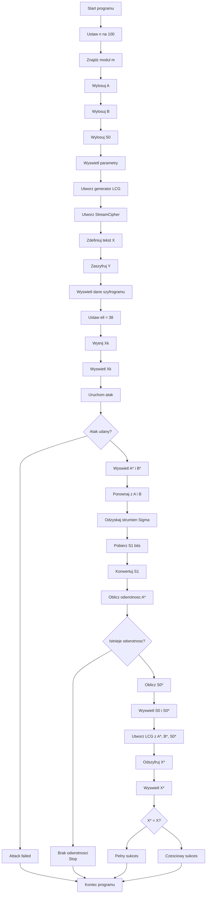

# Kryptografia i kryptoanaliza
## Laboratorium 4
### Grupa 1ID24B
### Autorzy: Iga Ozimska, Eliza Janus

### Zadanie 1
Głównym zadaniem jest implementacja pełnego
systemu kryptograficznego opartego na generatorze LCG, a następnie wykonanie ataku algebraicznego, 
który ujawni fundamentalną słabość tego podejścia. Laboratorium ma na celu uzmysłowienie różnicy między 
zwykłymi generatorami pseudolosowymi a generatorami kryptograficznie bezpiecznymi.

### Schemat blokowy 

#### Implementacja
Plik zad1.py
``` Python
plik zad1.py
import random
from math_utils import find_prime, mod_inv
from lcg import LCG
from cipher import StreamCipher
from attack import attack, recover_stream, bits_to_int


# ------------------------------------------------------------
# Funkcja: demo_attack()
# Wejście:
#   (brak argumentów wejściowych)
#
# Wyjście:
#   (brak zwracanej wartości – funkcja wypisuje wyniki na ekran)
#
# Działanie:
#   Funkcja demonstruje pełny atak known-plaintext na
#   kryptosystem strumieniowy oparty o generator LCG
#   zgodnie z Algorytmem 8 z instrukcji laboratoryjnej.
#
#   Przebieg działania:
#
#   • Faza I:
#       - generuje parametry kryptosystemu: moduł m (liczba pierwsza),
#         współczynniki A, B oraz stan początkowy S0.
#       - wypisuje ich wartości.
#
#   • Faza II:
#       - tworzy instancję generatora LCG i strumieniowego szyfru,
#       - szyfruje dłuższy tekst ASCII,
#       - pokazuje długość tekstu oraz pierwsze 100 bitów szyfrogramu.
#
#   • Faza III:
#       - zakłada możliwość poznania pierwszych 38 znaków tekstu jawnego,
#       - uruchamia funkcję attack() odzyskującą parametry A* i B*,
#       - wypisuje wyniki lub informuje o niepowodzeniu ataku.
#
#   • Faza IV:
#       - porównuje odzyskane A* i B* z prawdziwymi wartościami A i B.
#
#   • Faza V:
#       - odzyskuje S0* na podstawie strumienia klucza Σ oraz obliczonego A* i B*,
#       - porównuje S0* z oryginalnym S0.
#
#   • Faza VI:
#       - buduje „atakujący” generator LCG z parametrami (A*, B*, S0*),
#       - deszyfruje cały szyfrogram,
#       - wypisuje odzyskaną wiadomość oraz informuje czy atak był w pełni skuteczny.
#
# ------------------------------------------------------------
def demo_attack():
    n = 100
    print("=== FAZA I: Generowanie parametrów kryptosystemu ===")
    m = find_prime(1 << n)
    A = random.randint(1, m - 1)
    B = random.randint(0, m - 1)
    S0 = random.randint(0, m - 1)
    print(f"n = {n}")
    print(f"m (moduł, liczba pierwsza) = {m}")
    print(f"A = {A}")
    print(f"B = {B}")
    print(f"S0 = {S0}")

    print("\n=== FAZA II: Szyfrowanie wiadomości ===")
    G = LCG(A, B, m, S0, n)
    cipher = StreamCipher(G)

    X = (
        "This is an example of a long plaintext message used in a cryptography lab. "
        "Its purpose is to demonstrate that a stream cipher based on a linear congruential "
        "generator (LCG) is vulnerable to a known-plaintext attack and can be broken."
    )
    Y = cipher.encrypt(X)
    print(f"Length of X (chars) = {len(X)}")
    print("First 100 bits of ciphertext Y:", ''.join(str(b) for b in Y[:100]))

    print("\n=== FAZA III: Wykonanie ataku kryptanalitycznego ===")
    ell = 38  
    Xk = X[:ell]
    print(f"Attack assumption: first {ell} characters of plaintext are known (8 * {ell} bits).")
    print("Known fragment Xk:", repr(Xk))

    result = attack(Xk, Y, m, n)
    if result is None:
        print("Attack failed.")
        return
    A_star, B_star = result
    print("Recovered parameters: ")
    print(f"A* = {A_star}")
    print(f"B* = {B_star}")

    print("\n=== FAZA IV: Verification of recovered parameters ===")
    print(f"A == A* ? {A == A_star}")
    print(f"B == B* ? {B == B_star}")

    print("\n=== FAZA V: Recovering initial state S0 ===")
    Sigma = recover_stream(Xk, Y)
    S1_bits = Sigma[0:n]
    S1 = bits_to_int(S1_bits)

    A_inv = mod_inv(A_star, m)
    if A_inv is None:
        print("No modular inverse for A* – cannot recover S0.")
        return
    S0_star = ((S1 - B_star) * A_inv) % m
    print(f"Original S0 = {S0}")
    print(f"Recovered S0* = {S0_star}")
    print(f"S0 == S0* ? {S0 == S0_star}")

    print("\n=== FAZA VI: Decrypting the whole message ===")
    G_star = LCG(A_star, B_star, m, S0_star, n)
    cipher_star = StreamCipher(G_star)
    X_star = cipher_star.decrypt(Y, S0_star)
    print("Recovered message X*:")
    print(X_star)

    if X_star == X:
        print("\nResult: SUCCESS – message fully recovered.")
    else:
        same = sum(1 for a, b in zip(X, X_star) if a == b)
        similarity = same / len(X)
        print("\nResult: partial success.")
        print(f"Character match: {same}/{len(X)} (~{similarity:.2%})")


if __name__ == "__main__":
    demo_attack()
```
Plik attack.py
``` Python
from typing import List, Optional, Tuple
from math import gcd

from cipher import to_bits
from math_utils import mod_inv


# ------------------------------------------------------------
# Funkcja: bits_to_int(bits)
# Wejście:
#   bits (List[int]) – lista bitów 0/1, reprezentująca liczbę
#                      w kodzie binarnym (MSB jako pierwszy element).
#
# Wyjście:
#   int – liczba całkowita odpowiadająca zapisowi binarnemu
#         podanemu w liście bits. Dla pustej listy zwracane jest 0.
#
# Działanie:
#   Funkcja konwertuje sekwencję bitów na liczbę całkowitą.
#   Bity są najpierw łączone w ciąg znaków '0'/'1', a następnie
#   interpretowane jako liczba w systemie binarnym (podstawa 2).
# ------------------------------------------------------------
def bits_to_int(bits: List[int]) -> int:
    if not bits:
        return 0
    return int(''.join(str(b) for b in bits), 2)


# ------------------------------------------------------------
# Funkcja: recover_stream(known_plaintext, ciphertext_bits)
# Wejście:
#   known_plaintext (str)      – znany fragment tekstu jawnego X_k,
#   ciphertext_bits (List[int]) – szyfrogram Y zapisany jako lista bitów.
#
# Wyjście:
#   List[int] – lista bitów Σ (sigma_stream) będąca odzyskanym
#               strumieniem klucza dla znanego fragmentu tekstu.
#
# Działanie:
#   1. Konwertuje znany tekst jawny na bity za pomocą to_bits().
#   2. Sprawdza, czy długość szyfrogramu (w bitach) jest wystarczająca.
#      Jeśli nie – rzuca wyjątek ValueError.
#   3. Dla każdej pozycji i wykonuje operację XOR:
#         s_i = x_i ⊕ y_i
#      gdzie x_i – i-ty bit znanego tekstu, y_i – i-ty bit szyfrogramu.
#   4. Zwraca listę bitów strumienia klucza Σ dla zakresu,
#      w którym tekst jawny jest znany.
# ------------------------------------------------------------
def recover_stream(known_plaintext: str, ciphertext_bits: List[int]) -> List[int]:
    
    xi_k = to_bits(known_plaintext)
    if len(xi_k) > len(ciphertext_bits):
        raise ValueError("Szyfrogram jest krótszy niż znany tekst (w bitach).")

    sigma_stream: List[int] = []
    for i in range(len(xi_k)):
        s_i = xi_k[i] ^ ciphertext_bits[i]
        sigma_stream.append(s_i)
    return sigma_stream


# ------------------------------------------------------------
# Funkcja: attack(known_plaintext, ciphertext_bits, m, n)
# Wejście:
#   known_plaintext (str)       – znany fragment tekstu jawnego X_k,
#   ciphertext_bits (List[int]) – pełny szyfrogram Y jako lista bitów,
#   m (int)                     – moduł LCG (liczba pierwsza),
#   n (int)                     – liczba bitów jednego stanu generatora.
#
# Wyjście:
#   Optional[Tuple[int, int]]:
#       - (A, B) – odzyskane parametry LCG, jeśli atak się powiedzie,
#       - None  – w przypadku niepowodzenia (np. zbyt mało danych,
#                 brak odwrotności modularnej, błąd weryfikacji).
#
# Działanie:
#   Implementacja Algorytmu 7 (atak known-plaintext na LCG):
#
#   1. Konwertuje znany tekst jawny na bity (ξ_k) i sprawdza, czy
#      szyfrogram jest wystarczająco długi. W przeciwnym razie
#      wypisuje komunikat błędu i zwraca None.
#
#   2. Odzyskuje strumień klucza Σ dla znanego fragmentu:
#        σ_i = ξ_k[i] ⊕ Y[i]
#
#   3. Sprawdza, czy długość Σ jest co najmniej 3 * n bitów.
#      Jeśli nie – atak nie jest możliwy (brak 3 stanów).
#
#   4. Dzieli Σ na trzy kolejne stany generatora:
#        S1, S2, S3 – każdy po n bitów, następnie konwertuje je
#        na liczby całkowite.
#
#   5. Tworzy układ równań:
#        S2 ≡ A·S1 + B (mod m)
#        S3 ≡ A·S2 + B (mod m)
#      i oblicza:
#        λ = (S2 - S3) mod m,
#        μ = (S1 - S2) mod m.
#
#   6. Oblicza gcd(μ, m). Jeśli gcd != 1, wypisuje ostrzeżenie o
#      wieloznaczności rozwiązań (ale kontynuuje próbę ataku).
#
#   7. Oblicza odwrotność modularną μ^{-1} przy użyciu mod_inv().
#      Jeśli odwrotność nie istnieje – wypisuje komunikat i zwraca None.
#
#   8. Wyznacza:
#        A = (λ · μ^{-1}) mod m,
#        B = (S2 - S1 · A) mod m.
#
#   9. Weryfikuje poprawność rozwiązania, obliczając:
#        S3_hat = (A · S2 + B) mod m
#      i porównuje ją z S3. W przypadku niezgodności wypisuje
#      komunikat o błędnej weryfikacji i zwraca None.
#
#   10. W przypadku udanej weryfikacji zwraca parę (A, B) jako
#       odzyskane parametry generatora LCG.
# ------------------------------------------------------------
def attack(known_plaintext: str, ciphertext_bits: List[int],
           m: int, n: int) -> Optional[Tuple[int, int]]:
    xi_k = to_bits(known_plaintext)
    if len(xi_k) > len(ciphertext_bits):
        print("[ATAK] Błąd: szyfrogram krótszy niż znany tekst.")
        return None

    sigma_stream: List[int] = []
    for i in range(len(xi_k)):
        s_i = xi_k[i] ^ ciphertext_bits[i]
        sigma_stream.append(s_i)

    if len(sigma_stream) < 3 * n:
        print("[ATAK] Niewystarczająca długość znanego fragmentu (mniej niż 3n bitów).")
        return None

    S1_bits = sigma_stream[0:n]
    S2_bits = sigma_stream[n:2*n]
    S3_bits = sigma_stream[2*n:3*n]

    S1 = bits_to_int(S1_bits)
    S2 = bits_to_int(S2_bits)
    S3 = bits_to_int(S3_bits)

    lam = (S2 - S3) % m  
    mu = (S1 - S2) % m   

    delta = gcd(mu, m)
    if delta != 1:
        print("[ATAK] Ostrzeżenie: gcd(S1 - S2, m) != 1 -> wieloznaczność rozwiązań (delta =", delta, ")")

    mu_inv = mod_inv(mu, m)
    if mu_inv is None:
        print("[ATAK] Brak odwrotności modularnej, atak nieudany.")
        return None

    A = (lam * mu_inv) % m
    B = (S2 - S1 * A) % m

    S3_hat = (A * S2 + B) % m
    if S3_hat != S3:
        print("[ATAK] Weryfikacja nieudana: obliczony S3_hat != S3.")
        return None

    return A, B

```
Plik cipher.py
``` Python
from typing import List
from lcg import LCG


# ------------------------------------------------------------
# Funkcja: to_bits(text)
# Wejście:
#   text (str) – tekst wejściowy zapisany w ASCII.
#
# Wyjście:
#   List[int] – lista bitów (0/1), gdzie każdy znak tekstu
#   jest zamieniany na 8-bitową reprezentację binarną.
#
# Działanie:
#   - Iteruje po każdym znaku w tekście.
#   - Konwertuje znak na jego kod ASCII (ord).
#   - Sprawdza, czy znak mieści się w zakresie 0–255.
#   - Zamienia kod ASCII na 8-bitowy ciąg znaków '0'/'1'.
#   - Dodaje kolejne bity do listy wynikowej.
#
# Zastosowanie:
#   Funkcja używana do konwersji tekstu jawnego przed szyfrowaniem
#   oraz do konwersji znanego fragmentu w ataku known-plaintext.
# ------------------------------------------------------------
def to_bits(text: str) -> List[int]:
    bits: List[int] = []
    for ch in text:
        byte = ord(ch)
        if byte > 255:
            raise ValueError("Używaj tylko znaków ASCII (kod < 256).")
        bin_str = format(byte, '08b')
        bits.extend(int(b) for b in bin_str)
    return bits


# ------------------------------------------------------------
# Funkcja: to_text(bits)
# Wejście:
#   bits (List[int]) – lista bitów (0/1).
#
# Wyjście:
#   str – odtworzony tekst ASCII.
#
# Działanie:
#   - Dzieli listę bitów na grupy po 8 bitów.
#   - Każde 8 bitów zamienia na kod ASCII (int).
#   - Każdy kod zamienia na znak (chr).
#   - Łączy wszystkie znaki w jeden string.
#
# Uwagi:
#   - Jeśli liczba bitów nie jest podzielna przez 8,
#     nadmiarowe bity na końcu są ignorowane.
#
# Zastosowanie:
#   Używana podczas deszyfrowania, kiedy trzeba zamienić
#   zrekonstruowany strumień bitów z powrotem na tekst.
# ------------------------------------------------------------
def to_text(bits: List[int]) -> str:
    chars = []
    length = len(bits) - (len(bits) % 8)
    for i in range(0, length, 8):
        byte_bits = bits[i:i+8]
        value = int(''.join(str(b) for b in byte_bits), 2)
        chars.append(chr(value))
    return ''.join(chars)

# ------------------------------------------------------------
# Klasa: StreamCipher
#
# Konstruktor:
#   generator (LCG) – instancja generatora LCG, który
#                     dostarcza kolejne bity strumienia klucza.
#
# Działanie:
#   Klasa implementuje szyfrowanie i deszyfrowanie tekstu
#   za pomocą operacji XOR między bitami danych a bitami,
#   które generuje LCG.
#
# Uwaga:
#   - Operacja XOR jest symetryczna, więc ta sama metoda
#     może służyć do szyfrowania i deszyfrowania, jeśli tylko
#     generator jest w tym samym stanie początkowym.
# ------------------------------------------------------------
class StreamCipher:
    # --------------------------------------------------------
    # Funkcja: __init__(generator)
    # Wejście:
    #   generator (LCG) – obiekt generatora LCG.
    #
    # Wyjście:
    #   brak (inicjalizuje wewnętrzny stan klasy).
    #
    # Działanie:
    #   Zapamiętuje instancję generatora, z której będą pobierane
    #   kolejne bity strumienia przy szyfrowaniu/deszyfrowaniu.
    # --------------------------------------------------------
    def __init__(self, generator: LCG):
        self.generator = generator

    # --------------------------------------------------------
    # Funkcja: encrypt(plaintext)
    # Wejście:
    #   plaintext (str) – tekst jawny w ASCII.
    #
    # Wyjście:
    #   List[int] – szyfrogram zapisany jako lista bitów.
    #
    # Działanie:
    #   - Konwertuje tekst jawny na bity (to_bits).
    #   - Dla każdego bitu:
    #       β (bit tekstu jawnego)
    #       κ (bit strumienia z generatora)
    #       γ = β XOR κ (bit szyfrogramu)
    #   - Zwraca listę bitów szyfrogramu.
    #
    # Uwaga:
    #   Brak resetu generatora — szyfrowanie zaczyna się
    #   od jego aktualnego stanu (czyli S0 przy pierwszym użyciu).
    # --------------------------------------------------------
    def encrypt(self, plaintext: str) -> list[int]:
        xi = to_bits(plaintext)
        Y: list[int] = []
        for beta in xi:
            kappa = self.generator.next_bit()
            gamma = beta ^ kappa
            Y.append(gamma)
        return Y

    # --------------------------------------------------------
    # Funkcja: decrypt(ciphertext_bits, seed)
    # Wejście:
    #   ciphertext_bits (List[int]) – lista bitów szyfrogramu,
    #   seed (int) – stan początkowy generatora S0,
    #                który musi być taki sam jak użyty przy szyfrowaniu.
    #
    # Wyjście:
    #   str – odszyfrowany tekst ASCII.
    #
    # Działanie:
    #   - Resetuje generator do stanu S0.
    #   - Generuje kolejne bity κ z LCG.
    #   - XORuje każdy bit szyfrogramu γ z κ, aby odzyskać β.
    #   - Konwertuje listę bitów wynikowych z powrotem na tekst ASCII.
    #
    # Uwaga:
    #   Jeśli atakujący odtworzy poprawne A*, B*, S0*,
    #   funkcja zwróci oryginalny tekst jawny.
    # --------------------------------------------------------
    def decrypt(self, ciphertext_bits: list[int], seed: int) -> str:
        self.generator.reset(seed)
        xi: list[int] = []
        for gamma in ciphertext_bits:
            kappa = self.generator.next_bit()
            beta = gamma ^ kappa
            xi.append(beta)
        return to_text(xi)

```
Plik lcg.py
``` Python
class LCG:
    # ------------------------------------------------------------
    # Klasa: LCG (Linear Congruential Generator)
    #
    # Reprezentuje liniowy generator kongruencyjny służący do
    # generowania kolejnych stanów σ_i oraz bitów strumienia klucza.
    #
    # Wzór LCG:
    #     S_{i+1} = (A * S_i + B) mod m
    #
    # Generator przechowuje bieżący stan σ oraz jego binarną
    # reprezentację τ (lista bitów), z której pobierane są kolejne bity.
    #
    # Pola:
    #   A, B, m – parametry generatora,
    #   n       – liczba bitów na stan (typowo 100),
    #   sigma   – bieżący stan liczbowy,
    #   tau     – aktualny stan jako lista bitów,
    #   pi      – indeks kolejnego bitu do pobrania z tau.
    # ------------------------------------------------------------

    # ------------------------------------------------------------
    # Funkcja: __init__(A, B, m, seed, n=100)
    # Wejście:
    #   A (int)     – mnożnik LCG,
    #   B (int)     – przesunięcie addytywne,
    #   m (int)     – moduł arytmetyki, zwykle liczba pierwsza,
    #   seed (int)  – wartość początkowa S0,
    #   n (int)     – liczba bitów na każdy stan (domyślnie 100).
    #
    # Wyjście:
    #   brak (konstruktor inicjalizuje obiekt).
    #
    # Działanie:
    #   - Sprawdza poprawność parametrów (A, B i seed muszą być < m).
    #   - Zapisuje parametry generatora jako pola obiektu.
    #   - Wywołuje _init_state(seed), które ustawia generator
    #     w stanie początkowym i przygotowuje go do generowania bitów.
    # ------------------------------------------------------------
    def __init__(self, A: int, B: int, m: int, seed: int, n: int = 100):
        if not (0 <= seed < m):
            raise ValueError("Seed musi być z zakresu [0, m).")
        if not (0 < A < m):
            raise ValueError("A musi być z zakresu (0, m).")
        if not (0 <= B < m):
            raise ValueError("B musi być z zakresu [0, m).")
        self.A = A
        self.B = B
        self.m = m
        self.n = n
        self._init_state(seed)

    # ------------------------------------------------------------
    # Funkcja: _init_state(seed)
    # Wejście:
    #   seed (int) – nowy stan początkowy S0.
    #
    # Wyjście:
    #   brak (ustawia stan obiektu).
    #
    # Działanie:
    #   - Ustawia bieżący stan sigma na wartość seed.
    #   - Czyści tau (będące binarną reprezentacją stanu).
    #   - Ustawia pi = n, aby zmusić generator do odświeżenia stanu
    #     przy pierwszym next_bit() (tau będzie wówczas puste).
    #
    # Uwagi:
    #   Jest to metoda pomocnicza dla __init__ i reset().
    # ------------------------------------------------------------
    def _init_state(self, seed: int):
        self.sigma = seed         # bieżący stan liczbowy
        self.tau = []             # lista bitów reprezentująca stan
        self.pi = self.n          # wymusza wygenerowanie nowego stanu

    # ------------------------------------------------------------
    # Funkcja: reset(seed)
    # Wejście:
    #   seed (int) – nowy stan początkowy.
    #
    # Wyjście:
    #   brak.
    #
    # Działanie:
    #   - Sprawdza poprawność seeda.
    #   - Resetuje generator do podanego stanu początkowego,
    #     wywołując _init_state(seed).
    #
    # Zastosowanie:
    #   Niezbędne w deszyfrowaniu, aby generator zaczął generować
    #   bity od dokładnie tego samego miejsca, co przy szyfrowaniu.
    # ------------------------------------------------------------
    def reset(self, seed: int):
        if not (0 <= seed < self.m):
            raise ValueError("Seed musi być z zakresu [0, m).")
        self._init_state(seed)

    # ------------------------------------------------------------
    # Funkcja: _refresh_state()
    # Wejście:
    #   brak.
    #
    # Wyjście:
    #   brak (aktualizuje sigma, tau i pi).
    #
    # Działanie:
    #   - Oblicza kolejny stan LCG:
    #         sigma = (A * sigma + B) mod m
    #   - Konwertuje sigma na n-bitową reprezentację binarną (τ):
    #         tau = lista bitów 0/1
    #   - Ustawia pi = 0, aby kolejne next_bit() pobierało z tau.
    #
    # Zastosowanie:
    #   Wywoływana automatycznie, gdy wykorzystano wszystkie bity
    #   bieżącego stanu lub tau jest puste.
    # ------------------------------------------------------------
    def _refresh_state(self):
        self.sigma = (self.A * self.sigma + self.B) % self.m
        bin_str = format(self.sigma, f'0{self.n}b')
        self.tau = [int(b) for b in bin_str]
        self.pi = 0

    # ------------------------------------------------------------
    # Funkcja: next_bit()
    # Wejście:
    #   brak.
    #
    # Wyjście:
    #   int – kolejny bit strumienia klucza (0 lub 1).
    #
    # Działanie:
    #   - Jeśli wszystkie bity τ zostały już pobrane (pi >= n)
    #     lub τ jest puste, wywołuje _refresh_state(), generując
    #     nowy stan.
    #
    #   - Pobiera bit τ[pi] i zwiększa indeks pi.
    #
    #   - Zwraca ten bit jako element strumienia klucza.
    #
    # Uwagi:
    #   Jest to implementacja Algorytmu 1 z instrukcji:
    #       β = τ[π], π ← π + 1
    #
    #   Generator zwraca po 1 bicie, mimo że każdy stan ma n bitów,
    #   aby umożliwić strumieniowe szyfrowanie XOR bit po bicie.
    # ------------------------------------------------------------
    def next_bit(self) -> int:
        if self.pi >= self.n or not self.tau:
            self._refresh_state()
        beta = self.tau[self.pi]
        self.pi += 1
        return beta
```
Plik mathutils.py
``` Python
import random
from typing import Tuple, Optional


# ------------------------------------------------------------
# Funkcja: ext_gcd(a, b)
# Wejście:
#   a (int), b (int) – liczby całkowite, dla których
#                      obliczany jest rozszerzony algorytm Euklidesa.
#
# Wyjście:
#   Tuple(delta, alpha, beta), gdzie:
#       delta – gcd(a, b),
#       alpha, beta – współczynniki całkowite spełniające równanie:
#               a * alpha + b * beta = gcd(a, b)
#
# Działanie:
#   - Implementuje rekurencyjny rozszerzony algorytm Euklidesa.
#   - Jeżeli a = 0, zwraca (b, 0, 1).
#   - W przeciwnym wypadku rozkłada gcd(b % a, a) i oblicza
#     współczynniki alpha, beta.
#
# Zastosowanie:
#   Funkcja jest niezbędna do obliczania odwrotności modularnej.
# ------------------------------------------------------------
def ext_gcd(a: int, b: int) -> Tuple[int, int, int]:
    if a == 0:
        return b, 0, 1
    delta, alpha1, beta1 = ext_gcd(b % a, a)
    alpha = beta1 - (b // a) * alpha1
    beta = alpha1
    return delta, alpha, beta


# ------------------------------------------------------------
# Funkcja: mod_inv(theta, m)
# Wejście:
#   theta (int) – liczba, której odwrotność modularna ma zostać obliczona,
#   m (int)     – moduł arytmetyki modularnej.
#
# Wyjście:
#   int – odwrotność modularna theta mod m (jeśli istnieje),
#   None – jeśli gcd(theta, m) ≠ 1, czyli odwrotność nie istnieje.
#
# Działanie:
#   - Oblicza gcd(theta, m) oraz współczynniki równania diofantycznego
#     za pomocą ext_gcd().
#   - Jeżeli gcd = 1, odwrotność modularna istnieje i wynosi:
#         alpha mod m
#   - Jeśli gcd != 1, zwraca None.
#
# Zastosowanie:
#   Potrzebne w odwracaniu równań LCG podczas ataku kryptanalitycznego.
# ------------------------------------------------------------
def mod_inv(theta: int, m: int) -> Optional[int]:
    theta_mod = theta % m
    delta, alpha, _ = ext_gcd(theta_mod, m)
    if delta != 1:
        return None
    return (alpha % m + m) % m


# ------------------------------------------------------------
# Funkcja: is_probable_prime(n, k=10)
# Wejście:
#   n (int) – liczba testowana na pierwszość,
#   k (int) – liczba iteracji testu Millera–Rabina (domyślnie 10).
#
# Wyjście:
#   bool – True, jeśli n jest prawdopodobnie pierwsza,
#          False, jeśli na pewno jest złożona.
#
# Działanie:
#   - Implementacja probabilistycznego testu Millera–Rabina.
#   - Rozkłada n−1 = 2^r * d, z d nieparzystym.
#   - Wykonuje k prób:
#       • losuje bazę testową a,
#       • sprawdza warunek a^d ≡ 1 (mod n)
#       • lub a^{2^i d} ≡ -1 (mod n) dla i < r
#   - Jeżeli którykolwiek test zostanie oblany, n jest złożone.
#   - Jeżeli wszystkie testy przejdą, n jest „prawdopodobnie” pierwsza.
#
# Zastosowanie:
#   Funkcja używana w find_prime() do generowania dużych liczb pierwszych.
# ------------------------------------------------------------
def is_probable_prime(n: int, k: int = 10) -> bool:
    if n < 2 or (n > 2 and n % 2 == 0):
        return False
    if n in (2, 3):
        return True

    # rozkład n-1 = 2^r * d (Miller–Rabin)
    d = n - 1
    r = 0
    while d % 2 == 0:
        d //= 2
        r += 1

    for _ in range(k):
        a = random.randrange(2, n - 1)  # baza testowa
        x = pow(a, d, n)
        if x in (1, n - 1):
            continue
        for _ in range(r - 1):
            x = pow(x, 2, n)
            if x == n - 1:
                break
        else:
            return False
    return True


# ------------------------------------------------------------
# Funkcja: find_prime(min_value, k=10)
# Wejście:
#   min_value (int) – minimalna wartość, od której rozpoczyna się szukanie,
#   k (int) – liczba rund testu Millera–Rabina.
#
# Wyjście:
#   int – liczba pierwsza ≥ min_value.
#
# Działanie:
#   - Jeśli min_value ≤ 2, zwraca 2.
#   - W przeciwnym razie testuje kolejne liczby nieparzyste,
#     zaczynając od min_value (lub min_value+1 jeśli parzyste).
#   - Dla każdego kandydata wykonuje test is_probable_prime().
#   - Zwraca pierwszą liczbę, która przejdzie test.
#
# Zastosowanie:
#   Używane przy generowaniu modułu m (liczby pierwszej ~2^n)
#   w głównym programie demonstracyjnym.
# ------------------------------------------------------------
def find_prime(min_value: int, k: int = 10) -> int:
    if min_value <= 2:
        return 2
    candidate = min_value
    if candidate % 2 == 0:
        candidate += 1

    while True:
        if is_probable_prime(candidate, k=k):
            return candidate
        candidate += 2

```

#### Wyniki
``` sh
zad1.py
```
#### Pytania kontrolne
1. Dlaczego klucz o długości 300 bitów nie zapewnia bezpieczeństwa?

Choć klucz 300-bitowy sugerowałby odporność na ataki siłowe na poziomie 
2^(− 300), to w omawianym systemie szyfrowania długość klucza nie ma realnego znaczenia dla bezpieczeństwa. 
Wynika to z faktu, że generator LCG posiada strukturę liniową, którą można wykorzystać do przeprowadzenia ataku 
algebraicznego, omijającego konieczność przeszukiwania przestrzeni kluczy.Odzyskanie parametrów LCG sprowadza się do prostych operacji modularnych (m.in. obliczania odwrotności modularnej), 
które są wielomianowe, a nie wykładnicze. W rezultacie atak jest szybki i skuteczny nawet przy kluczach o długości setek bitów.

2. Minimalna ilość znanego tekstu jawnego wymagana do ataku.
Generator LCG ma dwie nieznane wartości (A i B), które można wyznaczyć z dwóch niezależnych równań. Aby je uzyskać, konieczne jest posiadanie trzech kolejnych stanów generatora:
S1, S2, S3. Ponieważ każdy stan LCG ma długość n=100 bitów, minimalnie potrzeba: 3n=300 bitów, czyli tylu bitów strumienia klucza, które możemy wydobyć z 300 bitów znanego tekstu jawnego.
W przypadku, gdy gcd (S1−S2,m)=\1, układ równań ma wiele rozwiązań. Wówczas konieczne może być wykorzystanie dodatkowego stanu, co oznacza potrzebę posiadania co najmniej 400 bitów znanego strumienia.

3. Czy zwiększenie rozmiaru modułu do 256 lub 512 bitów zwiększa bezpieczeństwo?
Zwiększenie rozmiaru modułu m nie usuwa podatności systemu na atak algebraiczny. Wynika to z tego, że:
Struktura generatora pozostaje liniowa, niezależnie od długości liczb.
Atak polega na rozwiązaniu układu równań modularnych, a operacje takie jak rozszerzony algorytm Euklidesa czy obliczanie odwrotności modularnej mają złożoność wielomianową w liczbie bitów modułu.
Zwiększenie bitowości m jedynie powiększa rozmiary liczb w obliczeniach, ale nie wpływa na bezpieczeństwo strukturalne generatora.
Dlatego generator LCG będzie podatny nawet przy modułach 256-, 512- czy 2048-bitowych – fundamentalny problem pozostaje ten sam.

4. Różnice między PRNG a CSPRNG
Generator pseudolosowy (PRNG) taki jak LCG nie jest przeznaczony do zastosowań kryptograficznych. Kryptograficzny generator pseudolosowy (CSPRNG) musi spełniać znacznie bardziej rygorystyczne wymagania:

- Nieprzewidywalność przyszłych wartości (forward security)
Nawet znając dowolnie długi fragment wyjścia, przeciwnik nie może przewidzieć kolejnych bitów lepiej niż przez losowe zgadywanie. LCG tej właściwości nie posiada — znajomość kilku stanów pozwala przewidzieć całą przyszłą sekwencję.

- Niemożność odtworzenia stanu wewnętrznego
CSPRNG powinien uniemożliwiać odzyskanie stanu wewnętrznego z obserwacji wyjścia. W LCG jest to proste, gdyż sekwencja stanów wynika z równań liniowych.

- Brak korelacji i odporność na testy statystyczne
Ciągi generowane przez CSPRNG muszą przechodzić zaawansowane testy losowości i nie mogą posiadać wykrywalnych zależności. LCG wykazuje silne korelacje w wymiarach wielowymiarowych i oblewa testy statystyczne wysokiego rzędu.
Kluczową różnicą jest to, że CSPRNG korzysta z nieliniowych funkcji jednokierunkowych, co radykalnie utrudnia odwrócenie procesu generowania bitów — odwrotnie niż w przypadku LCG.

5. Trzy realistyczne scenariusze wystąpienia znanego tekstu jawnego
- Nagłówki protokołów sieciowych
W protokołach takich jak HTTP, SMTP czy FTP występują stałe i przewidywalne pola (np. „GET /”, „Host:”). Jeśli są szyfrowane prostym szyfrem strumieniowym, służą jako naturalne źródło znanego tekstu.

- Nagłówki plików o standardowym formacie
Wiele formatów plików zaczyna się od charakterystycznych podpisów („magic numbers”), np. %PDF-, 89 50 4E 47 (PNG), FF D8 FF (JPEG). Atakujący, przechwytując zaszyfrowany plik, zna początek tekstu jawnego.

- Szablony komunikatów systemowych

Automatyczne wiadomości, raporty logów, szablony e-maili i inne strukturalnie powtarzalne treści zawierają przewidywalne fragmenty („Hello”, „Dear user”). W takich przypadkach wzorzec tekstu można łatwo przewidzieć.
We wszystkich tych scenariuszach znany plaintext nie jest wynikiem błędu użytkownika, lecz naturalnym elementem komunikacji.

6. Atak przy znanym tekście nie znajdującym się na początku wiadomości

Atak można przeprowadzić nawet wtedy, gdy znany fragment tekstu znajduje się w środku lub na końcu wiadomości.
Jeśli znany fragment zaczyna się na pozycji k bitów od początku strumienia:

Szukamy w odzyskanym ciągu trzech kolejnych stanów generatora, czyli trzech bloków po 100 bitów.
Przesunięcie o k bitów wymaga jedynie korekty indeksowania podczas wycinania.
Jeśli pozycja znanego fragmentu nie jest znana

Atakujący może:
przesuwać okno długości 300 bitów po strumieniu,
dla każdego okna próbować odzyskać (A,B) i weryfikować równania lub próbować odszyfrować resztę wiadomości.
Atak nadal jest wykonalny — wymaga jedynie przeszukania możliwych przesunięć.