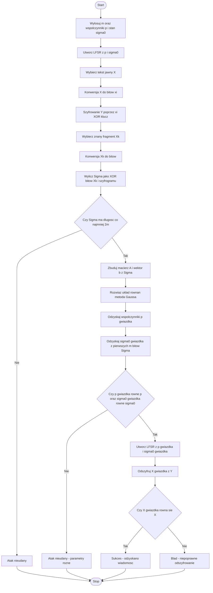
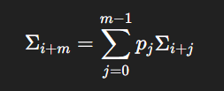

# Kryptografia i kryptoanaliza
## Laboratorium 5
### Grupa 1ID24B
### Autorzy: Iga Ozimska, Eliza Janus

### Zadanie 1
Część pierwsza: Implementacja generatora LFSR
Należy zaimplementować klasę reprezentującą liniowy rejestr przesuwny ze sprzężeniem zwrotnym zgodnie z
poniższym algorytmem generowania pojedynczego bitu strumienia klucza.
Część druga: Implementacja kryptosystemu strumieniowego
Należy utworzyć klasę realizującą kryptosystem strumieniowy, która wykorzystuje zaimplementowany wcześniej generator LFSR. Kluczowe operacje szyfrowania i deszyfrowania przedstawiają poniższe algorytmy
Część trzecia: Funkcje pomocnicze do arytmetyki nad polem Galois
W ramach przygotowania do implementacji ataku należy zrealizować funkcje matematyczne niezbędne do
rozwiązywania układów równań liniowych nad polem Galois GF(2). Kluczowym elementem procedury odzyskiwania współczynników sprzężenia zwrotnego jest eliminacja Gaussa dostosowana do arytmetyki binarnej.
Część czwarta: Implementacja ataku
Należy zaimplementować funkcję przeprowadzającą atak known-plaintext na kryptosystem strumieniowy z
generatorem LFSR. Pełna procedura ataku przedstawiona jest w algorytmie poniżej.
Część piąta: Implementacja algorytmu Berlekampa-Masseya
Jako uzupełnienie głównego ataku opartego na eliminacji Gaussa, należy zaimplementować algorytm BerlekampaMasseya zgodnie z pseudokodem przedstawionym we wprowadzeniu teoretycznym.
Część szósta: Demonstracja pełnego ataku
Należy napisać program główny przeprowadzający kompletną demonstrację podatności kryptosystemu strumieniowego opartego na generatorze LFSR. Proces ataku składa się z pięciu wyraźnie wyodrębnionych faz,
które łącznie prowadzą od wygenerowania kryptosystemu do pełnego złamania i odzyskania oryginalnej wiadomości.
Część siódma: Eksperymenty i analiza
Po zaimplementowaniu podstawowego ataku należy przeprowadzić serię eksperymentów badających różne
aspekty bezpieczeństwa systemu. Eksperymenty te powinny być przeprowadzone systematycznie z zachowaniem odpowiedniej metodologii naukowej oraz dokładnym rejestrowaniem wyników.


### Schemat blokowy 

#### Implementacja
``` Python
import math
import random

# --------------------------------------------------------------
#  Funkcja: to_bits(text)
#
#  Wejście:
#      text (str) – tekst jawny.
#
#  Wyjście:
#      List[int] – lista bitów reprezentujących tekst.
#
#  Działanie:
#      Konwertuje tekst UTF-8 na listę bitów
#      poprzez odczytywanie każdego bajtu i wyciąganie bitów.
# --------------------------------------------------------------
def to_bits(text):
    bits = []
    for ch in text.encode("utf-8"):
        for i in range(8):
            bits.append((ch >> (7 - i)) & 1)
    return bits


# --------------------------------------------------------------
#  Funkcja: bits_to_text(bits)
#
#  Wejście:
#      bits (List[int]) – lista bitów kodujących tekst UTF-8.
#
#  Wyjście:
#      str – tekst zdekodowany z listy bitów.
#
#  Działanie:
#      Grupuje bity po 8, składa bajty i dekoduje UTF-8.
# --------------------------------------------------------------
def bits_to_text(bits):
    n = len(bits) - (len(bits) % 8)
    bits = bits[:n]
    out = []
    for i in range(0, len(bits), 8):
        byte = 0
        for b in bits[i:i+8]:
            byte = (byte << 1) | b
        out.append(byte)
    return bytes(out).decode("utf-8", errors="ignore")


# --------------------------------------------------------------
#  Klasa: LFSR
#
#  Opis:
#      Implementuje liniowy rejestr z przesuwaniem i sprzężeniem
#      zwrotnym (Linear Feedback Shift Register).
#
#  Wejście:
#      p (List[int]) – współczynniki sprzężenia zwrotnego p0..pm-1
#      state (List[int]) – stan początkowy σ0..σm-1
#
#  Metody:
#      next_bit() – generuje pojedynczy bit
#      generate(n) – generuje n bitów
#      reset() – resetuje stan rejestru
# --------------------------------------------------------------
class LFSR:
    def __init__(self, p, state):
        self.p = p[:]                # p0,...,pm-1
        self.state0 = state[:]       # sigma0,...,sigma(m-1)
        self.state = state[:]
        self.m = len(p)

    def reset(self, state=None):
        if state is None:
            self.state = self.state0[:]
        else:
            self.state = state[:]

    def next_bit(self):
        beta = self.state[0]       # output bit = σ0
        phi = 0
        for j in range(self.m):
            phi ^= (self.p[j] & self.state[j])
        self.state = self.state[1:] + [phi]
        return beta

    def generate(self, n):
        return [self.next_bit() for _ in range(n)]


# --------------------------------------------------------------
#  Klasa: StreamCipher
#
#  Opis:
#      Szyfr strumieniowy oparty na LFSR.
#
#  Wejście:
#      lfsr – obiekt klasy LFSR
#
#  Funkcje:
#      encrypt(text) – szyfruje tekst jawny
#      decrypt(Y,state0) – deszyfruje szyfrogram
# --------------------------------------------------------------
class StreamCipher:
    def __init__(self, lfsr):
        self.lfsr = lfsr

    def encrypt(self, text):
        bits = to_bits(text)
        Y = []
        for b in bits:
            k = self.lfsr.next_bit()
            Y.append(b ^ k)
        return Y

    def decrypt(self, Y, state0):
        self.lfsr.reset(state0)
        bits = []
        for y in Y:
            k = self.lfsr.next_bit()
            bits.append(y ^ k)
        return bits_to_text(bits)


# --------------------------------------------------------------
#  Funkcja: gauss_gf2(A, b)
#
#  Wejście:
#      A – macierz współczynników nad GF(2)
#      b – wektor prawej strony równania
#
#  Wyjście:
#      x – rozwiązanie układu A·x = b
#
#  Działanie:
#      Eliminacja Gaussa w polu GF(2):
#      – wybór pivotów,
#      – zerowanie kolumn,
#      – podstawianie wstecz.
# --------------------------------------------------------------
def gauss_gf2(A, b):
    A = [row[:] for row in A]
    b = b[:]
    n = len(A)

    for col in range(n):
        pivot = None
        for r in range(col, n):
            if A[r][col] == 1:
                pivot = r
                break
        if pivot is None:
            continue

        A[col], A[pivot] = A[pivot], A[col]
        b[col], b[pivot] = b[pivot], b[col]

        for r in range(n):
            if r != col and A[r][col] == 1:
                for c in range(col, n):
                    A[r][c] ^= A[col][c]
                b[r] ^= b[col]

    x = [0]*n
    for i in reversed(range(n)):
        acc = b[i]
        for j in range(i+1, n):
            acc ^= (A[i][j] & x[j])
        x[i] = acc
    return x


# --------------------------------------------------------------
#  Funkcja: berlekamp_massey(s)
#
#  Wejście:
#      s – ciąg bitów
#
#  Wyjście:
#      (C, L)
#        C – minimalny wielomian
#        L – długość LFSR generującego s
#
#  Działanie:
#      Implementacja algorytmu Berlekampa–Masseya nad GF(2).
# --------------------------------------------------------------
def berlekamp_massey(s):
    n = len(s)
    C = [1]
    B = [1]
    L = 0
    m = -1

    for N in range(n):
        d = s[N]
        for i in range(1, L+1):
            d ^= (C[i] & s[N-i])

        if d == 0:
            continue

        T = C[:]
        delta = N - m

        if len(C) < len(B) + delta:
            C += [0] * (len(B) + delta - len(C))

        for i in range(len(B)):
            C[i+delta] ^= B[i]

        if 2*L <= N:
            L = N + 1 - L
            B = T
            m = N

    return C, L


# --------------------------------------------------------------
#  Funkcja: attack(known_text, Y, m)
#
#  Wejście:
#      known_text (str) – znany fragment tekstu jawnego X_k
#      Y (List[int]) – szyfrogram Y w postaci bitów
#      m (int) – długość LFSR
#
#  Wyjście:
#      (p, sigma0)
#         p – współczynniki sprzężenia zwrotnego
#         sigma0 – stan początkowy LFSR
#
#  Działanie:
#      1. Odzyskuje strumień klucza: Sigma = X ⊕ Y.
#      2. Buduje macierz A i wektor b zgodnie z równaniami Σ.
#      3. Rozwiązuje układ równań metodą Gaussa nad GF(2).
#      4. Zwraca p oraz pierwsze m bitów Sigma jako σ0.
# --------------------------------------------------------------
def attack(known_text, Y, m):
    xi = to_bits(known_text)
    Sigma = [xi[i] ^ Y[i] for i in range(len(xi))]

    if len(Sigma) < 2*m:
        return None

    A = [[0]*m for _ in range(m)]
    b = [0]*m

    for i in range(m):
        for j in range(m):
            A[i][j] = Sigma[i+j]
        b[i] = Sigma[i+m]

    p = gauss_gf2(A, b)
    sigma0 = Sigma[:m]

    return p, sigma0


# --------------------------------------------------------------
#  Funkcja demonstracyjna: demo()
#
#  Wykonuje cały algorytm:
#      1. Generowanie losowego LFSR
#      2. Szyfrowanie wiadomości
#      3. Atak kryptograficzny
#      4. Weryfikacja poprawności
#      5. Deszyfrowanie odzyskanym kluczem
# --------------------------------------------------------------
def demo():
    print("FAZA I")
    m = 8
    p = [random.randint(0,1) for _ in range(m)]
    p[0] = 1
    sigma0 = [random.randint(0,1) for _ in range(m)]
    sigma0[0] = 1

    print("p =", p)
    print("sigma0 =", sigma0)

    L = LFSR(p, sigma0)
    cipher = StreamCipher(L)

    print("\nFAZA II")
    X = "Tajna wiadomosc"
    Y = cipher.encrypt(X)
    print("Szyfrogram:", Y[:32])

    print("\nFAZA III")
    Lmin_chars = math.ceil(2*m/8)
    Xk = X[:Lmin_chars]
    print("Znany plaintext:", Xk)

    res = attack(Xk, Y, m)
    if res is None:
        print("Atak nieudany.")
        return

    p_star, sigma_star = res
    print("p* =", p_star)
    print("sigma0* =", sigma_star)

    print("\nFAZA IV")
    print("Czy p == p* ?", p == p_star)
    print("Czy sigma0 == sigma0* ?", sigma0 == sigma_star)

    print("\nFAZA V")
    L2 = LFSR(p_star, sigma_star)
    cipher2 = StreamCipher(L2)
    X_rec = cipher2.decrypt(Y, sigma_star)
    print("Odszyfrowano:", X_rec)

    if X_rec == X:
        print("Sukces – wiadomość odzyskana.")
    else:
        print("Blad – wiadomość niezgodna.")


# --------------------------------------------------------------
#  Punkt wejścia programu
# --------------------------------------------------------------
if __name__ == "__main__":
    demo()

```

#### Wyniki
``` sh
python zad1.py
```
#### Pytania kontrolne
1. Złożoność liniowa sekwencji binarnej
Złożoność liniowa (linear complexity) to najmniejsza długość rejestru LFSR, który potrafi wygenerować daną sekwencję bitową.
Formalnie: jest to minimalna liczba bitów stanu, jaka pozwala na odtworzenie reszty sekwencji na podstawie zależności liniowej w GF(2).
Dlaczego ma to znaczenie?
- Sekwencja o niskiej złożoności liniowej jest kryptograficznie słaba — można ją łatwo odtworzyć, np. algorytmem Berlekampa–Masseya.
- Sekwencja o wysokiej złożoności liniowej jest trudniejsza do przewidzenia, więc bezpieczniejsza jako strumień klucza.
Zależność od wielomianu LFSR
Dla LFSR stopnia m, z wielomianem pierwotnym, maksymalna złożoność liniowa sekwencji wynosi: L = m
Jeżeli wielomian nie jest pierwotny, złożoność liniowa będzie niższa, ponieważ sekwencja ma krótszy okres lub spełnia dodatkowe zależności.
Dlaczego LFSR nigdy nie przekracza złożoności m?
Ponieważ każdy kolejny bit jest liniową kombinacją dokładnie m poprzednich bitów.
Nie da się uzyskać sekwencji o złożoności większej niż liczba bitów stanu generatora.

2. Algorytm Berlekampa–Masseya i jego zastosowanie
Na czym polega algorytm?
Algorytm Berlekampa–Masseya znajduje minimalny LFSR generujący zadaną sekwencję binarną.
Zwraca:
- minimalny wielomian charakterystyczny,
- jego stopień, czyli złożoność liniową sekwencji.
Użycie w kryptanalizie
Jeśli atakujący dostanie wystarczająco długi fragment sekwencji klucza (≥ 2m), może:
- zastosować Berlekampa–Masseya,
- odzyskać wielomian sprzężenia zwrotnego,
- odzyskać stan LFSR,
- odszyfrować cały szyfrogram.
Złożoność obliczeniowa
Berlekamp–Massey: O(n²)
Eliminacja Gaussa nad GF(2): również O(n³) w najgorszym przypadku
Kiedy preferujemy BM zamiast Gaussa?
- przy analizie bardzo długich sekwencji,
- gdy nie znamy struktury układu równań,
- gdy chcemy znaleźć minimalny, a nie dowolny LFSR.
Gauss rozwiązuje układ, który my budujemy świadomie.
BM znajduje rozwiązanie optymalne.

3. Wielomiany pierwotne i maksymalny okres LFSR
Czym jest wielomian pierwotny (prymitywny)?
To taki niepodzielny wielomian nad GF(2), którego stopień m zapewnia, że pierścień generuje element o maksymalnym okresie:
2^𝑚 − 1
Czyli sekwencja LFSR cykluje po wszystkich możliwych stanach poza „zerowym”.
LFSR z wielomianem pierwotnym
Jeżeli LFSR ma wielomian pierwotny stopnia m, to:
- generuje sekwencję o maksymalnym okresie 2^m – 1,
- oraz o maksymalnej złożoności liniowej L = m.
Dlaczego nie 2^m?
Bo LFSR nigdy nie opuszcza stanu 0 → 0 → 0 przy sprzężeniu liniowym.
Dlatego maksymalna długość cyklu = 2^m – 1.

4. Ataki korelacyjne na generatory złożone z wielu LFSR
Idea ataku korelacyjnego
Jeśli funkcja f nie jest odpowiednio nieliniowa, to:
- istnieją statystyczne zależności między wyjściem generatora a wyjściem pojedynczych rejestrów,
- atakujący może oszacować jakiś rejestr LFSR osobno, mimo że generator jest złożony.
Odporność na ataki korelacyjne
Odpowiednio zbudowana funkcja powinna mieć:
- dużą nieliniowość,
- niski stopień algebraiczny, 
- dobre widmo Walsh–Hadamard,
- brak korelacji ze zmiennymi wejściowymi.
Jeśli funkcja jest słaba możliwy jest atak oparty na korelacjach, który łamie generator dużo szybciej niż brute-force.

5. Zastosowania LFSR w praktycznych systemach kryptograficznych
LFSR były szeroko stosowane w systemach radiowych oraz lekkich szyfrach strumieniowych.
Przykłady:
A5/1 (GSM)
- trzy LFSR różnej długości,
- taktowane nieregularnie,
- dziś uznawany za łamliwy.
E0 (Bluetooth)
- cztery LFSR + funkcja nieliniowa,
- podatny na ataki korelacyjne.
Grain, Trivium (eSTREAM)
- nowoczesne lekkie szyfry,
- używają LFSR połączonych z NLFSR i nieliniowymi filtrami.
Ocena bezpieczeństwa dzisiaj
- proste LFSR = słabe kryptograficznie, bo liniowe, przewidywalne, łamane BM.
- dobre systemy muszą dodawać nieliniowość (NLFSR, filtry, decymacja).

6. Atak przy nieznanym m – strategia poszukiwań
Założenie: atakujący nie zna długości rejestru m.
Strategia:
Zakładamy kolejne wartości m = 1, 2, 3, …
Dla każdego m:
- wybieramy pierwsze 2m bitów sekwencji klucza,
- próbujemy rozwiązać układ A·p = b,
- sprawdzamy, czy uzyskane p i σ₀ dają zgodny ciąg bitów.
Stop warunkowy:
- Jeśli otrzymany p i σ₀ poprawnie generują sekwencję → m jest prawidłowe.
- Jeśli nie — próbujemy kolejnego m.
Dlaczego to działa?
Bo LFSR zawsze musi spełniać równania liniowe opisujące Σ:

Jeżeli m jest niepoprawne — te równania nigdy nie będą spójne.
Sensowny zakres m do sprawdzania
W praktyce:
- m ≤ 64 — systemy radiowe, lekkie szyfry
- m ≤ 128 — współczesne konstrukcje
- powyżej 256 — zbyt kosztowne do ataku liniowego