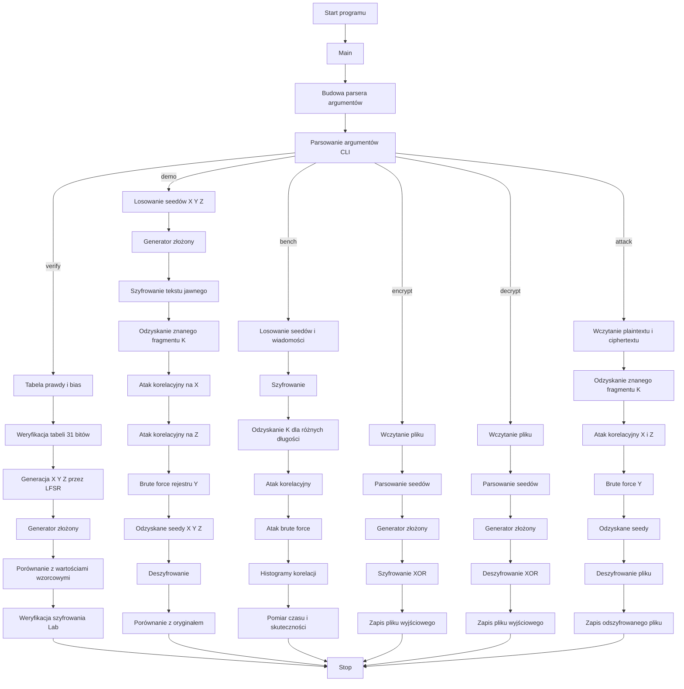

# Kryptografia i kryptoanaliza
## Laboratorium 6
### Grupa 1ID24B
### Autorzy: Iga Ozimska, Eliza Janus

### Zadanie 1
Celem zajęć jest praktyczne poznanie konstrukcji generatorów złożonych opartych na wielu rejestrach LFSR
oraz przeprowadzenie ataku korelacyjnego wykorzystującego słabości funkcji kombinującej. Głównym zadaniem jest implementacja kryptosystemu strumieniowego z trzema rejestrami LFSR połączonymi nieliniową
funkcją łączącą, a następnie wykonanie ataku korelacyjnego, który ujawni fundamentalną słabość tego podejścia wynikającą z niezbalansowania funkcji względem poszczególnych wejść. Laboratorium ma na celu
uzmysłowienie kompromisów projektowych przy konstrukcji bezpiecznych generatorów strumienia klucza
oraz znaczenia właściwości kryptograficznych funkcji kombinujących.

#### Schemat blokowy

#### Implementacja

``` Python
from __future__ import annotations
from dataclasses import dataclass
from typing import List, Tuple, Iterable, Optional, Dict
import argparse
import random
import time
import math
from collections import Counter

# ------------------------------------------------------------
# Typy pomocnicze
#
# Bit  – pojedynczy bit (0 lub 1)
# Bits – lista bitów
# ------------------------------------------------------------
Bit = int
Bits = List[Bit]


# ------------------------------------------------------------
# Funkcja: bytes_to_bits
#
# Wejście:
#   data (bytes) – dane w postaci bajtów
#
# Wyjście:
#   Bits – lista bitów (0/1)
#
# Działanie:
#   Zamienia każdy bajt na 8 bitów, od najbardziej
#   znaczącego bitu (MSB) do najmniej znaczącego (LSB).
# ------------------------------------------------------------
def bytes_to_bits(data: bytes) -> Bits:
    out: Bits = []
    for b in data:
        for i in range(7, -1, -1):
            out.append((b >> i) & 1)
    return out


# ------------------------------------------------------------
# Funkcja: bits_to_bytes
#
# Wejście:
#   bits (Bits) – lista bitów (długość musi być wielokrotnością 8)
#
# Wyjście:
#   bytes – dane bajtowe
#
# Działanie:
#   Grupuje bity po 8 i rekonstruuje z nich bajty.
# ------------------------------------------------------------
def bits_to_bytes(bits: Bits) -> bytes:
    if len(bits) % 8 != 0:
        raise ValueError("bits_to_bytes: długość bitów musi być wielokrotnością 8")
    out = bytearray()
    for i in range(0, len(bits), 8):
        v = 0
        for j in range(8):
            v = (v << 1) | (bits[i + j] & 1)
        out.append(v)
    return bytes(out)


# ------------------------------------------------------------
# Funkcja: xor_bits
#
# Wejście:
#   a, b (Bits) – dwie listy bitów tej samej długości
#
# Wyjście:
#   Bits – wynik operacji XOR
#
# Działanie:
#   Wykonuje operację XOR bit po bicie.
# ------------------------------------------------------------
def xor_bits(a: Bits, b: Bits) -> Bits:
    if len(a) != len(b):
        raise ValueError("xor_bits: długości muszą być równe")
    return [(x ^ y) for x, y in zip(a, b)]


# ------------------------------------------------------------
# Funkcja: fmt_bits
#
# Wejście:
#   bits (Bits) – lista bitów
#   limit (int) – maksymalna liczba bitów do wyświetlenia
#
# Wyjście:
#   str – sformatowany ciąg bitów
#
# Działanie:
#   Skraca długie ciągi bitów, aby były czytelne
#   w wypisywaniu na ekran.
# ------------------------------------------------------------
def fmt_bits(bits: Bits, limit: int = 64) -> str:
    s = "".join(map(str, bits))
    if len(s) <= limit:
        return s
    return s[:limit] + f"... ({len(s)} bits)"


# ------------------------------------------------------------
# Funkcja: bits_to_hex
#
# Wejście:
#   bits (Bits) – lista bitów
#
# Wyjście:
#   str – zapis szesnastkowy (HEX)
#
# Działanie:
#   Zamienia bity na bajty i prezentuje je
#   w postaci szesnastkowej.
# ------------------------------------------------------------
def bits_to_hex(bits: Bits) -> str:
    padded = list(bits)
    if len(padded) % 8 != 0:
        padded += [0] * (8 - (len(padded) % 8))
    return bits_to_bytes(padded).hex().upper()


# ------------------------------------------------------------
# Funkcja: text_to_bits_utf8
#
# Wejście:
#   s (str) – tekst jawny
#
# Wyjście:
#   Bits – lista bitów
#
# Działanie:
#   Koduje tekst do UTF-8 i zamienia go na ciąg bitów.
# ------------------------------------------------------------
def text_to_bits_utf8(s: str) -> Bits:
    return bytes_to_bits(s.encode("utf-8"))


# ------------------------------------------------------------
# Funkcja: bits_to_text_utf8
#
# Wejście:
#   bits (Bits) – lista bitów
#
# Wyjście:
#   str – tekst UTF-8
#
# Działanie:
#   Zamienia bity na bajty i dekoduje je
#   do postaci tekstowej UTF-8.
# ------------------------------------------------------------
def bits_to_text_utf8(bits: Bits) -> str:
    return bits_to_bytes(bits).decode("utf-8", errors="replace")


# ------------------------------------------------------------
# Klasa: LFSR
#
# Opis:
#   Implementacja liniowego rejestru przesuwnego
#   ze sprzężeniem zwrotnym (LFSR – Linear Feedback Shift Register).
# ------------------------------------------------------------
@dataclass
class LFSR:
    taps: Bits
    state: Bits

    # --------------------------------------------------------
    # Metoda: __post_init__
    #
    # Działanie:
    #   Sprawdza poprawność długości i zawartości
    #   stanu oraz wektora sprzężeń zwrotnych.
    # --------------------------------------------------------
    def __post_init__(self) -> None:
        m = len(self.taps)
        if len(self.state) != m:
            raise ValueError("LFSR: stan musi mieć długość równą stopniowi rejestru")
        if any(b not in (0, 1) for b in self.state):
            raise ValueError("LFSR: stan musi być bitami 0/1")
        if any(t not in (0, 1) for t in self.taps):
            raise ValueError("LFSR: taps muszą być bitami 0/1")

    # --------------------------------------------------------
    # Metoda: reset
    #
    # Wejście:
    #   state (Bits) – nowy stan rejestru
    #
    # Działanie:
    #   Ustawia nowy stan początkowy rejestru LFSR.
    # --------------------------------------------------------
    def reset(self, state: Bits) -> None:
        if len(state) != len(self.state):
            raise ValueError("LFSR.reset: zły rozmiar stanu")
        self.state = list(state)

    # --------------------------------------------------------
    # Metoda: next_bit
    #
    # Wyjście:
    #   Bit – wygenerowany bit
    #
    # Działanie:
    #   Zwraca najstarszy bit rejestru oraz
    #   aktualizuje stan zgodnie ze sprzężeniem zwrotnym.
    # --------------------------------------------------------
    def next_bit(self) -> Bit:
        out = self.state[0]
        fb = 0
        for j, tj in enumerate(self.taps):
            if tj:
                fb ^= self.state[j]
        self.state = self.state[1:] + [fb]
        return out

    # --------------------------------------------------------
    # Metoda: generate
    #
    # Wejście:
    #   n (int) – liczba bitów do wygenerowania
    #
    # Wyjście:
    #   Bits – strumień wygenerowanych bitów
    #
    # Działanie:
    #   Generuje n kolejnych bitów z rejestru LFSR.
    # --------------------------------------------------------
    def generate(self, n: int) -> Bits:
        return [self.next_bit() for _ in range(n)]
# ------------------------------------------------------------
# Klasa: CompositeGenerator
#
# Opis:
#   Generator strumienia klucza złożony z trzech
#   rejestrów LFSR: X, Y oraz Z, połączonych
#   nieliniową funkcją łączącą.
# ------------------------------------------------------------
@dataclass
class CompositeGenerator:
    seed_x: Bits
    seed_y: Bits
    seed_z: Bits

    TAPS_X = [1, 1, 0]
    TAPS_Y = [1, 0, 0, 1]
    TAPS_Z = [1, 0, 1, 0, 0]

    # --------------------------------------------------------
    # Metoda: __post_init__
    #
    # Działanie:
    #   Inicjalizuje trzy rejestry LFSR na podstawie
    #   przekazanych seedów oraz zdefiniowanych sprzężeń.
    # --------------------------------------------------------
    def __post_init__(self) -> None:
        self.X = LFSR(list(self.TAPS_X), list(self.seed_x))
        self.Y = LFSR(list(self.TAPS_Y), list(self.seed_y))
        self.Z = LFSR(list(self.TAPS_Z), list(self.seed_z))

    # --------------------------------------------------------
    # Metoda: reset
    #
    # Wejście:
    #   seed_x, seed_y, seed_z (Bits) – nowe seedy rejestrów
    #
    # Działanie:
    #   Resetuje stan wszystkich trzech rejestrów LFSR.
    # --------------------------------------------------------
    def reset(self, seed_x: Bits, seed_y: Bits, seed_z: Bits) -> None:
        self.seed_x = list(seed_x)
        self.seed_y = list(seed_y)
        self.seed_z = list(seed_z)
        self.X.reset(self.seed_x)
        self.Y.reset(self.seed_y)
        self.Z.reset(self.seed_z)

    # --------------------------------------------------------
    # Funkcja: combine
    #
    # Wejście:
    #   x, y, z (Bit) – bity z rejestrów X, Y, Z
    #
    # Wyjście:
    #   Bit – pojedynczy bit strumienia klucza
    #
    # Działanie:
    #   Nieliniowa funkcja łącząca:
    #   f(x, y, z) = x·y ⊕ y·z ⊕ z
    # --------------------------------------------------------
    @staticmethod
    def combine(x: Bit, y: Bit, z: Bit) -> Bit:
        return (x & y) ^ (y & z) ^ z

    # --------------------------------------------------------
    # Metoda: next_bit
    #
    # Wyjście:
    #   Bit – kolejny bit strumienia klucza
    #
    # Działanie:
    #   Pobiera bity z trzech rejestrów LFSR
    #   i łączy je funkcją combine.
    # --------------------------------------------------------
    def next_bit(self) -> Bit:
        return self.combine(self.X.next_bit(), self.Y.next_bit(), self.Z.next_bit())

    # --------------------------------------------------------
    # Metoda: generate
    #
    # Wejście:
    #   n (int) – liczba bitów
    #
    # Wyjście:
    #   Bits – wygenerowany strumień klucza
    #
    # Działanie:
    #   Generuje n kolejnych bitów klucza.
    # --------------------------------------------------------
    def generate(self, n: int) -> Bits:
        return [self.next_bit() for _ in range(n)]


# ------------------------------------------------------------
# Klasa: StreamCipher
#
# Opis:
#   Implementacja szyfru strumieniowego XOR
#   wykorzystującego generator złożony.
# ------------------------------------------------------------
class StreamCipher:

    # --------------------------------------------------------
    # Metoda: __init__
    #
    # Wejście:
    #   gen (CompositeGenerator) – generator strumienia klucza
    #
    # Działanie:
    #   Inicjalizuje szyfr strumieniowy.
    # --------------------------------------------------------
    def __init__(self, gen: CompositeGenerator):
        self.gen = gen

    # --------------------------------------------------------
    # Metoda: reset
    #
    # Wejście:
    #   sx, sy, sz (Bits) – seedy generatora
    #
    # Działanie:
    #   Resetuje generator strumienia klucza.
    # --------------------------------------------------------
    def reset(self, sx: Bits, sy: Bits, sz: Bits) -> None:
        self.gen.reset(sx, sy, sz)

    # --------------------------------------------------------
    # Metoda: encrypt_bytes
    #
    # Wejście:
    #   data (bytes) – dane jawne
    #
    # Wyjście:
    #   bytes – szyfrogram
    #
    # Działanie:
    #   Szyfruje dane przy użyciu XOR
    #   ze strumieniem klucza.
    # --------------------------------------------------------
    def encrypt_bytes(self, data: bytes) -> bytes:
        bits = bytes_to_bits(data)
        k = self.gen.generate(len(bits))
        c_bits = xor_bits(bits, k)
        return bits_to_bytes(c_bits)

    # --------------------------------------------------------
    # Metoda: decrypt_bytes
    #
    # Wejście:
    #   data (bytes) – szyfrogram
    #
    # Wyjście:
    #   bytes – dane odszyfrowane
    #
    # Działanie:
    #   Deszyfruje dane (XOR jest operacją symetryczną).
    # --------------------------------------------------------
    def decrypt_bytes(self, data: bytes) -> bytes:
        return self.encrypt_bytes(data)


# ------------------------------------------------------------
# Funkcja: all_nonzero_seeds
#
# Wejście:
#   m (int) – długość seeda
#
# Wyjście:
#   Iterable[Bits] – wszystkie niezerowe seedy
#
# Działanie:
#   Generuje wszystkie możliwe niezerowe seedy
#   o długości m bitów.
# ------------------------------------------------------------
def all_nonzero_seeds(m: int) -> Iterable[Bits]:
    for v in range(1, 1 << m):
        yield [(v >> i) & 1 for i in range(m - 1, -1, -1)]


# ------------------------------------------------------------
# Funkcja: random_nonzero_seed
#
# Wejście:
#   m (int) – długość seeda
#
# Wyjście:
#   Bits – losowy niezerowy seed
#
# Działanie:
#   Losuje niezerowy seed o długości m bitów.
# ------------------------------------------------------------
def random_nonzero_seed(m: int) -> Bits:
    v = random.randint(1, (1 << m) - 1)
    return [(v >> i) & 1 for i in range(m - 1, -1, -1)]
# ------------------------------------------------------------
# Funkcja: pearson_correlation
#
# Wejście:
#   x, y (Bits) – dwa strumienie bitów tej samej długości
#
# Wyjście:
#   float – współczynnik korelacji Pearsona
#
# Działanie:
#   Oblicza liniową korelację pomiędzy dwoma
#   strumieniami bitów, traktując je jako zmienne losowe.
# ------------------------------------------------------------
def pearson_correlation(x: Bits, y: Bits) -> float:
    n = len(x)
    if n == 0:
        return 0.0
    xm = sum(x) / n
    ym = sum(y) / n
    num = sum((xi - xm) * (yi - ym) for xi, yi in zip(x, y))
    denx = sum((xi - xm) ** 2 for xi in x)
    deny = sum((yi - ym) ** 2 for yi in y)
    if denx <= 0 or deny <= 0:
        return 0.0
    return num / math.sqrt(denx * deny)


# ------------------------------------------------------------
# Funkcja: agreement_score
#
# Wejście:
#   x, y (Bits) – dwa strumienie bitów
#
# Wyjście:
#   float – współczynnik zgodności
#
# Działanie:
#   Oblicza odsetek pozycji, na których bity
#   w obu strumieniach są takie same.
# ------------------------------------------------------------
def agreement_score(x: Bits, y: Bits) -> float:
    if not x:
        return 0.0
    eq = sum(1 for a, b in zip(x, y) if a == b)
    return eq / len(x)


# ------------------------------------------------------------
# Funkcja: correlation_attack_lfsr
#
# Wejście:
#   K (Bits) – znany fragment strumienia klucza
#   m (int) – długość rejestru LFSR
#   taps (Bits) – wektor sprzężeń zwrotnych
#   selector (str) – metoda oceny ('pearson' lub 'agree')
#   return_ranking (bool) – czy zwrócić pełny ranking seedów
#
# Wyjście:
#   (Bits, float, Optional[List]) – najlepszy seed,
#   jego wynik oraz opcjonalny ranking
#
# Działanie:
#   Realizuje atak korelacyjny na pojedynczy rejestr LFSR
#   poprzez porównanie generowanego strumienia
#   z znanym fragmentem klucza.
# ------------------------------------------------------------
def correlation_attack_lfsr(
    K: Bits,
    m: int,
    taps: Bits,
    selector: str = "pearson",
    return_ranking: bool = False
) -> Tuple[Bits, float, Optional[List[Tuple[Bits, float]]]]:
    best_seed: Optional[Bits] = None
    best_score = -1e18
    ranking: List[Tuple[Bits, float]] = []

    for seed in all_nonzero_seeds(m):
        R = LFSR(list(taps), list(seed))
        out = R.generate(len(K))
        if selector == "pearson":
            sc = pearson_correlation(K, out)
        elif selector == "agree":
            sc = agreement_score(K, out)
        else:
            raise ValueError("selector must be 'pearson' or 'agree'")
        ranking.append((seed, sc))
        if sc > best_score:
            best_score = sc
            best_seed = seed

    assert best_seed is not None
    if return_ranking:
        ranking.sort(key=lambda t: t[1], reverse=True)
        return best_seed, best_score, ranking
    return best_seed, best_score, None


# ------------------------------------------------------------
# Funkcja: recover_y_by_bruteforce
#
# Wejście:
#   K (Bits) – znany fragment strumienia klucza
#   seed_x (Bits) – odzyskany seed rejestru X
#   seed_z (Bits) – odzyskany seed rejestru Z
#
# Wyjście:
#   Optional[Bits] – seed rejestru Y lub None
#
# Działanie:
#   Odzyskuje seed rejestru Y metodą brute-force,
#   sprawdzając wszystkie możliwe niezerowe seedy.
# ------------------------------------------------------------
def recover_y_by_bruteforce(
    K: Bits,
    seed_x: Bits,
    seed_z: Bits
) -> Optional[Bits]:
    for sy in all_nonzero_seeds(4):
        gen = CompositeGenerator(seed_x, sy, seed_z)
        if gen.generate(len(K)) == K:
            return sy
    return None
# ------------------------------------------------------------
# Funkcja: attack_correlation_then_y
#
# Wejście:
#   K (Bits) – znany fragment strumienia klucza
#   selector (str) – metoda korelacji ('pearson' lub 'agree')
#   verbose (bool) – tryb wypisywania informacji diagnostycznych
#   top (int) – liczba najlepszych kandydatów do sprawdzenia
#
# Wyjście:
#   (Bits, Bits, Bits, Dict) – odzyskane seedy X, Y, Z
#   oraz słownik informacji diagnostycznych
#
# Działanie:
#   Wykonuje pełny atak korelacyjny:
#   1) odzyskuje seedy X i Z metodą korelacyjną,
#   2) odzyskuje seed Y metodą brute-force,
#   3) w razie potrzeby sprawdza TOP kandydatów.
# ------------------------------------------------------------
def attack_correlation_then_y(
    K: Bits,
    selector: str = "pearson",
    verbose: bool = True,
    top: int = 5
) -> Tuple[Bits, Bits, Bits, Dict]:
    diag: Dict = {}

    sx, rho_x, rank_x = correlation_attack_lfsr(
        K, 3, CompositeGenerator.TAPS_X, selector=selector, return_ranking=True
    )
    sz, rho_z, rank_z = correlation_attack_lfsr(
        K, 5, CompositeGenerator.TAPS_Z, selector=selector, return_ranking=True
    )

    diag["rho_x"] = rho_x
    diag["rho_z"] = rho_z
    diag["rank_x"] = rank_x
    diag["rank_z"] = rank_z

    sy = recover_y_by_bruteforce(K, sx, sz)
    if sy is None:
        if verbose:
            print("Nie znaleziono Y dla najlepszych X,Z — próbuję kombinacje TOP kandydatów...")
        for sx2, _ in rank_x[:top]:
            for sz2, _ in rank_z[:top]:
                sy2 = recover_y_by_bruteforce(K, sx2, sz2)
                if sy2 is not None:
                    sx, sz, sy = sx2, sz2, sy2
                    diag["used_top_search"] = True
                    diag["top_limit"] = top
                    return sx, sy, sz, diag
        raise RuntimeError("Atak korelacyjny nie odzyskał seedów (nawet z TOP).")

    return sx, sy, sz, diag


# ------------------------------------------------------------
# Funkcja: brute_force_all
#
# Wejście:
#   K (Bits) – znany fragment strumienia klucza
#
# Wyjście:
#   (Bits, Bits, Bits, int) – seedy X, Y, Z oraz liczba prób
#
# Działanie:
#   Wykonuje pełne przeszukiwanie przestrzeni
#   wszystkich możliwych seedów generatora.
# ------------------------------------------------------------
def brute_force_all(
    K: Bits
) -> Tuple[Bits, Bits, Bits, int]:
    tries = 0
    for sx in all_nonzero_seeds(3):
        for sy in all_nonzero_seeds(4):
            for sz in all_nonzero_seeds(5):
                tries += 1
                gen = CompositeGenerator(sx, sy, sz)
                if gen.generate(len(K)) == K:
                    return sx, sy, sz, tries
    raise RuntimeError("Brute-force: nie znaleziono seedów (to nie powinno się zdarzyć).")


# ------------------------------------------------------------
# Stałe: przykładowe seedy i ciągi testowe
#
# Opis:
#   Dane referencyjne z instrukcji do weryfikacji
#   poprawności implementacji (tabela 31 bitów).
# ------------------------------------------------------------
SEED_X_EX = [1, 0, 1]
SEED_Y_EX = [1, 0, 1, 0]
SEED_Z_EX = [1, 1, 0, 0, 0]

X_31_EX = [1,0,1,0,0,1,1,1,0,1,0,0,1,1,1,0,1,0,0,1,1,1,0,1,0,0,1,1,1,0,1]
Y_31_EX = [1,0,1,0,1,0,0,0,1,1,0,1,1,1,0,0,1,0,0,1,1,0,1,1,1,0,0,1,0,0,1]
Z_31_EX = [1,1,0,0,0,1,0,0,1,0,1,1,1,0,1,0,0,0,1,0,0,1,0,1,1,1,0,1,0,0,0]
K_31_EX = [1,0,0,1,0,1,0,0,0,1,0,0,1,0,0,0,1,0,0,1,1,0,1,0,0,0,0,1,0,1,1]


# ------------------------------------------------------------
# Stałe: przykład szyfrowania z instrukcji
# ------------------------------------------------------------
PT_LAB = b"Lab"
CT_LAB_HEX = "BE04E9"


# ------------------------------------------------------------
# Funkcja: truth_table_and_bias
#
# Wyjście:
#   brak
#
# Działanie:
#   Wyświetla tabelę prawdy funkcji łączącej
#   oraz oblicza jej bias względem wejść X, Y i Z.
# ------------------------------------------------------------
def truth_table_and_bias() -> None:
    rows = []
    cnt = Counter()
    for x in (0, 1):
        for y in (0, 1):
            for z in (0, 1):
                f = CompositeGenerator.combine(x, y, z)
                rows.append((x, y, z, f))
                cnt["f1"] += f
                cnt["fx"] += 1 if f == x else 0
                cnt["fy"] += 1 if f == y else 0
                cnt["fz"] += 1 if f == z else 0
    print("Tabela prawdy f(x,y,z)=xy ⊕ yz ⊕ z:")
    print(" x y z | f")
    print("-------+---")
    for x, y, z, f in rows:
        print(f" {x} {y} {z} | {f}")
    print()
    print("Prawdopodobieństwa (na 8 wejść):")
    print(f"  P(f=1) = {cnt['f1']}/8 = {cnt['f1']/8:.3f}")
    print(f"  P(f=x) = {cnt['fx']}/8 = {cnt['fx']/8:.3f}")
    print(f"  P(f=y) = {cnt['fy']}/8 = {cnt['fy']/8:.3f}")
    print(f"  P(f=z) = {cnt['fz']}/8 = {cnt['fz']/8:.3f}")
    print("Wnioski: bias wobec X i Z (3/4), brak biasu wobec Y (1/2) — podstawa ataku korelacyjnego.\n")


# ------------------------------------------------------------
# Funkcja: verify_known_example
#
# Wyjście:
#   brak
#
# Działanie:
#   Weryfikuje poprawność generatorów LFSR
#   oraz generatora złożonego na podstawie
#   przykładowej tabeli 31 bitów z instrukcji.
# ------------------------------------------------------------
def verify_known_example() -> None:
    print("Tabela 31 bitów (X,Y,Z,K) ")
    gen = CompositeGenerator(SEED_X_EX, SEED_Y_EX, SEED_Z_EX)

    X = LFSR(CompositeGenerator.TAPS_X, list(SEED_X_EX)).generate(31)
    Y = LFSR(CompositeGenerator.TAPS_Y, list(SEED_Y_EX)).generate(31)
    Z = LFSR(CompositeGenerator.TAPS_Z, list(SEED_Z_EX)).generate(31)
    K = gen.generate(31)

    ok_x = (X == X_31_EX)
    ok_y = (Y == Y_31_EX)
    ok_z = (Z == Z_31_EX)
    ok_k = (K == K_31_EX)
    # --------------------------------------------------------
    # Funkcja lokalna: show
    #
    # Wejście:
    #   name (str) – nazwa sygnału
    #   got (Bits) – wygenerowany ciąg bitów
    #   exp (Bits) – oczekiwany ciąg bitów
    #   ok (bool) – wynik porównania
    #
    # Działanie:
    #   Wyświetla wynik porównania ciągów bitów
    #   z wartościami referencyjnymi.
    # --------------------------------------------------------
    def show(name: str, got: Bits, exp: Bits, ok: bool) -> None:
        print(f"{name}: {'OK' if ok else 'FAIL'}")
        if not ok:
            print(f"  got: {fmt_bits(got, 64)}")
            print(f"  exp: {fmt_bits(exp, 64)}")

    show("X[31]", X, X_31_EX, ok_x)
    show("Y[31]", Y, Y_31_EX, ok_y)
    show("Z[31]", Z, Z_31_EX, ok_z)
    show("K[31]", K, K_31_EX, ok_k)

    if ok_x and ok_y and ok_z and ok_k:
        print("Tabela 31 bitów: WSZYSTKO OK.\n")
    else:
        raise SystemExit("Błąd: nie zgadza się tabela 31 bitów.")


# ------------------------------------------------------------
# Funkcja: verify_encrypt_example
#
# Wyjście:
#   brak
#
# Działanie:
#   Weryfikuje poprawność szyfrowania strumieniowego
#   na przykładzie tekstu „Lab” z instrukcji.
# ------------------------------------------------------------
def verify_encrypt_example() -> None:
    print("Szyfrowanie przykładu 'Lab' ")
    gen = CompositeGenerator(SEED_X_EX, SEED_Y_EX, SEED_Z_EX)
    cipher = StreamCipher(gen)
    ct = cipher.encrypt_bytes(PT_LAB)
    hx = ct.hex().upper()
    print(f"PT: {PT_LAB!r}")
    print(f"CT: {hx} (expected {CT_LAB_HEX})")
    if hx != CT_LAB_HEX:
        raise SystemExit("Błąd: szyfrogram nie zgadza się z instrukcją.")
    print("Szyfrowanie 'Lab': OK.\n")


# ------------------------------------------------------------
# Funkcja: file_encrypt_decrypt
#
# Wejście:
#   in_path (str) – ścieżka do pliku wejściowego
#   out_path (str) – ścieżka do pliku wyjściowego
#   sx, sy, sz (Bits) – seedy generatora
#   decrypt (bool) – tryb pracy (True = deszyfrowanie)
#
# Działanie:
#   Szyfruje lub deszyfruje plik binarny
#   przy użyciu szyfru strumieniowego XOR.
# ------------------------------------------------------------
def file_encrypt_decrypt(in_path: str, out_path: str, sx: Bits, sy: Bits, sz: Bits, decrypt: bool) -> None:
    with open(in_path, "rb") as f:
        data = f.read()
    gen = CompositeGenerator(sx, sy, sz)
    cipher = StreamCipher(gen)
    out = cipher.decrypt_bytes(data) if decrypt else cipher.encrypt_bytes(data)
    with open(out_path, "wb") as f:
        f.write(out)


# ------------------------------------------------------------
# Funkcja: demo_attack
#
# Wejście:
#   known_bits (int) – liczba znanych bitów klucza
#   plaintext (str) – tekst jawny do demonstracji
#
# Wyjście:
#   brak
#
# Działanie:
#   Demonstruje pełny scenariusz:
#   1) losowanie seedów,
#   2) szyfrowanie,
#   3) odzyskanie fragmentu klucza,
#   4) atak korelacyjny,
#   5) deszyfrację i weryfikację.
# ------------------------------------------------------------
def demo_attack(known_bits: int, plaintext: str) -> None:
    print("Szyfrowanie + odzyskanie K + atak korelacyjny")
    sx = random_nonzero_seed(3)
    sy = random_nonzero_seed(4)
    sz = random_nonzero_seed(5)
    print(f"Losowe seedy (tajne): X={sx} Y={sy} Z={sz}")

    pt_bits = text_to_bits_utf8(plaintext)
    gen_enc = CompositeGenerator(sx, sy, sz)
    ct_bits = xor_bits(pt_bits, gen_enc.generate(len(pt_bits)))

    kb = min(known_bits, len(pt_bits))
    K_known = xor_bits(pt_bits[:kb], ct_bits[:kb])
    print(f"Znane bity: {kb}")
    print(f"Odzyskany fragment K: {fmt_bits(K_known, 96)}")

    t0 = time.perf_counter()
    rx, ry, rz, diag = attack_correlation_then_y(K_known, selector="pearson", verbose=True)
    t1 = time.perf_counter()

    print("\nWyniki ataku korelacyjnego")
    print(f"Odzyskane seedy: X={rx} Y={ry} Z={rz}")
    print(f"Czas ataku: {(t1-t0)*1000:.3f} ms")
    print(f"Pearson: rho_x={diag['rho_x']:.4f}, rho_z={diag['rho_z']:.4f}")
    if diag.get("used_top_search"):
        print(f"Użyto TOP-search: limit={diag.get('top_limit')}")

    gen_dec = CompositeGenerator(rx, ry, rz)
    pt2_bits = xor_bits(ct_bits, gen_dec.generate(len(ct_bits)))
    pt2 = bits_to_text_utf8(pt2_bits)
    ok = (pt2_bits == pt_bits)
    print("\n Weryfikacja deszyfracji ")
    print(f"Odszyfrowany tekst: {pt2!r}")
    print(f"Zgodność z oryginałem: {'OK' if ok else 'FAIL'}")
    if not ok:
        print("Uwaga: jeśli znany fragment jest bardzo krótki, atak może się mylić statystycznie.")
    print()
# ------------------------------------------------------------
# Funkcja: print_top_ranking
#
# Wejście:
#   ranking (List[(Bits, float)]) – lista seedów i ich wyników
#   name (str) – nazwa rejestru (np. X lub Z)
#   top (int) – liczba najlepszych wyników do wyświetlenia
#
# Wyjście:
#   brak
#
# Działanie:
#   Wyświetla listę TOP najlepszych kandydatów
#   uzyskanych w ataku korelacyjnym.
# ------------------------------------------------------------
def print_top_ranking(ranking: List[Tuple[Bits, float]], name: str, top: int = 5) -> None:
    print(f"TOP {top} kandydatów dla {name}:")
    for i, (seed, sc) in enumerate(ranking[:top], 1):
        print(f"  {i:2d}. seed={seed} score={sc:.6f}")
    print()


# ------------------------------------------------------------
# Funkcja: ascii_hist
#
# Wejście:
#   values (List[float]) – lista wartości do histogramu
#   bins (int) – liczba przedziałów
#   width (int) – szerokość histogramu ASCII
#
# Wyjście:
#   str – tekstowa reprezentacja histogramu
#
# Działanie:
#   Tworzy histogram w postaci ASCII,
#   ilustrujący rozkład wartości korelacji.
# ------------------------------------------------------------
def ascii_hist(values: List[float], bins: int = 12, width: int = 40) -> str:
    if not values:
        return "(brak danych)"
    lo, hi = min(values), max(values)
    if lo == hi:
        return f"(wszystkie wartości = {lo:.6f})"
    step = (hi - lo) / bins
    counts = [0] * bins
    for v in values:
        idx = min(bins - 1, int((v - lo) / step))
        counts[idx] += 1
    m = max(counts) or 1
    lines = []
    for i, c in enumerate(counts):
        a = lo + i * step
        b = a + step
        bar = "#" * int(round((c / m) * width))
        lines.append(f"{a: .3f}..{b: .3f} | {bar} ({c})")
    return "\n".join(lines)


# ------------------------------------------------------------
# Funkcja: run_trials
#
# Wejście:
#   trials (int) – liczba prób eksperymentu
#   lengths (List[int]) – długości znanego fragmentu klucza (bity)
#   bytes_len (int) – długość wiadomości w bajtach
#   selector (str) – metoda korelacji ('pearson' lub 'agree')
#
# Wyjście:
#   brak
#
# Działanie:
#   Przeprowadza serię eksperymentów porównujących:
#   - skuteczność ataku korelacyjnego,
#   - czas jego działania,
#   - porównanie z atakiem brute-force,
#   w zależności od długości znanego fragmentu klucza.
# ------------------------------------------------------------
def run_trials(
    trials: int,
    lengths: List[int],
    bytes_len: int,
    selector: str = "pearson"
) -> None:

    rnd = random.Random(12345)

    print("EKSPERYMENTY ")
    print(f"Próby: {trials}, długość wiadomości: {bytes_len} B, selektor: {selector}")
    print(f"Długości znanego fragmentu (bity): {lengths}\n")

    stats = {L: {"ok_corr": 0, "t_corr": 0.0, "ok_bf": 0, "t_bf": 0.0, "tries_bf": 0} for L in lengths}

    example_hist_done = {L: False for L in lengths}

    for t in range(1, trials + 1):
        sx = random_nonzero_seed(3)
        sy = random_nonzero_seed(4)
        sz = random_nonzero_seed(5)

        msg = bytes(rnd.getrandbits(8) for _ in range(bytes_len))
        pt_bits = bytes_to_bits(msg)
        gen = CompositeGenerator(sx, sy, sz)
        ct_bits = xor_bits(pt_bits, gen.generate(len(pt_bits)))

        for L in lengths:
            kb = min(L, len(pt_bits))
            K = xor_bits(pt_bits[:kb], ct_bits[:kb])

            t0 = time.perf_counter()
            ok_corr = 0
            try:
                rx, ry, rz, diag = attack_correlation_then_y(K, selector=selector, verbose=False)
                ok_corr = int((rx == sx) and (ry == sy) and (rz == sz))
            except Exception:
                ok_corr = 0
            t1 = time.perf_counter()

            stats[L]["ok_corr"] += ok_corr
            stats[L]["t_corr"] += (t1 - t0)

            tb0 = time.perf_counter()
            bx, by, bz, tries = brute_force_all(K)
            tb1 = time.perf_counter()
            ok_bf = int((bx == sx) and (by == sy) and (bz == sz))
            stats[L]["ok_bf"] += ok_bf
            stats[L]["t_bf"] += (tb1 - tb0)
            stats[L]["tries_bf"] += tries

            if not example_hist_done[L]:
                _, _, rank_x = correlation_attack_lfsr(K, 3, CompositeGenerator.TAPS_X, selector=selector, return_ranking=True)
                _, _, rank_z = correlation_attack_lfsr(K, 5, CompositeGenerator.TAPS_Z, selector=selector, return_ranking=True)
                assert rank_x is not None and rank_z is not None
                vals_x = [sc for _, sc in rank_x]
                vals_z = [sc for _, sc in rank_z]
                print(f"--- Histogram score ({selector}) dla L={L} (przykładowa próba) ---")
                print("X (7 seedów):")
                print(ascii_hist(vals_x))
                print("\nZ (31 seedów):")
                print(ascii_hist(vals_z))
                print()
                print_top_ranking(rank_x, "X", top=5)
                print_top_ranking(rank_z, "Z", top=5)
                example_hist_done[L] = True

        if t % max(1, trials // 5) == 0:
            print(f"[{t}/{trials}] ...")

    print("\nPODSUMOWANIE")
    header = f"{'L(bits)':>7} | {'corr_ok':>7} | {'corr_succ%':>10} | {'corr_avg_ms':>11} | {'bf_avg_ms':>9} | {'bf_avg_tries':>12}"
    print(header)
    print("-" * len(header))
    for L in lengths:
        corr_ok = stats[L]["ok_corr"]
        corr_s = 100.0 * corr_ok / trials
        corr_avg_ms = (stats[L]["t_corr"] / trials) * 1000.0
        bf_avg_ms = (stats[L]["t_bf"] / trials) * 1000.0
        bf_avg_tries = stats[L]["tries_bf"] / trials
        print(f"{L:7d} | {corr_ok:7d} | {corr_s:10.2f} | {corr_avg_ms:11.3f} | {bf_avg_ms:9.3f} | {bf_avg_tries:12.1f}")
    print()
# ------------------------------------------------------------
# Funkcja: compare_selectors
#
# Wejście:
#   trials (int) – liczba prób eksperymentu
#   known_bits (int) – liczba znanych bitów strumienia klucza
#
# Wyjście:
#   brak
#
# Działanie:
#   Porównuje skuteczność dwóch metod selekcji
#   w ataku korelacyjnym:
#   - korelacji Pearsona
#   - współczynnika zgodności (agreement)
#   Raportuje procent poprawnego odzyskania
#   seedów rejestrów X i Z.
# ------------------------------------------------------------
def compare_selectors(trials: int, known_bits: int) -> None:

    rnd = random.Random(999)

    # --------------------------------------------------------
    # Funkcja pomocnicza: one_trial
    #
    # Wyjście:
    #   (Bits, Bits, Bits, Bits) – seedy X,Y,Z oraz znany fragment K
    #
    # Działanie:
    #   Generuje pojedynczą próbę eksperymentu:
    #   losowe seedy, losową wiadomość oraz
    #   fragment strumienia klucza uzyskany
    #   metodą known-plaintext.
    # --------------------------------------------------------
    def one_trial() -> Tuple[Bits, Bits, Bits, Bits]:
        sx = random_nonzero_seed(3)
        sy = random_nonzero_seed(4)
        sz = random_nonzero_seed(5)
        msg = bytes(rnd.getrandbits(8) for _ in range(32))
        pt_bits = bytes_to_bits(msg)
        gen = CompositeGenerator(sx, sy, sz)
        ct_bits = xor_bits(pt_bits, gen.generate(len(pt_bits)))
        kb = min(known_bits, len(pt_bits))
        K = xor_bits(pt_bits[:kb], ct_bits[:kb])
        return sx, sy, sz, K

    ok = {"pearson": {"x": 0, "z": 0}, "agree": {"x": 0, "z": 0}}

    for _ in range(trials):
        sx, _, sz, K = one_trial()
        rx, _, _ = correlation_attack_lfsr(K, 3, CompositeGenerator.TAPS_X, selector="pearson", return_ranking=False)
        rz, _, _ = correlation_attack_lfsr(K, 5, CompositeGenerator.TAPS_Z, selector="pearson", return_ranking=False)
        ok["pearson"]["x"] += int(rx == sx)
        ok["pearson"]["z"] += int(rz == sz)

        rx, _, _ = correlation_attack_lfsr(K, 3, CompositeGenerator.TAPS_X, selector="agree", return_ranking=False)
        rz, _, _ = correlation_attack_lfsr(K, 5, CompositeGenerator.TAPS_Z, selector="agree", return_ranking=False)
        ok["agree"]["x"] += int(rx == sx)
        ok["agree"]["z"] += int(rz == sz)

    print("PORÓWNANIE SELEKTORÓW ")
    for sel in ("pearson", "agree"):
        sxp = 100.0 * ok[sel]["x"] / trials
        szp = 100.0 * ok[sel]["z"] / trials
        print(f"{sel:8s}: X ok {ok[sel]['x']}/{trials} ({sxp:.2f}%), Z ok {ok[sel]['z']}/{trials} ({szp:.2f}%)")
    print()


# ------------------------------------------------------------
# Funkcja: parse_seed
#
# Wejście:
#   s (str) – zapis seeda (np. "101" lub "1,0,1")
#   m (int) – oczekiwana długość seeda
#
# Wyjście:
#   Bits – seed jako lista bitów
#
# Działanie:
#   Parsuje seed podany przez użytkownika,
#   sprawdza jego poprawność i długość.
# ------------------------------------------------------------
def parse_seed(s: str, m: int) -> Bits:
    s = s.strip()
    if "," in s:
        parts = [p.strip() for p in s.split(",") if p.strip() != ""]
        bits = [int(p) for p in parts]
    else:
        bits = [int(ch) for ch in s]
    if len(bits) != m or any(b not in (0, 1) for b in bits):
        raise argparse.ArgumentTypeError(f"Seed musi mieć długość {m} i zawierać tylko 0/1")
    if all(b == 0 for b in bits):
        raise argparse.ArgumentTypeError("Seed nie może być zerowy")
    return bits


# ------------------------------------------------------------
# Funkcja: cmd_verify
#
# Wejście:
#   _args – argumenty linii poleceń (nieużywane)
#
# Wyjście:
#   brak
#
# Działanie:
#   Uruchamia wszystkie procedury weryfikacyjne:
#   - tabelę prawdy i bias funkcji łączącej
#   - tabelę 31 bitów
#   - przykład szyfrowania "Lab"
# ------------------------------------------------------------
def cmd_verify(_args: argparse.Namespace) -> None:
    truth_table_and_bias()
    verify_known_example()
    verify_encrypt_example()
    print("VERIFY: zakończono sukcesem.")


# ------------------------------------------------------------
# Funkcja: cmd_demo
#
# Wejście:
#   args – argumenty linii poleceń
#
# Wyjście:
#   brak
#
# Działanie:
#   Uruchamia demonstrację:
#   szyfrowanie → odzyskanie K → atak korelacyjny.
# ------------------------------------------------------------
def cmd_demo(args: argparse.Namespace) -> None:
    demo_attack(known_bits=args.known_bits, plaintext=args.plaintext)


# ------------------------------------------------------------
# Funkcja: cmd_bench
#
# Wejście:
#   args – argumenty linii poleceń
#
# Wyjście:
#   brak
#
# Działanie:
#   Uruchamia eksperymenty porównawcze
#   skuteczności i czasów ataków.
# ------------------------------------------------------------
def cmd_bench(args: argparse.Namespace) -> None:
    if args.lengths:
        lengths = [int(x) for x in args.lengths.split(",")]
    else:
        lengths = [8, 16, 24, 31, 62, 93]
    run_trials(trials=args.trials, lengths=lengths, bytes_len=args.bytes, selector=args.selector)
    if args.compare_selectors:
        compare_selectors(trials=max(20, args.trials), known_bits=min(31, args.bytes * 8))


# ------------------------------------------------------------
# Funkcja: cmd_encrypt
#
# Wejście:
#   args – argumenty linii poleceń
#
# Wyjście:
#   brak
#
# Działanie:
#   Szyfruje plik wejściowy strumieniem klucza
#   generowanym przez generator złożony.
# ------------------------------------------------------------
def cmd_encrypt(args: argparse.Namespace) -> None:
    sx = parse_seed(args.seed_x, 3)
    sy = parse_seed(args.seed_y, 4)
    sz = parse_seed(args.seed_z, 5)
    file_encrypt_decrypt(args.input, args.output, sx, sy, sz, decrypt=False)
    print(f"Zaszyfrowano: {args.input} -> {args.output}")


# ------------------------------------------------------------
# Funkcja: cmd_decrypt
#
# Wejście:
#   args – argumenty linii poleceń
#
# Wyjście:
#   brak
#
# Działanie:
#   Odszyfrowuje plik (operacja symetryczna do szyfrowania).
# ------------------------------------------------------------
def cmd_decrypt(args: argparse.Namespace) -> None:
    sx = parse_seed(args.seed_x, 3)
    sy = parse_seed(args.seed_y, 4)
    sz = parse_seed(args.seed_z, 5)
    file_encrypt_decrypt(args.input, args.output, sx, sy, sz, decrypt=True)
    print(f"Odszyfrowano: {args.input} -> {args.output}")


# ------------------------------------------------------------
# Funkcja: cmd_attack
#
# Wejście:
#   args – argumenty linii poleceń
#
# Wyjście:
#   brak
#
# Działanie:
#   Wykonuje atak known-plaintext na plikach:
#   odzyskuje seedy generatora i odszyfrowuje plik.
# ------------------------------------------------------------
def cmd_attack(args: argparse.Namespace) -> None:
    with open(args.plaintext, "rb") as f:
        pt = f.read()
    with open(args.ciphertext, "rb") as f:
        ct = f.read()
    pt_bits = bytes_to_bits(pt)
    ct_bits = bytes_to_bits(ct)
    kb = min(args.known_bits, len(pt_bits), len(ct_bits))
    K = xor_bits(pt_bits[:kb], ct_bits[:kb])

    print(f"Znany fragment: {kb} bitów (z plików)")
    t0 = time.perf_counter()
    rx, ry, rz, diag = attack_correlation_then_y(K, selector=args.selector, verbose=True)
    t1 = time.perf_counter()

    print("\n Odzyskane seedy ")
    print(f"X={rx} Y={ry} Z={rz}")
    print(f"Czas: {(t1-t0)*1000:.3f} ms")
    print(f"rho_x={diag['rho_x']:.4f}, rho_z={diag['rho_z']:.4f}")

    gen = CompositeGenerator(rx, ry, rz)
    cipher = StreamCipher(gen)
    dec = cipher.decrypt_bytes(ct)
    with open(args.output, "wb") as f:
        f.write(dec)
    print(f"Odszyfrowany plik zapisano do: {args.output}")
# ------------------------------------------------------------
# Funkcja: build_argparser
#
# Wyjście:
#   argparse.ArgumentParser – skonfigurowany parser argumentów
#
# Działanie:
#   Tworzy i konfiguruje parser argumentów linii poleceń.
#   Definiuje wszystkie tryby pracy programu:
#   - verify   – weryfikacja przykładów z instrukcji
#   - demo     – demonstracja ataku korelacyjnego
#   - bench    – eksperymenty i benchmarki
#   - encrypt  – szyfrowanie pliku
#   - decrypt  – deszyfrowanie pliku
#   - attack   – atak known-plaintext na plikach
# ------------------------------------------------------------
def build_argparser() -> argparse.ArgumentParser:
    p = argparse.ArgumentParser(description="Lab6: LFSR composite stream cipher + correlation attack")
    sub = p.add_subparsers(dest="cmd", required=True)

    pv = sub.add_parser("verify", help="Weryfikacja tabeli 31 bitów i szyfrowania 'Lab'")
    pv.set_defaults(func=cmd_verify)

    pd = sub.add_parser("demo", help="Demonstracja: losowe seedy, szyfrowanie, odzyskanie K i atak korelacyjny")
    pd.add_argument("--known-bits", type=int, default=93, help="Ile bitów znanego tekstu użyć (prefix)")
    pd.add_argument(
        "--plaintext",
        type=str,
        default="To jest przykladowa wiadomosc do demonstracji ataku korelacyjnego.",
        help="Tekst jawny do demonstracji (UTF-8)"
    )
    pd.set_defaults(func=cmd_demo)

    pb = sub.add_parser("bench", help="Benchmark/eksperymenty: skuteczność i czasy vs długość znanego fragmentu")
    pb.add_argument("--trials", type=int, default=20, help="Liczba prób")
    pb.add_argument("--bytes", type=int, default=64, help="Długość losowej wiadomości (bajty)")
    pb.add_argument("--lengths", type=str, default="", help="Długości znanego fragmentu bitów, np. 8,16,24,31,62,93")
    pb.add_argument(
        "--selector",
        type=str,
        default="pearson",
        choices=["pearson", "agree"],
        help="Selekcja w ataku korelacyjnym: pearson lub agree"
    )
    pb.add_argument(
        "--compare-selectors",
        action="store_true",
        help="Dodatkowo porównaj pearson vs agree na odzysk X i Z"
    )
    pb.set_defaults(func=cmd_bench)

    pe = sub.add_parser("encrypt", help="Szyfruj plik: XOR z generowanym strumieniem klucza")
    pe.add_argument("-i", "--input", required=True, help="Plik wejściowy")
    pe.add_argument("-o", "--output", required=True, help="Plik wyjściowy")
    pe.add_argument("--seed-x", required=True, help="Seed X (3 bity), np. 101 lub 1,0,1")
    pe.add_argument("--seed-y", required=True, help="Seed Y (4 bity)")
    pe.add_argument("--seed-z", required=True, help="Seed Z (5 bitów)")
    pe.set_defaults(func=cmd_encrypt)

    pdc = sub.add_parser("decrypt", help="Odszyfruj plik (symetrycznie)")
    pdc.add_argument("-i", "--input", required=True, help="Plik wejściowy")
    pdc.add_argument("-o", "--output", required=True, help="Plik wyjściowy")
    pdc.add_argument("--seed-x", required=True, help="Seed X (3 bity)")
    pdc.add_argument("--seed-y", required=True, help="Seed Y (4 bity)")
    pdc.add_argument("--seed-z", required=True, help="Seed Z (5 bitów)")
    pdc.set_defaults(func=cmd_decrypt)

    pa = sub.add_parser("attack", help="Atak z known-plaintext na plikach: odzysk seedów i deszyfracja")
    pa.add_argument("--plaintext", required=True, help="Plik z tekstem jawnym (znany fragment prefixu)")
    pa.add_argument("--ciphertext", required=True, help="Plik z szyfrogramem")
    pa.add_argument("--known-bits", type=int, default=93, help="Ile bitów prefixu plaintextu jest znane")
    pa.add_argument("-o", "--output", required=True, help="Gdzie zapisać odszyfrowany plik")
    pa.add_argument(
        "--selector",
        type=str,
        default="pearson",
        choices=["pearson", "agree"],
        help="Selekcja w ataku korelacyjnym: pearson lub agree"
    )
    pa.set_defaults(func=cmd_attack)

    return p


# ------------------------------------------------------------
# Funkcja: main
#
# Wejście:
#   argv (Optional[List[str]]) – lista argumentów linii poleceń
#
# Wyjście:
#   brak
#
# Działanie:
#   Punkt wejścia programu.
#   Parsuje argumenty linii poleceń i
#   wywołuje odpowiednią funkcję trybu pracy.
# ------------------------------------------------------------
def main(argv: Optional[List[str]] = None) -> None:
    ap = build_argparser()
    args = ap.parse_args(argv)
    args.func(args)


# ------------------------------------------------------------
# Uruchomienie programu
#
# Działanie:
#   Wywołuje funkcję main, gdy plik jest
#   uruchamiany bezpośrednio.
# ------------------------------------------------------------
if __name__ == "__main__":
    main()


```

#### Wyniki
Weryfikacja przykładów z instrukcji
``` sh
python lab6.py verify
```
Pełna demonstracja ataku:
``` sh
python lab6.py demo
```
Demonstracja z krótkim znanym fragmentem
``` sh
python lab6.py demo --known-bits 31
```
Eksperymenty (min. 20 prób jak w instrukcji):
``` sh
python lab6.py bench --trials 20 --bytes 64
```
Szyfrowanie/deszyfrowanie plików:
``` sh
python lab6.py encrypt -i in.bin -o out.bin --seed-x 101 --seed-y 1010 --seed-z 11000
```
``` sh
python lab6.py decrypt -i out.bin -o dec.bin --seed-x 101 --seed-y 1010 --seed-z 11000
```
Atak na plikach z known-plaintext:
``` sh
python lab6.py attack --plaintext plain.bin --ciphertext cipher.bin --known-bits 93 -o recovered.bin
```

Pytania kontrolne
Pytanie 1. Wyjaśnić, dlaczego funkcja łącząca f(x, y, z) = xy ⊕ yz ⊕ z jest podatna na atak korelacyjny.
Podać warunki, jakie powinna spełniać funkcja kombinująca, aby była odporna na ten typ ataku.

Funkcja łącząca
f(x, y, z) = x·y XOR y·z XOR z
jest podatna na atak korelacyjny, ponieważ jej wyjście jest statystycznie skorelowane z niektórymi wejściami (konkretnie z rejestrami X i Z). Oznacza to, że bit wyjściowy funkcji z większym prawdopodobieństwem przyjmuje wartość równą bitowi z jednego z rejestrów niż wynikałoby to z przypadku losowego.

Atak korelacyjny polega na porównywaniu obserwowanego strumienia klucza z sekwencjami generowanymi przez pojedyncze rejestry LFSR. Jeżeli występuje istotna korelacja, możliwe jest odtworzenie seeda danego rejestru poprzez przetestowanie wszystkich jego możliwych stanów początkowych i wybranie tego, który daje największą zgodność statystyczną.

Aby funkcja kombinująca była odporna na atak korelacyjny, powinna spełniać następujące warunki:

- być zbalansowana, czyli prawdopodobieństwo wystąpienia bitu 0 i 1 na wyjściu powinno być równe,

- nie wykazywać korelacji z żadnym pojedynczym wejściem (odporność korelacyjna co najmniej pierwszego rzędu),

- mieć wysoki stopień nieliniowości,

- mieć wysoki stopień algebraiczny,

- nie dawać się dobrze aproksymować funkcją liniową.

Pytanie 2. Udowodnić, że dla analizowanej funkcji f zachodzi P(f = x) = P(f = z) = 3/4 oraz P(f = y) = 1/2.
Wyjaśnić, dlaczego ta asymetria umożliwia atak korelacyjny na rejestry X i Z, ale nie na rejestr Y.

Rozważana funkcja ma postać:
f(x, y, z) = x·y XOR y·z XOR z

Można ją przeanalizować, rozpatrując wartości zmiennej y:

Jeżeli y = 0, to:
f = z

Jeżeli y = 1, to:
f = x

Zakładając, że zmienne x, y, z są niezależne i równomiernie losowe:

Prawdopodobieństwo, że f = x:

gdy y = 1 (prawdopodobieństwo 1/2), zawsze zachodzi f = x,

gdy y = 0 (prawdopodobieństwo 1/2), f = z, więc f = x tylko wtedy, gdy z = x (prawdopodobieństwo 1/2).

Łącznie:
P(f = x) = 1/2 + 1/4 = 3/4

Analogicznie:
P(f = z) = 3/4

Natomiast dla zmiennej y:

gdy y = 0, f = z i f = y zachodzi tylko wtedy, gdy z = 0,

gdy y = 1, f = x i f = y zachodzi tylko wtedy, gdy x = 1.

W obu przypadkach prawdopodobieństwo wynosi 1/4, więc:
P(f = y) = 1/2

Asymetria polega na tym, że funkcja jest silnie skorelowana z rejestrami X i Z, ale nie z rejestrem Y. Dzięki temu możliwe jest przeprowadzenie ataku korelacyjnego na rejestry X i Z, natomiast nie na rejestr Y, który musi być odzyskany metodą brute force.

Pytanie 3. Opisać twierdzenie Siegenthalera i jego konsekwencje dla projektowania funkcji kombinujących.
Wyjaśnić kompromis między stopniem algebraicznym a odpornością korelacyjną.

Twierdzenie Siegenthalera mówi, że funkcja boolowska nie może jednocześnie:

- być zbalansowana,

- mieć wysoką odporność korelacyjną,

- mieć wysoki stopień algebraiczny.

Oznacza to, że przy projektowaniu funkcji kombinujących w szyfrach strumieniowych konieczny jest kompromis pomiędzy tymi własnościami. Zwiększenie odporności korelacyjnej zazwyczaj prowadzi do obniżenia stopnia algebraicznego, co z kolei może ułatwić inne ataki kryptograficzne.

W praktyce projektanci muszą wybierać takie funkcje, które zapewniają wystarczającą odporność korelacyjną przy akceptowalnym poziomie nieliniowości i zbalansowania.

Pytanie 4. Wyprowadzić wzór na minimalną długość sekwencji wymaganą do osiągnięcia zadanego prawdopodobieństwa błędu w ataku korelacyjnym. Obliczyć tę wartość dla P(błąd) = 0.01 przy korelacji p =
3/4.

Minimalna długość znanego fragmentu sekwencji klucza wymagana do skutecznego ataku korelacyjnego zależy od siły korelacji p. Przybliżony wzór ma postać:

N ≈ ln(1 / P(błąd)) / (2 · (p − 1/2)²)

Dla:

P(błąd) = 0.01

p = 3/4

otrzymujemy w przybliżeniu:

N ≈ 37 bitów

Oznacza to, że aby z prawdopodobieństwem błędu mniejszym niż 1% poprawnie odzyskać seed rejestru, należy znać co najmniej kilkadziesiąt bitów strumienia klucza.

Pytanie 5. Porównać złożoność obliczeniową ataku korelacyjnego i ataku siłowego dla generatora z k rejestrami o długościach n1, n2, . . . , nk. Wyprowadzić ogólny wzór na redukcję złożoności.

Dla generatora z k rejestrami LFSR o długościach n1, n2, ..., nk:

- atak brute force wymaga sprawdzenia 2^(n1 + n2 + ... + nk) kombinacji,
- atak korelacyjny pozwala atakować rejestry osobno, co daje złożoność rzędu:
2^n1 + 2^n2 + ... + 2^nk.

Redukcja złożoności jest więc wykładnicza. Zamiast jednego bardzo kosztownego przeszukiwania, wykonuje się kilka znacznie prostszych ataków na pojedyncze rejestry.

Pytanie 6. Opisać historyczne przykłady szyfrów strumieniowych podatnych na atak korelacyjny (na przykład A5/1, E0) oraz wyjaśnić, jakie mechanizmy obronne stosuje się we współczesnych konstrukcjach (Trivium, Grain).

Historycznymi przykładami szyfrów strumieniowych podatnych na atak korelacyjny są m.in.:

- A5/1 (stosowany w sieciach GSM),
- E0 (używany w Bluetooth).

W obu przypadkach zastosowano funkcje łączące o niewystarczającej odporności korelacyjnej, co umożliwiło skuteczne ataki na poszczególne rejestry LFSR.

We współczesnych konstrukcjach, takich jak Trivium czy Grain, stosuje się:

- funkcje o wysokiej nieliniowości,
- dodatkowe rejestry nieliniowe,
- sprzężenia zwrotne zależne od wielu bitów,
- projektowanie funkcji zgodne z twierdzeniem Siegenthalera.

Pytanie 7. Zaproponować modyfikację funkcji łączącej, która zwiększyłaby odporność korelacyjną generatora. Uzasadnić wybór i przeanalizować wpływ modyfikacji na inne właściwości kryptograficzne.

Aby zwiększyć odporność korelacyjną generatora, można zmodyfikować funkcję łączącą, np. poprzez:

- dodanie składników wyższego rzędu (np. iloczynów trzech zmiennych),
- zwiększenie liczby argumentów funkcji,
- zastosowanie funkcji zbalansowanej i odpornej korelacyjnie pierwszego rzędu.

Przykładowa modyfikacja polegałaby na wprowadzeniu dodatkowego składnika nieliniowego, co zmniejsza korelację z pojedynczymi rejestrami. Skutkiem ubocznym może być zwiększenie złożoności implementacji oraz potencjalne pogorszenie innych własności kryptograficznych, dlatego każda modyfikacja wymaga dokładnej analizy.