# Kryptografia i kryptoanaliza
## Laboratorium 7
### Grupa 1ID24B
### Autorzy: Iga Ozimska, Eliza Janus

### Zadanie 1
 Zadanie będzie polegało na implementacji szyfru strumieniowego Trivium zgodnie ze specyfikacją eSTREAM oraz na przeprowadzeniu serii eksperymentów analizujących jego poprawność, wydajność i własności kryptograficzne. W ramach pracy zostanie zweryfikowana poprawność implementacji przy użyciu wektora testowego, zademonstrowana zostanie podatność na ponowne użycie klucza i IV (atak IV reuse z wykorzystaniem crib dragging), a także zbadany zostanie wpływ liczby rund rozgrzewania na własności statystyczne szyfru. Dodatkowo przeprowadzony zostanie uproszczony atak cube dla zredukowanej liczby rund oraz wykonane zostaną testy statystyczne oceniające losowość generowanego strumienia klucza.
#### Schemat blokowy

```mermaid
flowchart TD
    A[Start programu] --> B[Import bibliotek]
    B --> C[Definicje funkcji pomocniczych]
    C --> D[Definicja klasy Trivium]
    D --> E{__main__}

    E --> E1[experiment_1]
    E1 --> E2[experiment_2]
    E2 --> E3[experiment_3]
    E3 --> E4[experiment_4]
    E4 --> E5[experiment_5]
    E5 --> Z[Zakończenie programu]

    subgraph TRIVIUM [Trivium]
        T1[Klucz 80 bitów + IV 80 bitów]
        T2[Inicjalizacja stanu 288 bitów]
        T3[Rundy rozgrzewania]
        T4[Generacja strumienia klucza]

        T1 --> T2 --> T3 --> T4
    end

    subgraph EXP1 [Eksperyment 1]
        X1[Klucz = 0, IV = 0]
        X2[Generacja 256 bitów]
        X3[Porównanie z eSTREAM]

        X1 --> X2 --> X3
    end

    subgraph EXP2 [Eksperyment 2]
        Y1[Dwa plaintexty]
        Y2[Ten sam klucz i IV]
        Y3[Szyfrowanie]
        Y4[XOR szyfrogramów]
        Y5[Crib dragging]
        Y6[Statystyka fałszywych alarmów]

        Y1 --> Y2 --> Y3 --> Y4 --> Y5 --> Y6
    end

    subgraph EXP3 [Eksperyment 3]
        R1[Różne liczby rund]
        R2[Czas inicjalizacji]
        R3[Przepustowość]
        R4[Test chi-kwadrat]

        R1 --> R2 --> R3 --> R4
    end

    subgraph EXP4 [Eksperyment 4]
        C1[Losowe kostki IV]
        C2[Superwielomiany]
        C3[Test liniowości]
        C4[Faza offline]
        C5[Równania liniowe]
        C6[Eliminacja Gaussa]
        C7[Odzysk bitów klucza]

        C1 --> C2 --> C3 --> C4 --> C5 --> C6 --> C7
    end

    subgraph EXP5 [Eksperyment 5]
        S1[Generacja 1e6 bitów]
        S2[Test częstości]
        S3[Test serii]
        S4[Autokorelacja]

        S1 --> S2 --> S3 --> S4
    end

```

#### Implementacja

``` Python
# ==========================================================
# Importy bibliotek standardowych
#
# random      – generowanie liczb losowych (np. klucz, IV)
# time        – pomiar czasu wykonania
# math        – funkcje matematyczne (testy statystyczne)
# Counter     – zliczanie elementów (analiza statystyczna)
# ==========================================================
import random
import time
import math
from collections import Counter


# ----------------------------------------------------------
# Funkcja: hex_to_bits
#
# Wejście:
#   hex_string (str) – ciąg znaków w zapisie szesnastkowym
#
# Wyjście:
#   bits (list[int]) – lista bitów (0/1)
#
# Działanie:
#   Zamienia ciąg hex na listę bitów.
#   Każdy bajt rozbijany jest na 8 bitów
#   w kolejności little-endian (LSB → MSB).
# ----------------------------------------------------------
def hex_to_bits(hex_string: str) -> list[int]:
    bits = []
    for byte in bytes.fromhex(hex_string):
        for i in range(8):
            bits.append((byte >> i) & 1)
    return bits


# ----------------------------------------------------------
# Funkcja: bits_to_bytes
#
# Wejście:
#   bits (list[int]) – lista bitów (0/1), długość wielokrotności 8
#
# Wyjście:
#   bytes – dane w postaci bajtów
#
# Działanie:
#   Grupuje bity po 8 i konwertuje je na bajty
#   zgodnie z konwencją little-endian.
# ----------------------------------------------------------
def bits_to_bytes(bits: list[int]) -> bytes:
    if len(bits) % 8 != 0:
        raise ValueError("bits_to_bytes: liczba bitów musi być wielokrotnością 8")
    out = []
    for i in range(0, len(bits), 8):
        b = 0
        for j in range(8):
            b |= (bits[i + j] << j)
        out.append(b)
    return bytes(out)


# ----------------------------------------------------------
# Funkcja: xor_bytes
#
# Wejście:
#   a (bytes) – pierwszy ciąg bajtów
#   b (bytes) – drugi ciąg bajtów
#
# Wyjście:
#   bytes – wynik XOR bajt po bajcie
#
# Działanie:
#   Wykonuje operację XOR na odpowiadających
#   sobie bajtach dwóch sekwencji.
# ----------------------------------------------------------
def xor_bytes(a: bytes, b: bytes) -> bytes:
    return bytes(x ^ y for x, y in zip(a, b))


# ----------------------------------------------------------
# Funkcja: bits_xor
#
# Wejście:
#   a (list[int]) – lista bitów
#   b (list[int]) – lista bitów
#
# Wyjście:
#   list[int] – wynik XOR bit po bicie
# ----------------------------------------------------------
def bits_xor(a: list[int], b: list[int]) -> list[int]:
    return [x ^ y for x, y in zip(a, b)]


# ----------------------------------------------------------
# Funkcja: is_printable_ascii
#
# Wejście:
#   bs (bytes) – dane bajtowe
#
# Wyjście:
#   bool – True jeśli wszystkie znaki są drukowalne ASCII
#
# Działanie:
#   Sprawdza, czy bajty mieszczą się
#   w zakresie drukowalnych znaków ASCII (32–126).
# ----------------------------------------------------------
def is_printable_ascii(bs: bytes) -> bool:
    return all(32 <= b <= 126 for b in bs)


# ----------------------------------------------------------
# Funkcja: chunk_bytes
#
# Wejście:
#   bs (bytes) – dane wejściowe
#   n (int)    – rozmiar bloku
#
# Wyjście:
#   generator – kolejne fragmenty bajtów
#
# Działanie:
#   Dzieli dane wejściowe na kolejne bloki
#   o zadanej długości n bajtów.
# ----------------------------------------------------------
def chunk_bytes(bs: bytes, n: int):
    for i in range(0, len(bs), n):
        yield bs[i:i+n]


# ==========================================================
# Klasa: Trivium
#
# Opis:
#   Implementacja szyfru strumieniowego Trivium
#   zgodna ze specyfikacją eSTREAM.
#
# Parametry:
#   - klucz: 80 bitów
#   - IV:    80 bitów
#   - stan:  288 bitów
# ==========================================================
class Trivium:

    # ------------------------------------------------------
    # Metoda: __init__
    #
    # Wejście:
    #   key_bits (list[int]) – 80-bitowy klucz
    #   iv_bits  (list[int]) – 80-bitowy wektor IV
    #   rounds   (int)       – liczba rund rozgrzewania
    #
    # Działanie:
    #   Inicjalizuje stan wewnętrzny Trivium
    #   i wykonuje fazę rozgrzewania.
    # ------------------------------------------------------
    def __init__(self, key_bits: list[int], iv_bits: list[int], rounds: int = 1152):
        if len(key_bits) != 80:
            raise ValueError("Klucz musi mieć dokładnie 80 bitów")
        if len(iv_bits) != 80:
            raise ValueError("IV musi mieć dokładnie 80 bitów")

        self.state = [0] * 288

        # Rejestr A – klucz
        self.state[0:80] = key_bits

        # Rejestr B – IV
        self.state[93:173] = iv_bits

        # Rejestr C – trzy jedynki na końcu
        self.state[285] = 1
        self.state[286] = 1
        self.state[287] = 1

        # Faza rozgrzewania
        for _ in range(rounds):
            self.clock()


    # ------------------------------------------------------
    # Metoda: clock
    #
    # Wyjście:
    #   int – pojedynczy bit strumienia klucza
    #
    # Działanie:
    #   Wykonuje jedną iterację aktualizacji
    #   stanu Trivium i generuje bit wyjściowy.
    # ------------------------------------------------------
    def clock(self) -> int:
        s = self.state

        t1 = s[65] ^ s[92]
        t2 = s[161] ^ s[176]
        t3 = s[242] ^ s[287]

        z = t1 ^ t2 ^ t3

        t1 ^= (s[90] & s[91]) ^ s[170]
        t2 ^= (s[174] & s[175]) ^ s[263]
        t3 ^= (s[285] & s[286]) ^ s[68]

        self.state = (
            [t3] + s[0:92] +
            [t1] + s[93:176] +
            [t2] + s[177:287]
        )
        return z


    # ------------------------------------------------------
    # Metoda: keystream
    #
    # Wejście:
    #   n_bits (int) – liczba bitów do wygenerowania
    #
    # Wyjście:
    #   list[int] – strumień klucza
    # ------------------------------------------------------
    def keystream(self, n_bits: int) -> list[int]:
        return [self.clock() for _ in range(n_bits)]


# ----------------------------------------------------------
# Funkcja: experiment_1
#
# Działanie:
#   Weryfikuje poprawność implementacji Trivium
#   przy użyciu oficjalnego wektora testowego eSTREAM.
# ----------------------------------------------------------
def experiment_1():
    print("\nEKSPERYMENT 1: WEKTOR TESTOWY eSTREAM")

    key_hex = "00000000000000000000"
    iv_hex  = "00000000000000000000"

    trivium = Trivium(hex_to_bits(key_hex), hex_to_bits(iv_hex), rounds=1152)
    stream = trivium.keystream(256)
    result = bits_to_bytes(stream).hex().upper()

    expected = "FBE0BF265859051B517A2E4E239FC97F563203161907CF2DE7A8790FA1B2E9CD"

    print("Wynik:     ", result)
    print("Oczekiwany:", expected)
    print("Poprawny:  ", result == expected)

    # Test powtarzalności
    trivium2 = Trivium(hex_to_bits(key_hex), hex_to_bits(iv_hex), rounds=1152)
    stream2 = trivium2.keystream(256)
    result2 = bits_to_bytes(stream2).hex().upper()
    print("Powtarzalność:", result2 == result)


# ----------------------------------------------------------
# Funkcja: crib_drag
#
# Wejście:
#   D (bytes)    – C1 ⊕ C2
#   crib (bytes) – przypuszczalny fragment tekstu jawnego
#
# Wyjście:
#   list[(int, bytes)] – lista trafień (pozycja, tekst)
#
# Działanie:
#   Realizuje atak crib dragging, sprawdzając
#   drukowalność ASCII odzyskanych fragmentów.
# ----------------------------------------------------------
def crib_drag(D: bytes, crib: bytes) -> list[tuple[int, bytes]]:
    hits = []
    L = len(crib)
    for i in range(0, len(D) - L + 1):
        candidate = xor_bytes(D[i:i+L], crib)
        if is_printable_ascii(candidate):
            hits.append((i, candidate))
    return hits


# ----------------------------------------------------------
# Funkcja: crib_drag_stats
#
# Wejście:
#   D (bytes)    – C1 ⊕ C2
#   crib (bytes) – przypuszczalny fragment
#
# Wyjście:
#   total_positions (int) – liczba pozycji
#   hits (int)            – liczba trafień
#   false_rate (float)    – odsetek fałszywych alarmów
# ----------------------------------------------------------
def crib_drag_stats(D: bytes, crib: bytes):
    total_positions = len(D) - len(crib) + 1
    hits = crib_drag(D, crib)
    false_rate = (len(hits) / total_positions) if total_positions > 0 else 0.0
    return total_positions, len(hits), false_rate
# ----------------------------------------------------------
# Funkcja: experiment_2
#
# Działanie:
#   Demonstruje podatność szyfru strumieniowego
#   na ponowne użycie tego samego klucza i IV.
#   Realizuje atak IV reuse oraz crib dragging,
#   pokazując zależność liczby fałszywych alarmów
#   od długości użytego criba.
# ----------------------------------------------------------
def experiment_2():
    print("\n=== EKSPERYMENT 2: ATAK IV REUSE + CRIB DRAGGING ===")

    # Klucz i IV (użyte ponownie – celowo)
    key_hex = "0123456789ABCDEF0123"
    iv_hex  = "FEDCBA9876543210FEDC"

    # Dwa różne teksty jawne
    P1 = b"Tajna wiadomosc nr jeden!!"
    P2 = b"Inna sekretna informacja!!"

    # Generacja strumienia klucza
    trivium = Trivium(hex_to_bits(key_hex), hex_to_bits(iv_hex), rounds=1152)
    S = bits_to_bytes(trivium.keystream(len(P1) * 8))

    # Szyfrogramy
    C1 = xor_bytes(P1, S)
    C2 = xor_bytes(P2, S)

    # XOR szyfrogramów (C1 ⊕ C2 = P1 ⊕ P2)
    D = xor_bytes(C1, C2)

    print("C1 ⊕ C2:", D.hex())
    print("P1 ⊕ P2:", xor_bytes(P1, P2).hex())

    print("\n--- Crib dragging: fałszywe alarmy vs długość criba ---")

    # Zestawy cribów o różnych długościach
    crib_sets = {
        2:  [b"nr", b"!!", b"na"],
        4:  [b" wi", b"sek ", b"info"],
        8:  [b"wiadomos", b"sekretna"],
        16: [b"Tajna wiadomosc"]
    }

    # Nagłówek tabeli wyników
    header = f"{'Len':>4} | {'Crib':>20} | {'Pozycji':>9} | {'Trafień':>8} | {'False %':>8}"
    print(header)
    print("-" * len(header))

    # Analiza skuteczności crib dragging
    for L in [2, 4, 8, 16]:
        for crib in crib_sets.get(L, []):
            total_pos, hits, rate = crib_drag_stats(D, crib)
            print(f"{L:4d} | {crib!r:>20} | {total_pos:9d} | {hits:8d} | {rate*100:7.3f}%")


# ----------------------------------------------------------
# Funkcja: chi_square_monobit
#
# Wejście:
#   bits (list[int]) – sekwencja bitów
#
# Wyjście:
#   float – wartość statystyki chi-kwadrat
#
# Działanie:
#   Realizuje test monobitowy chi-kwadrat,
#   porównując liczbę zer i jedynek
#   z rozkładem idealnie losowym (50/50).
# ----------------------------------------------------------
def chi_square_monobit(bits: list[int]) -> float:
    n = len(bits)
    ones = sum(bits)
    zeros = n - ones
    expected = n / 2
    return ((zeros - expected) ** 2) / expected + ((ones - expected) ** 2) / expected


# ----------------------------------------------------------
# Funkcja: experiment_3
#
# Działanie:
#   Bada wpływ liczby rund rozgrzewania Trivium
#   na:
#   - balans jedynek i zer
#   - czas inicjalizacji
#   - przepustowość generacji strumienia
#   - statystykę chi-kwadrat
# ----------------------------------------------------------
def experiment_3():
    print("\nEKSPERYMENT 3: WPŁYW LICZBY RUND (init, throughput, chi^2)")

    # Stały klucz i IV
    key = hex_to_bits("0123456789ABCDEF0123")
    iv  = hex_to_bits("FEDCBA9876543210FEDC")

    rounds_list = [192, 288, 384, 480, 576, 768, 1152]
    ks_bits = 200000

    # Nagłówek tabeli
    header = f"{'Rundy':>6} | {'Jedynki':>7} | {'Balans':>7} | {'Init [ms]':>9} | {'Thr [Mbit/s]':>12} | {'chi^2 (10k)':>11}"
    print(header)
    print("-" * len(header))

    for rounds in rounds_list:
        # Pomiar czasu inicjalizacji
        t0 = time.perf_counter()
        trivium = Trivium(key, iv, rounds=rounds)
        t_init = (time.perf_counter() - t0) * 1000

        # Analiza balansu stanu wewnętrznego
        ones_state = sum(trivium.state)
        balance = ones_state / 288

        # Pomiar przepustowości
        t1 = time.perf_counter()
        _ = trivium.keystream(ks_bits)
        t_gen = time.perf_counter() - t1
        thr_mbps = (ks_bits / t_gen) / 1e6 if t_gen > 0 else float("inf")

        # Test chi-kwadrat
        triv2 = Trivium(key, iv, rounds=rounds)
        bits10k = triv2.keystream(10000)
        chi2 = chi_square_monobit(bits10k)

        print(f"{rounds:6d} | {ones_state:7d} | {balance:7.3f} | {t_init:9.2f} | {thr_mbps:12.2f} | {chi2:11.3f}")


# ----------------------------------------------------------
# Funkcja: keystream_bit
#
# Wejście:
#   key_bits (list[int]) – klucz
#   iv_bits  (list[int]) – IV
#   rounds   (int)       – liczba rund
#
# Wyjście:
#   int – pojedynczy bit strumienia klucza
#
# Działanie:
#   Generuje pierwszy bit wyjściowy Trivium
#   dla zadanych parametrów.
# ----------------------------------------------------------
def keystream_bit(key_bits: list[int], iv_bits: list[int], rounds: int) -> int:
    t = Trivium(key_bits, iv_bits, rounds=rounds)
    return t.keystream(1)[0]


# ----------------------------------------------------------
# Funkcja: cube_sum_firstbit
#
# Wejście:
#   key_bits (list[int]) – klucz
#   cube (tuple[int])    – indeksy bitów IV tworzących kostkę
#   rounds (int)         – liczba rund
#   fixed_iv (list[int]) – pozostałe bity IV (opcjonalnie)
#
# Wyjście:
#   int – wartość superwielomianu (0/1)
#
# Działanie:
#   Oblicza sumę XOR pierwszego bitu strumienia
#   dla wszystkich kombinacji IV w danej kostce.
# ----------------------------------------------------------
def cube_sum_firstbit(
    key_bits: list[int],
    cube: tuple[int, ...],
    rounds: int,
    fixed_iv: list[int] | None = None
) -> int:
    if fixed_iv is None:
        fixed_iv = [0]*80

    total = 0
    d = len(cube)

    for mask in range(1 << d):
        iv = fixed_iv[:]
        for j, idx in enumerate(cube):
            iv[idx] = (mask >> j) & 1
        total ^= keystream_bit(key_bits, iv, rounds)

    return total
# ----------------------------------------------------------
# Funkcja: find_linear_cubes_offline
#
# Wejście:
#   rounds (int)           – liczba rund rozgrzewania Trivium
#   trials_per_size (int)  – liczba losowych kostek na dany rozmiar
#   max_cube_size (int)    – maksymalny rozmiar kostki (liczba bitów IV)
#   seed (int)             – ziarno generatora losowego
#
# Wyjście:
#   list[(cube, c0, coeff_set)]
#     cube      – krotka indeksów bitów IV (kostka)
#     c0        – wyraz stały superwielomianu
#     coeff_set – zbiór indeksów bitów klucza występujących liniowo
#
# Działanie:
#   Realizuje fazę offline ataku cube.
#   Losuje kostki IV o rozmiarach 1..max_cube_size i sprawdza,
#   czy odpowiadające im superwielomiany są liniowe
#   względem bitów klucza.
# ----------------------------------------------------------
def find_linear_cubes_offline(
    rounds: int,
    trials_per_size: int = 80,
    max_cube_size: int = 6,
    seed: int = 1234
):
    # Generator losowy o stałym ziarnie (powtarzalność wyników)
    rng = random.Random(seed)

    # Klucz zerowy – do wyznaczania wyrazu stałego
    base_key = [0]*80

    good = []          # lista poprawnych (liniowych) kostek
    used = set()       # zbiór już sprawdzonych kostek

    # Iteracja po rozmiarach kostek
    for d in range(1, max_cube_size+1):
        for _ in range(trials_per_size):

            # Losowy wybór d bitów IV
            cube = tuple(sorted(rng.sample(range(80), d)))
            if cube in used:
                continue
            used.add(cube)

            # Wyraz stały superwielomianu p_I(0)
            c0 = cube_sum_firstbit(base_key, cube, rounds)

            # Współczynniki liniowe przy bitach klucza
            coeff = [0]*80
            for j in range(80):
                ej = [0]*80
                ej[j] = 1
                pj = cube_sum_firstbit(ej, cube, rounds)
                coeff[j] = pj ^ c0

            # Test liniowości (losowe próby)
            linear = True
            for _t in range(12):
                x = [rng.randint(0,1) for _ in range(80)]
                p = cube_sum_firstbit(x, cube, rounds)

                # Predykcja wartości p(x) z modelu liniowego
                pred = c0
                for j in range(80):
                    if x[j] and coeff[j]:
                        pred ^= 1

                if p != pred:
                    linear = False
                    break

            # Zachowujemy tylko rzeczywiście liniowe kostki
            if linear:
                coeff_set = {j for j, v in enumerate(coeff) if v == 1}
                if len(coeff_set) == 0:
                    continue
                good.append((cube, c0, coeff_set))

    return good


# ----------------------------------------------------------
# Funkcja: gauss_elim_gf2
#
# Wejście:
#   A_rows (list[int]) – macierz współczynników (wiersze jako maski bitowe)
#   b (list[int])      – wektor wyrazów wolnych
#   n_vars (int)       – liczba zmiennych (bitów klucza)
#
# Wyjście:
#   list[int] | None – rozwiązanie układu lub None,
#                      jeśli układ jest sprzeczny
#
# Działanie:
#   Realizuje eliminację Gaussa nad ciałem GF(2),
#   rozwiązując układ równań liniowych A·x = b.
# ----------------------------------------------------------
def gauss_elim_gf2(A_rows: list[int], b: list[int], n_vars: int) -> list[int] | None:
    A = A_rows[:]
    b = b[:]
    m = len(A)

    where = [-1]*n_vars
    row = 0

    for col in range(n_vars):
        pivot = None
        for r in range(row, m):
            if (A[r] >> col) & 1:
                pivot = r
                break
        if pivot is None:
            continue

        # Zamiana wierszy
        A[row], A[pivot] = A[pivot], A[row]
        b[row], b[pivot] = b[pivot], b[row]
        where[col] = row

        # Zerowanie pozostałych wierszy
        for r in range(m):
            if r != row and ((A[r] >> col) & 1):
                A[r] ^= A[row]
                b[r] ^= b[row]

        row += 1
        if row == m:
            break

    # Sprawdzenie sprzeczności układu
    for r in range(m):
        if A[r] == 0 and b[r] == 1:
            return None

    # Odczyt rozwiązania
    x = [0]*n_vars
    for col in range(n_vars):
        if where[col] != -1:
            x[col] = b[where[col]]

    return x


# ----------------------------------------------------------
# Funkcja: experiment_4
#
# Działanie:
#   Realizuje pełny atak cube:
#   - faza offline: wyszukiwanie liniowych kostek
#   - faza online: budowa układu równań
#   - rozwiązanie układu metodą Gaussa
#   Wyniki prezentowane są dla różnych liczby rund.
# ----------------------------------------------------------
def experiment_4():
    print("\n EKSPERYMENT 4: ATAK CUBE (offline + online + Gauss) ")

    rounds_list = [192, 288, 384, 480]
    trials_per_size = 80
    max_cube_size = 6

    for rounds in rounds_list:
        print(f"\n--- Rundy rozgrzewania: {rounds} ---")

        # Faza offline
        t0 = time.perf_counter()
        good = find_linear_cubes_offline(
            rounds,
            trials_per_size=trials_per_size,
            max_cube_size=max_cube_size,
            seed=1234
        )
        t_off = time.perf_counter() - t0

        per_size = Counter(len(cube) for (cube, _, _) in good)
        total_good = len(good)

        print(f"Faza offline: znaleziono {total_good} liniowych kostek w {t_off:.2f}s")
        for d in range(1, max_cube_size+1):
            print(f"  rozmiar {d}: {per_size[d]}")

        # Klucz docelowy (symulacja wyroczni)
        target_key = [random.randint(0,1) for _ in range(80)]
        fixed_iv = [0]*80

        A_rows = []
        b_vec = []

        # Budowa układu równań
        for (cube, c0, coeff_set) in good:
            rhs = cube_sum_firstbit(target_key, cube, rounds, fixed_iv=fixed_iv) ^ c0
            mask = 0
            for j in coeff_set:
                mask |= (1 << j)
            A_rows.append(mask)
            b_vec.append(rhs)

        if len(A_rows) == 0:
            print("Brak równań – atak nie działa dla tej liczby rund.")
            continue

        # Faza online – eliminacja Gaussa
        t1 = time.perf_counter()
        sol = gauss_elim_gf2(A_rows, b_vec, n_vars=80)
        t_on = time.perf_counter() - t1

        if sol is None:
            print(f"Faza online: układ sprzeczny (t_on={t_on:.3f}s).")
            continue

        # Ocena jakości odzyskania klucza
        involved = set()
        for m in A_rows:
            for j in range(80):
                if (m >> j) & 1:
                    involved.add(j)

        recovered = 0
        correct = 0
        for j in sorted(involved):
            recovered += 1
            if sol[j] == target_key[j]:
                correct += 1

        acc = (correct / recovered) * 100 if recovered else 0.0
        print(
            f"Faza online: równania={len(A_rows)}, "
            f"bity zaangażowane={recovered}, "
            f"poprawne={correct} ({acc:.1f}%), "
            f"czas={t_on:.3f}s"
        )

        # Przykładowe zależności liniowe
        print("Przykładowe zależności (max 10):")
        for (cube, c0, coeff_set) in good[:10]:
            if len(coeff_set) == 1:
                j = next(iter(coeff_set))
                print(f"  cube={cube}  =>  p_I(x)=x[{j}] ⊕ {c0}")
            else:
                coeff_preview = ",".join(str(j) for j in sorted(coeff_set)[:6])
                more = "..." if len(coeff_set) > 6 else ""
                print(f"  cube={cube}  =>  p_I(x)=⊕x[{coeff_preview}{more}] ⊕ {c0}")


# ----------------------------------------------------------
# Funkcja: frequency_test
#
# Wejście:
#   bits (list[int]) – sekwencja bitów
#
# Wyjście:
#   float – udział jedynek w sekwencji
# ----------------------------------------------------------
def frequency_test(bits: list[int]) -> float:
    return sum(bits) / len(bits)
# ----------------------------------------------------------
# Funkcja: runs_test
#
# Wejście:
#   bits (list[int]) – sekwencja bitów
#
# Wyjście:
#   float – p-value testu serii (runs test)
#
# Działanie:
#   Implementuje test serii zgodny z NIST SP 800-22.
#   Sprawdza, czy liczba przejść 0↔1 w sekwencji
#   jest zgodna z oczekiwaną dla ciągu losowego.
# ----------------------------------------------------------
def runs_test(bits: list[int]) -> float:
    n = len(bits)
    pi = frequency_test(bits)

    # Warunek wstępny NIST – balans jedynek i zer
    if abs(pi - 0.5) >= (2 / math.sqrt(n)):
        return 0.0

    # Liczba serii
    V = 1
    for i in range(1, n):
        if bits[i] != bits[i-1]:
            V += 1

    # Statystyka testowa
    num = abs(V - (2*n*pi*(1-pi)))
    den = 2 * math.sqrt(2*n) * pi * (1-pi)
    if den == 0:
        return 0.0

    return math.erfc(num / den)


# ----------------------------------------------------------
# Funkcja: autocorrelation
#
# Wejście:
#   bits (list[int]) – sekwencja bitów
#   lag (int)        – opóźnienie autokorelacji
#
# Wyjście:
#   float – współczynnik autokorelacji
#
# Działanie:
#   Oblicza autokorelację sekwencji bitów
#   po mapowaniu 0→−1 i 1→+1.
#   Używana do wykrywania zależności liniowych.
# ----------------------------------------------------------
def autocorrelation(bits: list[int], lag: int) -> float:
    n = len(bits)
    if lag <= 0 or lag >= n:
        raise ValueError("lag musi być w zakresie 1..n-1")

    # Mapowanie bitów do {-1, +1}
    x = [1 if b == 1 else -1 for b in bits]
    a = x[:-lag]
    b = x[lag:]

    # Średnie
    ma = sum(a) / len(a)
    mb = sum(b) / len(b)

    # Kowariancja i wariancje
    cov = sum((ai - ma)*(bi - mb) for ai, bi in zip(a, b)) / len(a)
    va = sum((ai - ma)**2 for ai in a) / len(a)
    vb = sum((bi - mb)**2 for bi in b) / len(b)

    if va == 0 or vb == 0:
        return 0.0

    return cov / math.sqrt(va * vb)


# ----------------------------------------------------------
# Funkcja: experiment_5
#
# Działanie:
#   Przeprowadza testy statystyczne strumienia klucza:
#   - test częstości (frequency)
#   - test serii (runs test)
#   - test autokorelacji (lag = 1 i 8)
#   dla różnych liczby rund rozgrzewania.
# ----------------------------------------------------------
def experiment_5():
    print("\n EKSPERYMENT 5: TESTY STATYSTYCZNE (>=10^6 bitów) ")

    # Stały klucz i IV
    key = hex_to_bits("0123456789ABCDEF0123")
    iv  = hex_to_bits("FEDCBA9876543210FEDC")

    rounds_list = [0, 192, 288, 576, 1152]
    N = 1_000_000

    # Nagłówek tabeli
    header = f"{'Rundy':>6} | {'Freq(1)':>8} | {'Runs p':>10} | {'AC lag1':>9} | {'AC lag8':>9}"
    print(header)
    print("-" * len(header))

    for rounds in rounds_list:
        # Generacja strumienia klucza
        triv = Trivium(key, iv, rounds=rounds)
        bits = triv.keystream(N)

        # Testy statystyczne
        freq = frequency_test(bits)
        p_runs = runs_test(bits)
        ac1 = autocorrelation(bits, 1)
        ac8 = autocorrelation(bits, 8)

        print(
            f"{rounds:6d} | {freq:8.4f} | {p_runs:10.4f} | "
            f"{ac1:9.4f} | {ac8:9.4f}"
        )


# ----------------------------------------------------------
# Punkt wejścia programu
#
# Działanie:
#   Uruchamia wszystkie eksperymenty
#   zdefiniowane w ramach laboratorium.
# ----------------------------------------------------------
if __name__ == "__main__":
    experiment_1()
    experiment_2()
    experiment_3()
    experiment_4()
    experiment_5()

```

#### Wyniki

``` sh
python lab7.py
```

Pytania kontrolne
Pytanie 1. Wyjaśnij różnicę między liniowymi (LFSR) a nieliniowymi (NLFSR) rejestrami przesuwającymi. Dlaczego Trivium wykorzystuje NLFSR zamiast LFSR i jak wpływa to na odporność kryptograficzną
szyfru?

Liniowe rejestry przesuwające (LFSR) wykorzystują wyłącznie operacje liniowe, co sprawia, że generowane przez nie sekwencje można opisać i analizować za pomocą narzędzi algebry liniowej. W konsekwencji są one podatne na klasyczne ataki algebraiczne i korelacyjne. Nieliniowe rejestry przesuwające (NLFSR) wprowadzają do mechanizmu aktualizacji operacje nieliniowe, co znacząco utrudnia analizę struktury generowanego strumienia. Trivium wykorzystuje NLFSR, ponieważ nieliniowość zwiększa złożoność zależności pomiędzy kluczem, IV i strumieniem klucza, co istotnie podnosi odporność kryptograficzną szyfru na ataki analityczne.

Pytanie 2. Udowodnij formalnie, że dla dwóch szyfrogramów C1 i C2 zaszyfrowanych tym samym kluczem
i IV zachodzi C1 ⊕ C2 = P1 ⊕ P2. Wyjaśnij, które własności algebraiczne operacji XOR są wykorzystywane
w dowodzie.

Jeżeli dwa szyfrogramy zostały zaszyfrowane tym samym kluczem i wektorem IV, to do ich utworzenia użyto identycznego strumienia klucza. Operacja XOR ma własność, że dwukrotne zastosowanie tego samego składnika znosi jego wpływ, a także jest przemienna i łączna. W rezultacie, po wykonaniu operacji XOR na dwóch szyfrogramach eliminowany jest strumień klucza, a otrzymany wynik odpowiada bezpośrednio różnicy pomiędzy tekstami jawnymi. Ta własność stanowi podstawę ataku IV reuse i pokazuje, dlaczego ponowne użycie tego samego klucza i IV w szyfrach strumieniowych jest niebezpieczne.

Pytanie 3. Wyjaśnij, dlaczego faza rozgrzewania (1152 cykli) jest kluczowa dla bezpieczeństwa Trivium. Oblicz, ile pełnych "obiegów"przez wszystkie rejestry wykonuje szyfr podczas rozgrzewania i uzasadnij, dlaczego
ta wartość jest wystarczająca.

Faza rozgrzewania w szyfrze Trivium ma na celu dokładne wymieszanie bitów klucza i wektora IV w całym stanie wewnętrznym szyfru. W trakcie 1152 cykli każdy rejestr wykonuje wielokrotne pełne przejścia, co prowadzi do propagacji wpływu każdego bitu wejściowego na wszystkie elementy stanu. Dzięki temu zależności pomiędzy wejściami a wyjściem stają się złożone i trudne do przewidzenia. Liczba rund została dobrana tak, aby zapewnić wystarczający poziom dyfuzji i margines bezpieczeństwa, co skutecznie utrudnia ataki na zredukowane wersje szyfru.

Pytanie 4. Opisz mechanizm sprzężeń krzyżowych między rejestrami w Trivium. Wyjaśnij, jak sprzężenia
te przyczyniają się do propagacji wpływu każdego bitu klucza i IV na cały stan wewnętrzny.

Trivium wykorzystuje mechanizm sprzężeń krzyżowych pomiędzy trzema rejestrami, w którym wyjście jednego rejestru wpływa na aktualizację kolejnego. Takie połączenie powoduje, że informacja zawarta w pojedynczym bicie klucza lub IV stopniowo rozprzestrzenia się na cały stan wewnętrzny szyfru. Nieliniowe sprzężenia dodatkowo wzmacniają ten efekt, powodując szybki wzrost złożoności zależności pomiędzy bitami. W rezultacie każdy bit wejściowy ma po fazie rozgrzewania wpływ na dużą część generowanego strumienia klucza.

Pytanie 5. Zdefiniuj pojęcia kostki i superwielomianu w kontekście ataku cube. Wyjaśnij, dlaczego atak
cube jest skuteczny dla zredukowanych wersji Trivium, ale niepraktyczny dla pełnej wersji.

W kontekście ataku cube kostka oznacza zbiór wybranych bitów wektora IV, których wartości są zmieniane w sposób systematyczny, podczas gdy pozostałe bity pozostają stałe. Superwielomian opisuje zależność pomiędzy kluczem a wynikiem sumowania wyjścia szyfru dla wszystkich kombinacji tych bitów. Atak cube jest skuteczny dla zredukowanych wersji Trivium, ponieważ przy mniejszej liczbie rund zależności te zachowują charakter częściowo liniowy. W pełnej wersji szyfru intensywna dyfuzja i nieliniowość powodują, że struktura superwielomianu staje się zbyt złożona, co czyni atak niepraktycznym.

Pytanie 6. Porównaj atak IV Reuse z atakiem korelacyjnym omawianym w poprzednim laboratorium.
Wskaż podobieństwa i różnice w modelach ataku, wymaganiach i konsekwencjach.

Atak IV reuse oraz atak korelacyjny opierają się na analizie statystycznych zależności w generowanym strumieniu klucza, jednak różnią się modelem zagrożenia. Atak IV reuse zakłada błąd w użyciu protokołu, polegający na ponownym wykorzystaniu tego samego klucza i IV, co prowadzi do bezpośredniego ujawnienia relacji pomiędzy tekstami jawnymi. Atak korelacyjny nie wymaga takiego błędu, lecz wykorzystuje słabe korelacje pomiędzy bitami klucza a wyjściem szyfru. W praktyce atak IV reuse jest łatwiejszy do przeprowadzenia, ale całkowicie możliwy do wyeliminowania poprzez poprawny projekt protokołu.

Pytanie 7. Przeanalizuj znaczenie marginesu bezpieczeństwa w projektowaniu szyfrów. Trivium ma margines
około 320 rund. Wyjaśnij, co to oznacza dla praktycznego bezpieczeństwa i dlaczego projektanci wybierają
takie wartości.

Margines bezpieczeństwa oznacza zapas pomiędzy liczbą rund używaną w praktycznej implementacji szyfru a liczbą rund, dla których znane są skuteczne ataki kryptograficzne. W przypadku Trivium margines ten wynosi około 320 rund, co oznacza, że nawet jeśli przyszłe badania doprowadzą do ulepszenia istniejących ataków, szyfr nadal pozostanie bezpieczny. Projektanci wybierają taki margines, aby uwzględnić rozwój technik analitycznych oraz wzrost mocy obliczeniowej w przyszłości, zapewniając długoterminowe bezpieczeństwo algorytmu.

Pytanie 8. Zaproponuj modyfikacje protokołu komunikacyjnego, które uniemożliwiałyby atak IV Reuse.
Rozważ rozwiązania oparte na licznikach, znacznikach czasu i trybach authenticated encryption (szyfrowanie
uwierzytelnione).

Aby uniemożliwić atak IV reuse, protokół komunikacyjny powinien zapewniać unikalność wektora IV dla każdej sesji szyfrowania. Można to osiągnąć poprzez stosowanie liczników lub znaczników czasu, które gwarantują, że IV nie zostanie użyty ponownie. Jeszcze skuteczniejszym rozwiązaniem jest wykorzystanie trybów szyfrowania uwierzytelnionego, które łączą poufność z integralnością danych i automatycznie zarządzają unikalnością parametrów szyfrowania. Takie podejście eliminuje całe klasy ataków wynikających z błędów w zarządzaniu IV.